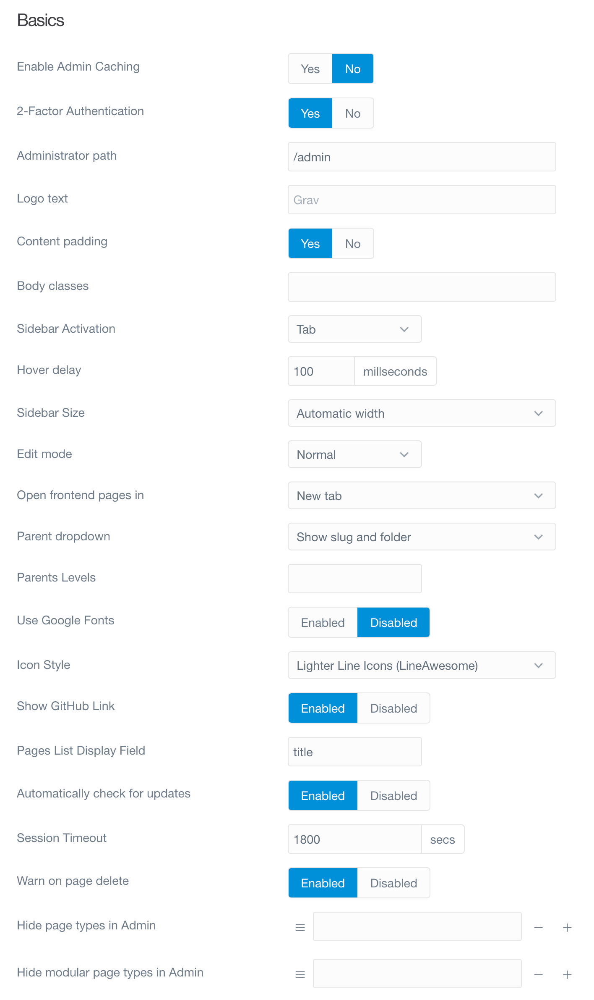
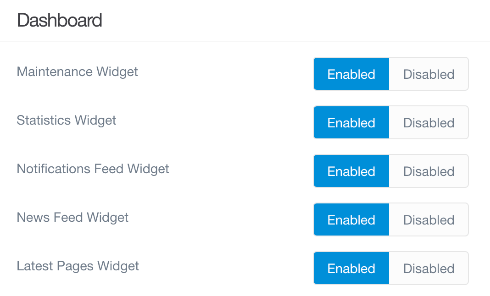
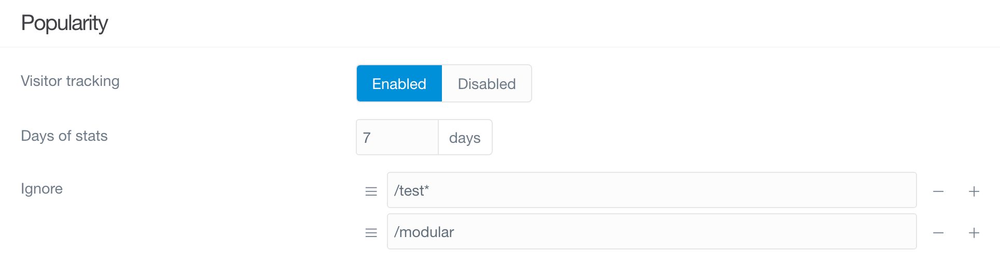

# Параметры

> Обзор настроек плагина админки Grav CMS.

Плагин админки имеет набор собственных опций, доступных в разделе **Плагины**. Чтобы познакомиться с ними, просто перейдите в **Плагины > Admin Panel** и нажмите на заголовок плагина. Откроется страница с полезными параметрами, которые помогут вам настроить работу админки.

### Информация плагина

В верхней части страницы параметров представлена ​​некоторая информация о плагине Admin Panel. Это включает в себя автора плагина, домашнюю страницу и лицензию, а также другие ссылки и информацию, которая поможет вам найти дополнительную информацию и сообщить о любых ошибках.

Это довольно стандартная функция на странице настроек любого плагина.

### Basics | Основы

Раздел **Основы** на этой странице дает вам набор опций, которые помогут вам определить свой опыт работы с админкой. Это включает в себя возможность изменить текст, отображаемый в верхней части боковой панели, создать собственный путь к админке и многое другое.

Мы разбили эти варианты и их функции ниже.

| Параметр                        | Описание                                                                                                                       |
| :-----                          | :-----                                                                                                                         |
| Включить кэширование админки    | Здесь можно **включить** или **отключить** кэширование самой админки, не влияющее на кэш CMS.                                  |
| Administrator Path              | Здесь производится изменение пути к админке. Путь по умолчанию - `/admin`, но вы можете указать в этом поле всё, что захотите. |
| Logo Text                       | Здесь вы определяете текст, который отображается в верхней части боковой панели админки.                                       |
| Body Classes                    | Хотите по-другому взглянуть на админку? Здесь вы можете добавить классы для тега body. Используйте пробел для разделения.      |
| Sidebar Activation              | Выберите методы ** Tab ** или ** Hover ** для раскрытия боковой панели.                                                        |
| Hover Delay                     | Установите время задержки, необходимое для наведения курсора на сжатую боковую панель для расширения в режиме **Hover**.       |
| Sidebar Size                    | В качестве размера боковой панели по умолчанию выберите **Автоматический** или **Маленький**.                                  |
| Edit Mode                       | Выберите редактор содержимого по умолчанию. По умолчанию доступны варианты **Обычный** и **Эксперт**.                          |
| Use Google Fonts                | Использование собственных шрифтов Google. Отключите это, чтобы использовать Helvetica. Полезно при использовании кириллицы и других языков с неподдерживаемыми символами.      |
| Show GitHub Link                | **Включить** или **отключить** отображение блока «Нашли ошибку? Пожалуйста, сообщите об этом на GitHub».                       |
| Automatically Check for Updates | Выберите автоматическую проверку обновлений для плагина **Admin Panel**.                                                       |
| Session Timeout                 | Установите здесь тайм-аут сеанса (в секундах).                                                                                 |

### Dashboard | Главная страница админки

В этом разделе страницы вы можете настроить элементы, которые отображаются на дашборде.

| Параметр                  | Описание                                                                                           |
| :-----                    | :-----                                                                                             |
| Maintenance Widget        | **Включить** или **отключить** отображение области **Техническое обслуживание** на дашборде.       |
| Statistics Widget         | **Включить** или **отключить** отображение области **Статистика** на дашборде.                     |
| Notifications Feed Widget | **Включить** или **отключить** отображение области **Уведомления** на дашборде.                    |
| News Feed Widget          | **Включить** или **отключить** отображение области **Лента новостей** на дашборде.                 |
| Latest Pages Widget       | **Включить** или **отключить** отображение области **Последние обновлённые страницы** на дашборде. |

### Notifications | Уведомления

В этом разделе можно включить или отключить определенные типы уведомлений. Вы можете отключить уведомления об обновлении ленты, а также уведомления о плагинах и/или темах.

| Параметр                | Описание                                                     |
| :-----                  | :-----                                                       |
| Feed Notifications      | **Включить** или **отключить** уведомления ленты новостей.   |
| Dashboard Notifications | **Включить** или **отключить** уведомления дашборда.         |
| Plugins Notifications   | **Включить** или **отключить** уведомления плагинов.         |
| Themes Notifications    | **Включить** или **отключить** уведомления тем .             |

### Popularity | Популярность

Одной из замечательных функций админки является его способность отслеживать и отображать информацию о трафике с панели администратора. Этот раздел параметров плагина админки дает вам возможность включить или отключить отслеживание трафика и настроить способ отображения этих данных.

| Параметр         | Описание                                                                                           |
| :-----           | :-----                                                                                             |
| Visitor tracking | Вы можете **включить** или **отключить** функцию отслеживания посетителей.                         |
| Days of stats    | Это поле позволяет задать количество дней хранения данных о посетителях на графике до их удаления. |
| Ignore           | Игнорируйте трафик на определенные URL-адреса вашего сайта. Например, `/test' или '/modular`       |

