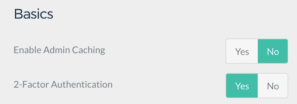
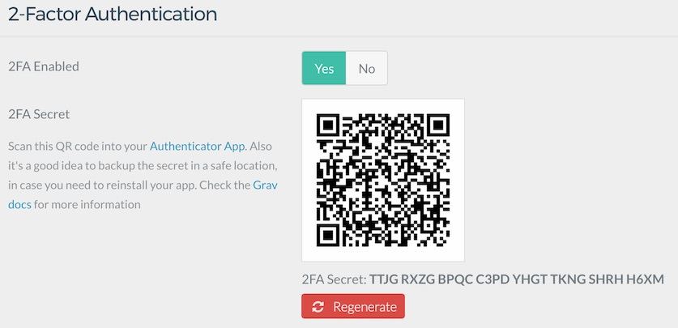
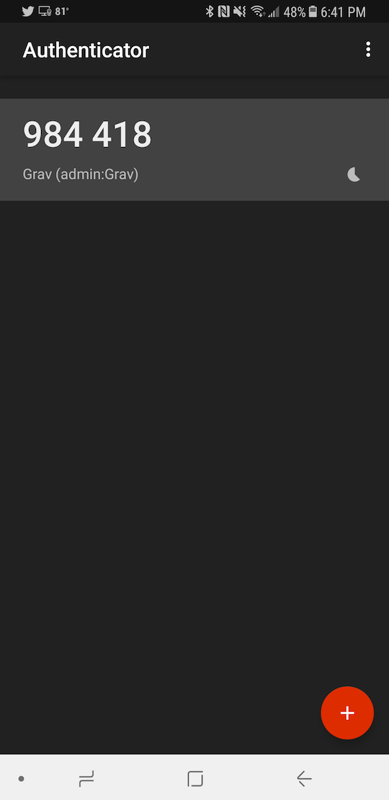
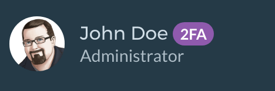

# Двухфакторная аутентификация

> Настраиваем двухфакторную аутентификацию в Grav CMS.


Двухфакторная аутентификация (2FA) - отличная мера безопасности, использующая метод аутентификации в стиле скользящего времени. Этот метод генерирует шестизначные коды, которые вы можете использовать в дополнение к вашему имени пользователя и паролю для доступа к администратору.

Чтобы воспользоваться этой функцией, вам нужно загрузить приложение с поддержкой 2FA, например [Authy](https://authy.com/) или [Google Authenticator](https://play.google.com/store/apps/details?id=com.google.android.apps.authenticator2&hl=en). Это приложение будет действовать как виртуальная связка ключей для кодов аутентификации.

## Как это настроить



Настроить двухфакторную аутентификацию в Grav очень просто. Всё, что вам нужно сделать, это перейти к **Плагины > Admin Panel > Basics** в админке.

Здесь вы найдете двухфакторную аутентификацию. Вы можете включить эту функцию, выбрав **Да**. Это позволит пользователям настроить двухфакторную аутентификацию для своих учетных записей.



Теперь вы можете выбрать изображение своего аватара, чтобы получить доступ к настройкам профиля пользователя. Затем вы захотите установить для параметра **2FA Enabled** значение **Yes**.

QR-код появится вместе с секретным ключом 2FA. Запишите ключ и положите его в безопасное место.



Используя любое приложение для аутентификации, отсканируйте QR-код или введите секретный ключ, чтобы зарегистрировать свой ключ 2FA. Сохраните страницу своего профиля, чтобы заблокировать настройки 2FA.



Теперь рядом с вашим именем на боковой панели появится фиолетовый значок 2FA. Этот значок сообщает, что в аккаунте активна двухфакторная аутентификация.

Теперь вы можете выйти и снова войти в систему. Вы увидите те же поля для имени пользователя и пароля, но как только вы введете эту информацию, вам будет предложено ввести дополнительный шестизначный код. Этот код находится в вашем приложении для аутентификации. Он сбрасывается каждые 30 секунд, поэтому код действует только в течение этого короткого периода. На его замену сгенерируется новый код.

Это оно! Теперь у вас есть более безопасный сайт Grav!

Да, и если вы хотите изменить свой ключ 2FA, всё, что вам нужно сделать, это нажать большую красную кнопку **Regenerate**.

## Часто задаваемые вопросы

#### Что произойдет, если я потеряю доступ к своему устройству с двухфакторной аутентификацией?

Не волнуйтесь! Еще не все потеряно.

Ваш статус 2FA и хешированный ключ хранятся в файловой системе вашего сайта в вашем пользовательском YAML-файле. Например, если ваша учетная запись пользователя - `admin`, перейдите к **ROOT /user/accounts/admin.yaml** и найдите эти две строки:

```yaml
twofa_enabled: true
twofa_secret: RQX46XTTBK7QMMB6VR4RAUNWOYVXXTSR
```

Просто установите для **twofa_enabled** значение `false` и сохраните. Теперь вы должны иметь доступ к своему сайту, используя только свое имя пользователя и пароль. Кроме того, вы можете использовать **twofa_secret**, чтобы зарегистрировать свою учетную запись в выбранном вами приложении-аутентификаторе.

#### Что делать, если мой ключ 2FA скомпрометирован?

Если вы считаете, что ваш секретный ключ 2FA может быть скомпрометирован, можно сгенерировать новый ключ и сделать старый недействительным, нажав большую красную кнопку **Regenerate** в настройках вашего профиля пользователя в админке.
