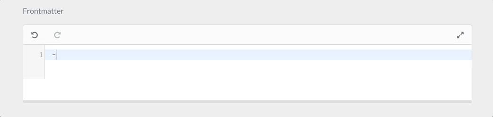
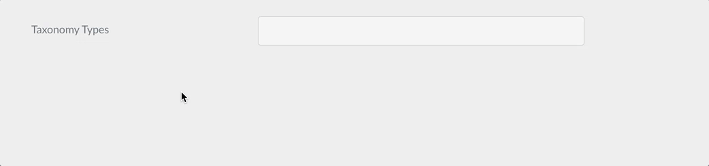

# Ссылка: чертеж полей формы

> Руководство по доступным типам полей в формах Grav CMS.

## Доступные поля формы для использования в админке

Формы на стороне администратора могут быть созданы с множеством полей. Этот документ предоставляет полную информацию о свойствах каждого поля и примеры использования.

В дополнение к перечисленным ниже полям, зарезервированным для использования в админке, вы также можете использовать все поля, доступные в формах фронтенда, описанных в [Справке по полям форм фронтенда](/06.forms/02.forms/02.fields-available/index).

### Специальные поля формы, доступные только в админке


| Поле                                             | Описание                                                                                                                                                                                                 |
| :-----                                            | :-----                                                                                                                                                                                                      |
| **[Array](#Поле-array)**                         | используется для создания массивов ключ-значение                                                                                                                                                                             |
| **BackupHistory**                                 |                                                                                                                                                                                                             |
| **Blueprint**                                     |                                                                                                                                                                                                             |
| **[Colorpicker](#Поле-выбора-цвета)**             | показать палитру цветов                                                                                                                                                                                         |
| **[Columns](#Поля-columnscolumn-столбцы)**             | используется для разбивки формы на несколько столбцов                                                                                                                                                                |
| **[Column](#Поля-columnscolumn-столбцы)**              | используется для отображения одного столбца (используется с полем `Columns`)                                                                                                                                                |
| **Cron**                                          |                                                                                                                                                                                                             |
| **CronStatus**                                    |                                                                                                                                                                                                             |
| **[Dateformat](#Поле-формата-даты)**               | специальный выбор, который отображает текущую дату/время в переданных форматах                                                                                                                                   |
| **[Datetime](#Поле-даты-и-времени)**                   | поле выбора даты и времени                                                                                                                                                                             |
| **[Editor](#Поле-редактора)**                       | показать редактор Markdown                                                                                                                                                                                      |
| **[Elements](#Поле-elements)** | условное и организационное поле для показа/скрытия потомков в зависимости от выбранного значения «триггера». Это чрезвычайно полезно для уменьшения беспорядка, когда есть много вариантов для отображения |
| **[Fieldset](#Поле-fieldset)**                   | сгруппируйте набор полей внутри складного аккордеона                                                                                                                                                        |
| **[File](#Поле-файла)**                           | в админке **File** специализирован для использования в конфигурациях плагинов и тем (чертежах). Обрабатывает загрузку файла в определенное место и его удаление, а также удаление его из конфигурации темы/плагина |
| **[Filepicker](#Поле-filepicker)**               | **Filepicker** позволяет выбирать файлы из расположения в файловой системе веб-сервера.                                                                                                                         |
| **Frontmatter**                                   |                                                                                                                                                                                                             |
| **IconPicker**                                    |                                                                                                                                                                                                             |
| **[List](#Поле-списка)**                           | используется для создания коллекций полей                                                                                                                                                                        |
| **Markdown**                                      |                                                                                                                                                                                                             |
| **MediaPicker**                                   |                                                                                                                                                                                                             |
| **Multilevel**                                    |                                                                                                                                                                                                             |
| **Order**                                         |                                                                                                                                                                                                             |
| **PageMedia**                                     |                                                                                                                                                                                                             |
| **[PageMediaSelect](#Поле-pagemediaselect)**     | показывает выбор со всеми носителями страницы. Используется в схемах элементов страниц, чтобы позволить пользователю выбрать медиафайл, который будет назначен полю.                                                                             |
| **[Pages](#Поле-pages)**                         | показывает список страниц сайта                                                                                                                                                                              |
| **Parents**                                       |                                                                                                                                                                                                             |
| **Permissions**                                   |                                                                                                                                                                                                             |
| **Range**                                         |                                                                                                                                                                                                             |
| **[Section](#Поле-section)**                     | используется для разделения страницы настроек на разделы; каждый раздел поставляется с заголовком                                                                                                                                |
| **[Selectize](#Поле-selectize)**                 | гибрид текстового поля и поля выбора. В основном полезно для тегов и других полей подбора элементов.                                                                                                        |
| **SelectUnique**                                  |                                                                                                                                                                                                             |
| **[Taxonomy](#Поле-taxonomy)**                   | специальный выбор предварительно настроенный для выбора одной или нескольких таксономий                                                                                                                                             |
| **ThemeSelect**                                   |                                                                                                                                                                                                             |
| **UserInfo**                                      |                                                                                                                                                                                                             |
| **Xss**                                           |                                                                                                                                                                                                             |


### Общие атрибуты полей

Каждое поле принимает список атрибутов, которые вы можете использовать. Каждое поле может иметь общие атрибуты, но отдельные поля могут их игнорировать. Лучший способ проверить, какие атрибуты разрешены в поле — проверить описание поля на этой странице и увидеть, какие атрибуты упоминаются.

Этот список обеспечивает общую основу, поэтому нет необходимости повторять описание общего поля.


| Атрибут          | Описание                                                                                                                                                                                                    |
| :-----              | :-----                                                                                                                                                                                                          |
| `autocomplete`      | принимает `on` или `off`                                                                                                                                                                                           |
| `autofocus`         | если включено, автофокус на этом поле                                                                                                                                                                             |
| `classes`           | принимает строку с одним или несколькими классами CSS для добавления                                                                                                                                                            |
| `default`           | устанавливает значение поля по умолчанию. Это гарантирует, что вы всегда получите либо значение, указанное пользователем, либо значение по умолчанию. Смотрите также `placeholder`.                                                             |
| `disabled`          | устанавливает отключенное состояние поля                                                                                                                                                                                   |
| `help`              | добавляет всплывающую подсказку к полю                                                                                                                                                                                     |
| `id`                | устанавливает идентификатор поля, а также атрибут `for` для метки                                                                                                                                                   |
| `label`             | устанавливает метку поля                                                                                                                                                                                            |
| `name`              | устанавливает имя поля                                                                                                                                                                                             |
| `novalidate`        | устанавливает состояние «novalidate»                                                                                                                                                                                 |
| `placeholder`       | устанавливает значение заполнителя поля. Это необходимо для установки значения, которое пользователь может видеть как подсказку для своего собственного значения, но не влияет на то, какое значение в конечном итоге будет записано. Смотрите также `default`.                   |
| `readonly`          | устанавливает состояние «только для чтения»                                                                                                                                                                                  |
| `size`              | устанавливает размер поля, которое, в свою очередь, добавляет класс в свой контейнер. Допустимые значения: `large`, `x-small`, `medium`, `long`, `small`. Конечно, вы можете добавить больше в шаблон, который вы видите, когда он используется во внешнем интерфейсе. |
| `style`             | устанавливает стиль поля. Если установлено на `vertical`, поле может отображаться во всю ширину. Это простой способ очистить форму.                                                                                   |
| `title`             | устанавливает значение заголовка поля                                                                                                                                                                                      |
| `toggleable`        | добавить флажок, который будет переключать активированный/отключенный атрибут поля                                                                                                                                     |
| `validate.required` | если установлено положительное значение, устанавливает поле как обязательное                                                                                                                                                          |
| `validate.pattern`  | устанавливает шаблон валидации                                                                                                                                                                                       |
| `validate.message`  | устанавливает сообщение, отображаемое в случае сбоя валидации                                                                                                                                                                  |
| `validate.type`     | устанавливает тип поля, используемый во время валидации                                                                                                                                                                      |


### Хотите знать больше?

Вы можете прочитать, как создаются поля, в дополнительных источниках: [Поля, добавленные плагином формы](https://github.com/getgrav/grav-plugin-form/tree/master/templates/forms) и [Поля, доступные только в админке](https://github.com/getgrav/grav-plugin-admin/tree/master/themes/grav/templates/forms).

### Валидация

Большинство полей допускают валидацию.

```yaml
validate:
    required: true
```

приведет к тому, что поле будет помечено как обязательное.

```yaml
validate:
    message: 'Some message'
```

покажет определенное сообщение, когда поле не заполнено правильно.

```yaml
validate:
    pattern: 'Some pattern'
```

проверяет значение поля на соответствие переданному шаблону регулярного выражения. Примеры: `pattern: "[1-9][0-9]*"`, `pattern: '[A-Za-z0-9-]+'`, `pattern: '[a-z0-9-]+'`, ` pattern: '^[a-z0-9_-]{3,16}$'`, `pattern: '(?=.*\d)(?=.*[a-z])(?=.*[A-Z]).{8,}'`

#### validate.type

`validate.type` указывает, по какому типу следует выполнять проверку.

Некоторые примеры:

Редактор приведет к `textarea`:

```yaml
content:
    type: editor
    validate:
      type: textarea
```

Selectize будет `commalist`:

```yaml
taxonomies:
    type: selectize
    size: large
    label: PLUGIN_ADMIN.TAXONOMY_TYPES
    classes: fancy
    help: PLUGIN_ADMIN.TAXONOMY_TYPES_HELP
    validate:
        type: commalist

filters.category:
  type: selectize
  label: Category filter
  help: Comma separated list of category names
  validate:
    type: commalist
```

Проверка адреса электронной почты:

```yaml
author.email:
    type: text
    size: large
    label: PLUGIN_ADMIN.DEFAULT_EMAIL
    help: PLUGIN_ADMIN.DEFAULT_EMAIL_HELP
    validate:
        type: email
```

Убедитесь, что значение является логическим:

```yaml
summary.enabled:
    type: toggle
    label: PLUGIN_ADMIN.ENABLED
    highlight: 1
    help: PLUGIN_ADMIN.ENABLED_HELP
    options:
        1: PLUGIN_ADMIN.YES
        0: PLUGIN_ADMIN.NO
    validate:
        type: bool
```

Убедитесь, что значение является целым числом от 0 до 65536:

```yaml
summary.size:
    type: text
    size: x-small
    label: PLUGIN_ADMIN.SUMMARY_SIZE
    help: PLUGIN_ADMIN.SUMMARY_SIZE_HELP
    validate:
        type: int
        min: 0
        max: 65536
```

Убедитесь, что значение является числом > 1:

```yaml
pages.list.count:
    type: text
    size: x-small
    label: PLUGIN_ADMIN.DEFAULT_PAGE_COUNT
    help: PLUGIN_ADMIN.DEFAULT_PAGE_COUNT_HELP
    validate:
        type: number
        min: 1
```

Проверить тип таксономии как массив:

```yaml
header.taxonomy:
  type: taxonomy
  label: PLUGIN_ADMIN.TAXONOMY
  multiple: true
  validate:
    type: array
```

Проверить текстовое поле как слаг:

```yaml
folder:
  type: text
  label: PLUGIN_ADMIN.FOLDER_NAME
  validate:
    type: slug
```

### Поле array


Тип поля `array` используется для создания простого списка объектов `ключ-значение`.

Пример:

```yaml
metadata:
   type: array
   label: PLUGIN_ADMIN.METADATA
   help: PLUGIN_ADMIN.METADATA_HELP
   placeholder_key: PLUGIN_ADMIN.METADATA_KEY
   placeholder_value: PLUGIN_ADMIN.METADATA_VALUE
   required: true
```


| Атрибут             | Описание    |
| :-----              | :-----      |
| `placeholder_key`   |             |
| `placeholder_value` |             |
| `value_only`        |             |


| Разрешены общие атрибуты                   |
| :-----                                     |
| [default](#Общие-атрибуты-полей)           |
| [help](#Общие-атрибуты-полей)              |
| [label](#Общие-атрибуты-полей)             |
| [name](#Общие-атрибуты-полей)              |
| [style](#Общие-атрибуты-полей)             |
| [toggleable](#Общие-атрибуты-полей)        |
| [validate.required](#Общие-атрибуты-полей) |
| [validate.type](#Общие-атрибуты-полей)     |


### Поле выбора цвета


Тип поля `colorpicker` используется для отображения поля выбора цвета

Пример:

```yaml
color:
   type: colorpicker
   label: Choose a color
```


| Разрешены общие атрибуты                       |
| :-----                                         |
| [autocomplete](#Общие-атрибуты-полей)      |
| [autofocus](#Общие-атрибуты-полей)         |
| [classes](#Общие-атрибуты-полей)           |
| [default](#Общие-атрибуты-полей)           |
| [disabled](#Общие-атрибуты-полей)          |
| [help](#Общие-атрибуты-полей)              |
| [id](#Общие-атрибуты-полей)                |
| [label](#Общие-атрибуты-полей)             |
| [name](#Общие-атрибуты-полей)              |
| [placeholder](#Общие-атрибуты-полей)       |
| [style](#Общие-атрибуты-полей)             |
| [title](#Общие-атрибуты-полей)             |
| [toggleable](#Общие-атрибуты-полей)        |
| [validate.message](#Общие-атрибуты-полей)  |
| [validate.required](#Общие-атрибуты-полей) |
| [validate.type](#Общие-атрибуты-полей)     |


### Поля `columns`/`column` (столбцы)


Типы полей `columns` и` column` используются для разделения содержащихся полей формы на столбцы.

Пример:

```yaml
columns:
  type: columns
  fields:
    column1:
      type: column
      fields:

        # .... subfields

    column2:
      type: column
      fields:

        # .... other subfields
```


| Атрибут   | Описание                 |
| :-----    | :-----                   |
| `fields`  | Подполя столбца/столбцов |


### Поле формата даты


Тип поля `dateformat` используется для выбора даты.

Пример:

```yaml
pages.dateformat.short:
    type: dateformat
    size: medium
    classes: fancy
    label: PLUGIN_ADMIN.SHORT_DATE_FORMAT
    help: PLUGIN_ADMIN.SHORT_DATE_FORMAT_HELP
    default: "jS M Y"
    options:
        "F jS \\a\\t g:ia": Date1
        "l jS \\of F g:i A": Date2
        "D, d M Y G:i:s": Date3
        "d-m-y G:i": Date4
        "jS M Y": Date5
```


| Атрибут     | Описание                                                           |
| :-----      | :-----                                                             |
| `options`   | В поле доступны параметры пары `ключ-значение`                     |
| `multiple`  | логическое. Если положительный, поле принимает несколько значений. |
| `selectize` |                                                                    |


| Разрешены общие атрибуты                       |
| :-----                                         |
| [autofocus](#Общие-атрибуты-полей)         |
| [classes](#Общие-атрибуты-полей)           |
| [default](#Общие-атрибуты-полей)           |
| [disabled](#Общие-атрибуты-полей)          |
| [help](#Общие-атрибуты-полей)              |
| [label](#Общие-атрибуты-полей)             |
| [name](#Общие-атрибуты-полей)              |
| [novalidate](#Общие-атрибуты-полей)        |
| [size](#Общие-атрибуты-полей)              |
| [style](#Общие-атрибуты-полей)             |
| [toggleable](#Общие-атрибуты-полей)        |
| [validate.required](#Общие-атрибуты-полей) |
| [validate.type](#Общие-атрибуты-полей)     |


### Поле даты и времени


Тип поля `datetime` используется для хранения и представления поля даты и времени.

Пример:

```yaml
header.date:
  type: datetime
  label: PLUGIN_ADMIN.DATE
  toggleable: true
  help: PLUGIN_ADMIN.DATE_HELP
```


| Атрибут        | Описание              |
| :-----         | :-----                |
| `format`       | Значение формата даты и времени, вы можете использовать любой из доступных [форматов даты PHP](https://php.net/manual/en/datetime.formats.date.php). |
| `validate.min` | Минимальное допустимое значение |
| `validate.max` | Максимально допустимое значение |


| Разрешены общие атрибуты                       |
| :-----                                         |
| [default](#Общие-атрибуты-полей)           |
| [help](#Общие-атрибуты-полей)              |
| [label](#Общие-атрибуты-полей)             |
| [name](#Общие-атрибуты-полей)              |
| [size](#Общие-атрибуты-полей)              |
| [style](#Общие-атрибуты-полей)             |
| [toggleable](#Общие-атрибуты-полей)        |
| [validate.required](#Общие-атрибуты-полей) |
| [validate.type](#Общие-атрибуты-полей)     |


### Поле редактора



Тип поля `editor` используется для представления редактора Codemirror.

Пример:

```yaml
frontmatter:
  classes: frontmatter
  type: editor
  label: PLUGIN_ADMIN.FRONTMATTER
  autofocus: true
  codemirror:
    mode: 'yaml'
    indentUnit: 4
    autofocus: true
    indentWithTabs: false
    lineNumbers: true
    styleActiveLine: true
    gutters: ['CodeMirror-lint-markers']
    lint: true
```


| Атрибут      | Описание                                                                                 |
| :-----       | :-----                                                                                   |
| `codemirror` | Набор значений, которые необходимо установить в [редакторе codemirror](https://codemirror.net/doc/manual.html#config). По умолчанию использует режим: gfm (github flavored markdown) |
| `resizer`    | Если положительный, включает изменение размера. В противном случае редактор фиксирован   |


| Разрешены общие атрибуты                       |
| :-----                                         |
| [default](#Общие-атрибуты-полей)           |
| [help](#Общие-атрибуты-полей)              |
| [label](#Общие-атрибуты-полей)             |
| [name](#Общие-атрибуты-полей)              |
| [style](#Общие-атрибуты-полей)             |
| [validate.required](#Общие-атрибуты-полей) |
| [validate.type](#Общие-атрибуты-полей)     |
| [autofocus](#Общие-атрибуты-полей)         |
| [classes](#Общие-атрибуты-полей)           |
| [disabled](#Общие-атрибуты-полей)          |
| [id](#Общие-атрибуты-полей)                |
| [novalidate](#Общие-атрибуты-полей)        |
| [placeholder](#Общие-атрибуты-полей)       |
| [readonly](#Общие-атрибуты-полей)          |


### Поле Elements


Это поле является только организационным и позволяет группировать элементы в рамках названной группы, которая будет показана только в том случае, если значение выбранного элемента соответствует группе.

Пример:

```yaml
header.elements-demo:
  type: elements
  label: 'Elements Demo'
  size: small
  default: gelato
  options:
    gelato: Gelato Flavors
    color: Color
    planets: Planets
  fields:
    gelato:
      type: element
      fields:
        .items:
          type: array
          default:
            pistacchio: Pistacchio
            vanilla: Vanilla
            chocolate: Chocolate
            stracciatella: Stracciatella
    color:
      type: element
      fields:
        .items:
          type: textarea
          rows: 10
          default: Color (American English) or colour (Commonwealth English) is the visual perceptual property corresponding in humans to the categories called blue, green, red, etc. Color derives from the spectrum of light (distribution of light power versus wavelength) interacting in the eye with the spectral sensitivities of the light receptors. Color categories and physical specifications of color are also associated with objects or materials based on their physical properties such as light absorption, reflection, or emission spectra. By defining a color space colors can be identified numerically by their coordinates.
    planets:
      type: element
      fields:
        .items:
          type: text
          placeholder: What are your favorite planets?
          markdown: true
          description: 'Find a list of planets from [Wikipedia](https://en.wikipedia.org/wiki/Planet)'
```

### Поле Fieldset


`Fieldset` группирует набор полей внутри одного блока.

Пример:

```yaml
header.fieldset:
  type: fieldset
  title: Your title
  help: Help text
  info: Info text
  text: Text inside fieldset and before other fields
  icon: comments       # Fork Awesome icons system (see : forkaweso.me).
  collapsed: true      # Initial state of fieldset (see collapsible option)
  collapsible: true    # Whether one can expand the fieldset or not
  fields:
    header.fieldset.an_example_text:
      type: text
      label: text
    header.fieldset.an_example_textarea:
      type: textarea
      label: textarea
```

?> Наборы полей также должны быть сохранены во frontmatter, с `header.`, чтобы их состояния подполей правильно запоминались!

> **Известная проблема:** если поля в наборе полей используют `toggleable:`, их состояние не будет запомнено, если названный набор полей не имеет префикса `header.`. Вот пример действующей структуры с модификацией опции *pagination*:

```yaml
header.fieldset:
  type: fieldset
  ... etc...
  fields:
    header.content.pagination:
      type: toggle
      toggleable: true
      label: "Activate Pagination ?"
      highlight: 1
      default: 0
      options:
        1: Yes
        0: No
      validate:
        type: bool
```

#### Значок набора полей

Вы можете использовать значок для размещения в заголовке набора полей. Используемая система значков [Fork Awesome](https://forkaweso.me).


| Атрибут       | Описание                                                            |
| :-----        | :-----                                                              |
| `icon`        | Иконка из коробки                                                   |
| `collapsed`   | Если `true`, список открывается свернутым. По умолчанию он расширен |
| `collapsible` |Можно ли расширять набор полей или нет                               |


| Разрешены общие атрибуты                       |
| :-----                                         |
| [disabled](#Общие-атрибуты-полей)          |
| [help](#Общие-атрибуты-полей)              |
| [label](#Общие-атрибуты-полей)             |
| [name](#Общие-атрибуты-полей)              |
| [size](#Общие-атрибуты-полей)              |
| [style](#Общие-атрибуты-полей)             |
| [toggleable](#Общие-атрибуты-полей)        |


### Поле файла


Тип поля `file` может использоваться в конфигурациях страниц, плагинов и тем (схемах). Обрабатывает загрузку файла в определенное место, а также удаление его из заголовков страниц или конфигурации темы/плагина.

> Поле `file` предназначено для использования **конфигурацией**, **темами** и **плагинами**, **НЕ схемами страниц**. Для страниц вы должны использовать существующее поле `pagemedia`, а затем использовать поле [filepicker](#Поле-filepicker) для выбора файлов.

?> Более подробную информацию можно найти в специальном разделе [Как добавить поле для загрузки файлов](/06.forms/01.blueprints/06.how-to-add-file-upload/index). Также обратите внимание, что отображение изображения, загруженного в поле файла, не выполняется так же, как в поле выбора файла. Более подробную информацию о том, как получить доступ к изображениям, загруженным в поле файла, можно найти в [быстрых рецептах](/10.cookbook/02.twig-recipes/index?id=Отображение-изображения-загруженного-в-поле-файла).

Пример:

```yaml
custom_logo_login_screen:
  type: file
  label: Custom Logo Login Screen
  destination: 'plugins://admin/assets'
  accept:
    - image/*
```

```yaml
custom_file:
  type: file
  label: A Label
  destination: 'theme://assets'
  multiple: true
  limit: 5
  filesize: 1
  accept:
    - image/*
```


| Атрибут             | Описание                                                                                                   |
| :-----              | :-----                                                                                                     |
| `destination`       | Папка, в которой будут храниться файлы, с помощью потока или относительно корня Grav. Например: `plugins://my-plugin/assets` |
| `multiple`          | Разрешить или запретить использование более одного файла для каждого поля                                  |
| `limit`             | Когда включен параметр `multiple`, можно ограничить количество файлов, разрешенных для загрузки.           |
| `filesize`          | Максимально допустимый размер каждого файла в МБ                                                           |
| `accept`            | Добавьте список разрешенных типов MIME и расширений страниц. Например. `["image/*", '.mp3']`               |
| `random_name`       | Использует случайное имя файла для каждого загруженного файла                                              |
| `avoid_overwriting` | Добавляет отметку времени перед каждым именем файла, если возникнет конфликт                               |


| Разрешены общие атрибуты                       |
| :-----                                         |
| [default](#Общие-атрибуты-полей)           |
| [disabled](#Общие-атрибуты-полей)          |
| [help](#Общие-атрибуты-полей)              |
| [label](#Общие-атрибуты-полей)             |
| [name](#Общие-атрибуты-полей)              |
| [size](#Общие-атрибуты-полей)              |
| [style](#Общие-атрибуты-полей)             |
| [toggleable](#Общие-атрибуты-полей)        |
| [validate.required](#Общие-атрибуты-полей) |
| [validate.type](#Общие-атрибуты-полей)     |


### Поле Filepicker


Тип поля `filepicker` можно использовать в конфигурациях страниц, плагинов и тем (схемах). Обрабатывает выбор файла из местоположения и сохранение его в заголовках страниц или в конфигурации темы/плагина.

Пример:

```yaml
picked_image:
  type: filepicker
  folder: 'theme://images/pages'
  label: Select a file
  preview_images: true
  accept:
    - .png
    - .jpg
```

```yaml
header.a_file:
  type: filepicker
  folder: 'self@'
  preview_images: true
  label: Select a file
```


| Атрибут          | Описание                                                                         |
| :-----           | :-----                                                                           |
| `folder`         | Папка, в которой будут выполняться поиск файлов, с помощью потока или относительно корня Grav. Принимает любое значение в [формате места назначения поля файла](/06.forms/01.blueprints/06.how-to-add-file-upload/index?id=destination). |
| `accept`         | Список допустимых расширений файлов                                              |
| `preview_images` | Если включено, файлы изображений будут иметь небольшой предварительный просмотр. |
| `on_demand`      | Если этот параметр включен, файлы и изображения будут загружаться только тогда, когда инструмент выбора файлов находится в фокусе. Это полезно для сокращения времени загрузки страницы редактирования администратора, когда есть большие медиафайлы или много полей для выбора файлов. |


| Разрешены общие атрибуты                       |
| :-----                                         |
| [default](#Общие-атрибуты-полей)           |
| [disabled](#Общие-атрибуты-полей)          |
| [help](#Общие-атрибуты-полей)              |
| [label](#Общие-атрибуты-полей)             |
| [name](#Общие-атрибуты-полей)              |
| [size](#Общие-атрибуты-полей)              |
| [style](#Общие-атрибуты-полей)             |
| [toggleable](#Общие-атрибуты-полей)        |
| [validate.required](#Общие-атрибуты-полей) |


### Поле приманки

Тип поля `honeypot` создает скрытое поле, которое при заполнении возвращается с ошибкой. Это полезный способ предотвратить заполнение и отправку формы ботами.

Пример:

```yaml
fields:
    - name: honeypot
      type: honeypot
```

Это простое текстовое поле, которое не отображается в интерфейсе пользователя. Боты, которые обнаруживают поля в коде и заполняют их автоматически, скорее всего, заполнят это поле. Ошибка не позволяет правильно отправить эту форму. Ошибка возвращается рядом с элементом формы, а не вверху блока сообщения.

Поле приманки — популярная альтернатива полям капчи.


### Поле списка


Тип поля `list` используется для создания коллекций полей. Поле принимает атрибут `fields`, который будет содержать подполя, и будет кнопка `Добавить элемент`, позволяющая пользователю добавлять дополнительные элементы в коллекцию.

Пример:

```yaml
header.buttons:
  name: buttons
  type: list
  style: vertical
  label: Buttons
  fields:
    .text:
      type: text
      label: Text
    .url:
      type: text
      label: URL
    .primary:
      type: toggle
      label: Primary
      highlight: 1
      default: 1
      options:
          1: 'Yes'
          0: 'No'
      validate:
          type: bool
```

В этом примере будет сгенерирован этот интерфейс администратора:


При сохранении страницы мы увидим следующий YAML, добавленный к frontmatter страницы:

```yaml
buttons:
    -
        text: 'Some text'
        url: 'https://getgrav.org'
        primary: false
    -
        text: 'Another text'
        url: 'https://another-url.com'
        primary: true
```

Это будет использовано в Theme Twig для вывода списка в удобной форме.

Другой пример этого определения поля - это список функций, используемый модульной дочерней страницей Antimatter Features. У каждой функции есть значок, заголовок и текст:

```yaml
header.features:
  name: features
  type: list
  label: Features

  fields:
    .icon:
      type: text
      label: Icon
    .header:
      type: text
      label: Header
    .text:
      type: text
      label: Text
```

Доступ к данным поля `list` и их отображение выполняется с помощью простого цикла twig for, как в примере ниже:

```twig

    {{ feature.icon }}
    {{ feature.header }}
    {{ feature.text }}

```


| Атрибут     | Описание                                                                                                                           |
| :-----      | :-----                                                                                                                             |
| `fields`    | Подполя                                                                                                                            |
| `collapsed` | Если `true`, список открывается свернутым. По умолчанию он расширен                                                                |
| `style`     | Может быть установлен на `vertical` для экономии места по горизонтали                                                              |
| `btnLabel`  | Текст метки «Добавить новый элемент»                                                                                               |
| `sort`      | Логический. Если отрицательный, отключает возможность сортировки элементов                                                         |
| `controls`  | Определяет, где будет размещена кнопка «Добавить элемент». Может быть установлен на `[top|bottom|both]`, по умолчанию `bottom`.    |
| `placement` | Определяет, куда будет помещен добавленный элемент. Может быть установлен на `[top|bottom|position]`, по умолчанию `bottom`. Если значение `placement` — `top` или `bottom`, обе кнопки добавляют элемент сверху или снизу соответственно. Если значение `placement` — `position`, элемент добавляется в зависимости от положения нажатой кнопки — при нажатии на верхнюю кнопку элемент будет добавлен сверху, а при нажатии на нижнюю — снизу. |
| `min`       | Минимальное количество элементов, разрешенных в списке.                                                                            |
| `max`       | Максимальное количество элементов, разрешенных в списке. Кнопка «Добавить элемент» не будет работать при превышении этого значения |


| Разрешены общие атрибуты                       |
| :-----                                         |
| [default](#Общие-атрибуты-полей)           |
| [help](#Общие-атрибуты-полей)              |
| [label](#Общие-атрибуты-полей)             |
| [name](#Общие-атрибуты-полей)              |
| [validate.required](#Общие-атрибуты-полей) |
| [validate.type](#Общие-атрибуты-полей)     |
| [size](#Общие-атрибуты-полей)              |


### Поле PageMediaSelect

Тип поля `pagemediaselect` используется для того, чтобы позволить пользователям выбирать медиа из одного из медиа страниц, уже загруженных через FTP или с помощью менеджера медиа страниц.

Пример:

```yaml
header.img_link:
  label: Choose media
  type: pagemediaselect
```


| Атрибут    | Описание                 |
| :-----     | :-----                   |
| `multiple` | Выбрать несколько файлов |


| Разрешены общие атрибуты                       |
| :-----                                         |
| [default](#Общие-атрибуты-полей)           |
| [help](#Общие-атрибуты-полей)              |
| [label](#Общие-атрибуты-полей)             |
| [name](#Общие-атрибуты-полей)              |
| [style](#Общие-атрибуты-полей)             |
| [toggleable](#Общие-атрибуты-полей)        |
| [validate.required](#Общие-атрибуты-полей) |
| [validate.type](#Общие-атрибуты-полей)     |
| [autofocus](#Общие-атрибуты-полей)         |
| [classes](#Общие-атрибуты-полей)           |
| [disabled](#Общие-атрибуты-полей)          |
| [id](#Общие-атрибуты-полей)                |
| [novalidate](#Общие-атрибуты-полей)        |
| [size](#Общие-атрибуты-полей)              |


### Поле Pages


Тип поля `pages` показывает список страниц сайта.

Пример:

```yaml
home.alias:
    type: pages
    size: medium
    classes: fancy
    label: PLUGIN_ADMIN.HOME_PAGE
    start_route: '/some_page'
    show_all: false
    show_modular: false
    show_root: false
    help: PLUGIN_ADMIN.HOME_PAGE_HELP
```


| Атрибут         | Описание                                       |
| :-----          | :-----                                         |
| `start_route`   | Выбрать корневой маршрут для списка            |
| `show_fullpath` | Показывать путь к странице вместо заголовка    |
| `show_slug`     | Показывать слаг                                |
| `show_all`      | Показать все страницы                          |
| `show_modular`  | Показать модульные страницы                    |
| `show_root`     | Показать корневые страницы                     |
| `options`       | Необязательный список дополнительных вариантов |
| `multiple`      | Выбрать несколько страниц                      |
| `limit_levels`  | Количество отображаемых уровней                |
| `selectize`     |                                                |


Если вы установите для `multiple` значение true, вам нужно добавить `validate.type: array`. В противном случае массив выбранных страниц не будет сохранен правильно.


| Разрешены общие атрибуты                       |
| :-----                                         |
| [default](#Общие-атрибуты-полей)           |
| [help](#Общие-атрибуты-полей)              |
| [label](#Общие-атрибуты-полей)             |
| [name](#Общие-атрибуты-полей)              |
| [style](#Общие-атрибуты-полей)             |
| [toggleable](#Общие-атрибуты-полей)        |
| [validate.required](#Общие-атрибуты-полей) |
| [validate.type](#Общие-атрибуты-полей)     |
| [autofocus](#Общие-атрибуты-полей)         |
| [classes](#Общие-атрибуты-полей)           |
| [disabled](#Общие-атрибуты-полей)          |
| [novalidate](#Общие-атрибуты-полей)        |
| [size](#Общие-атрибуты-полей)              |


### Поле Section

Тип поля `Section` используется для разделения страницы настроек на разделы.

Пример:

```yaml
content:
    type: section
    title: PLUGIN_ADMIN.DEFAULTS
    underline: true

    fields:

        #..... subfields
```


| Атрибут       | Описание                                                                       |
| :-----        | :-----                                                                         |
| `title`       | Заголовок                                                                      |
| `underline`   | Добавить подчеркивание после заголовка                                         |
| `text`        | Текст для отображения внизу                                                    |
| `security`    | Массив учетных данных, необходимых пользователю для визуализации этого раздела |
| `title_level` | Установить собственный тег заголовка. По умолчанию: `h3`                       |


### Поле Selectize



Тип поля `selectize` используется для отображения гибрида текстового поля и поля выбора. В основном полезно для тегов и других полей выбора элементов.

Пример:

```yaml
taxonomies:
    type: selectize
    selectize:
        options:
            - text: "test"
              value: "real value 1"
            - text: "test-2"
              value: "real value 2"
            - text: "test-3"
              value: "real value 3"
    size: large
    label: PLUGIN_ADMIN.TAXONOMY_TYPES
    classes: fancy
    help: PLUGIN_ADMIN.TAXONOMY_TYPES_HELP
    validate:
        type: commalist
```


| Разрешены общие атрибуты                       |
| :-----                                         |
| [default](#Общие-атрибуты-полей)           |
| [help](#Общие-атрибуты-полей)              |
| [label](#Общие-атрибуты-полей)             |
| [name](#Общие-атрибуты-полей)              |
| [style](#Общие-атрибуты-полей)             |
| [toggleable](#Общие-атрибуты-полей)        |
| [validate.required](#Общие-атрибуты-полей) |
| [validate.type](#Общие-атрибуты-полей)     |


| Общие атрибуты INPUT BLOCK                    |
| :-----                                        |
| [autocomplete](#Общие-атрибуты-полей)     |
| [autofocus](#Общие-атрибуты-полей)        |
| [classes](#Общие-атрибуты-полей)          |
| [disabled](#Общие-атрибуты-полей)         |
| [id](#Общие-атрибуты-полей)               |
| [novalidate](#Общие-атрибуты-полей)       |
| [placeholder](#Общие-атрибуты-полей)      |
| [readonly](#Общие-атрибуты-полей)         |
| [size](#Общие-атрибуты-полей)             |
| [title](#Общие-атрибуты-полей)            |
| [validate.pattern](#Общие-атрибуты-полей) |
| [validate.message](#Общие-атрибуты-полей) |


### Поле Taxonomy


Тип поля `taxonomy` - это специальный выбор, предварительно настроенный для выбора одного или нескольких значений таксономии.

Пример:

```yaml
header.taxonomy:
  type: taxonomy
  label: PLUGIN_ADMIN.TAXONOMY
  multiple: true
  validate:
    type: array
```


| Атрибут    | Описание                                                           |
| :-----     | :-----                                                             |
| `multiple` | Логический. Если положительный, поле принимает несколько значений. |


| Разрешены общие атрибуты                       |
| :-----                                         |
| [autofocus](#Общие-атрибуты-полей)         |
| [classes](#Общие-атрибуты-полей)           |
| [default](#Общие-атрибуты-полей)           |
| [disabled](#Общие-атрибуты-полей)          |
| [help](#Общие-атрибуты-полей)              |
| [id](#Общие-атрибуты-полей)                |
| [label](#Общие-атрибуты-полей)             |
| [name](#Общие-атрибуты-полей)              |
| [novalidate](#Общие-атрибуты-полей)        |
| [outerclasses](#Общие-атрибуты-полей)      |
| [size](#Общие-атрибуты-полей)              |
| [style](#Общие-атрибуты-полей)             |
| [validate.required](#Общие-атрибуты-полей) |
| [validate.pattern](#Общие-атрибуты-полей)  |
| [validate.message](#Общие-атрибуты-полей)  |

