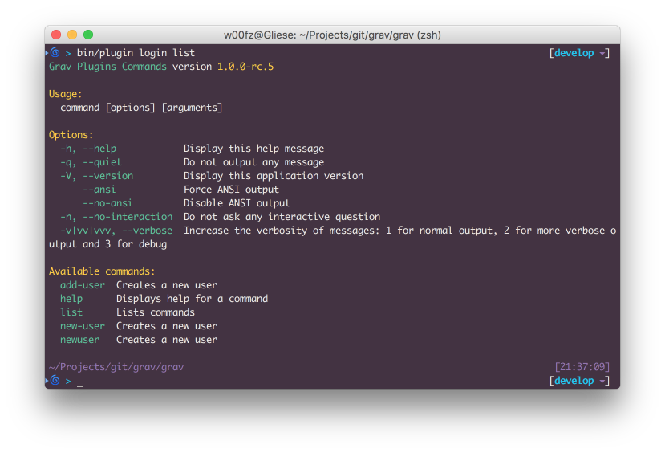
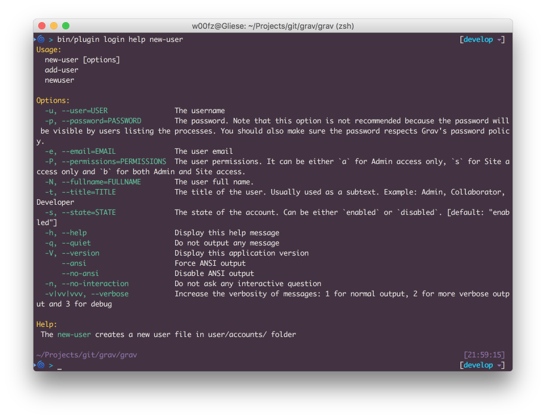
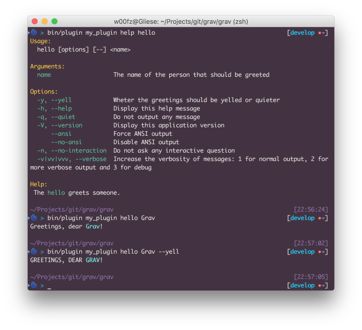

# Команды плагинов

> Список доступных командов для работы с плагинами в Grav CLI.

Плагины могут интегрироваться с CLI Grav `bin/plugin` и расширять функциональные возможности плагина через Терминал, выполняя определенные задачи.

Как объясняется в разделе [Grav CLI](/07.cli-console/02.grav-cli/index), вам нужно использовать **терминал**, чтобы иметь возможность выполнять команды.

При запуске команды `bin/plugin` будут перечислены все плагины, обеспечивающие интеграцию CLI.


Первым параметром, передаваемым в `bin/plugin`, всегда является имя подключаемого модуля (т. е. _error_, _login_ и т. д.). Второй вариант - это фактическая _команда_, которую предоставляет плагин.

В зависимости от реализации плагина могут быть и другие следующие варианты, и вы можете узнать больше о каждом из них, выполнив команду `bin/plugin [slug] list`.

## Зарезервированные команды и параметры

Есть некоторые зарезервированные _commands_ и _options_, которые всегда доступны из любого плагина. Это также особенно важно помнить, если вы разработчик и хотите реализовать свои собственные задачи, потому что вы не сможете использовать какие-либо зарезервированные команды и параметры.


| **Команды**  |                               |
|--------------|-------------------------------|
| `help`       | Отображает справку по команде |
| `list`       | Список команд                 |


| **Параметры**                |                                                                                                               |
|------------------------------|---------------------------------------------------------------------------------------------------------------|
| `-h`, `--help`               | Показать справочное сообщение                                                                                 |
| `-q`, `--quiet`              | Не выводить никаких сообщений                                                                                 |
| `-v`, `--version`            | Показать версию приложения                                                                                    |
| `--ansi`                     | Принудительный вывод ANSI                                                                                     |
| `--no-ansi`                  | Отключить вывод ANSI                                                                                          |
| `-n`, `--no-interaction`     | Не задавайте интерактивных вопросов                                                                           |
| `-v|vv|vvv`, `--verbose`     | Увеличьте уровень детализации сообщений: 1 для обычного вывода, 2 для более подробного вывода и 3 для отладки |


## Как использовать интерфейс командной строки для плагинов

Команды **list** и **help** очень полезны, когда вы ещё не знаете, как использовать интерфейс командной строки определенного плагина.

С помощью **list** вы можете получить доступ ко всем доступным командам и просмотреть краткое описание того, что каждая из них делает.

Вот пример с плагином **login**, когда мы запускаем команду `bin/plugin login list`.

?> Отсутствие указания какой-либо команды после того, как ярлык плагина автоматически переходит в `list`. Это означает, что `bin/plugin [slug] list` и `bin/plugin [slug]` являются эквивалентами.



Как видите, большинство параметров и команд соответствуют [зарезервированному списку](#Зарезервированные-команды-и-параметры). Фактические команды, предлагаемые плагином входа в систему, - это `add-user`, `new-user` и `newuser`.

Как вы можете заметить, описание всех трех команд идентично. Это потому, что по выбору 3 команды абсолютно одинаковы. **add-user** и **newuser** фактически являются псевдонимами для **new-user**, что позволяет легко угадать команду, не зная и не запоминая ее.

Теперь, когда мы знаем, что плагин входа в систему поставляется с командой `new-user`, нам нужно только узнать, как ее использовать. Здесь появляется зарезервированная команда **help**. Запустим `bin/plugin login help new-user`.



Теперь у нас есть полное представление о команде `new-user` и мы знаем, как ее использовать.
Попробуем создать нового пользователя. Поскольку все параметры по определению являются необязательными, мы намеренно опускаем пароль (позже нас спросят об этом).

```bash
bin/plugin login newuser -u joeuser -e joeuser@grav.org -P b -N "Joe User" -t "Site Administrator"
Creating new user

Enter a password: *********
Repeat the password: *********

Success! User joeuser created.
```

## Разработчикам: интеграция интерфейса командной строки в плагин

Как разработчик вы можете захотеть создавать команды интерфейса командной строки для запуска администраторами или пользователями. Добавить такую ​​функциональность в плагин очень просто.

Первое, что вам нужно сделать, это создать подпапку cli/ в корне вашего плагина. Эта папка будет обработана `bin/plugin` и просканирована на предмет классов команд.

CLI Grav основан на замечательном [Symfony Console Component](http://symfony.com/doc/current/components/console/introduction.html), и вы можете в значительной степени следить за их документацией для получения полной справки, есть только несколько важных вещей, которые следует учитывать.

1. Имя файла класса стандартное. Он должен начинаться с заглавной буквы и заканчиваться ** Command.php **.
    * `Hello.php`: НЕПРАВИЛЬНО
    * `helloworldCommand.php`: НЕПРАВИЛЬНО
    * `HelloworldCommand.php`: ВЕРНО
    * `HelloWorldCommand.php`: ВЕРНО
2. Вы всегда должны расширять `ConsoleCommand`, это предложит вам некоторые дополнительные возможности Grav, такие как форматированные цвета, прямой доступ к экземпляру Grav и другим утилитам ([подробнее](https://github.com/getgrav/grav/blob/develop/system/src/Grav/Console/ConsoleTrait.php)).
3. Консоль Symfony требует метода execute. При расширении **ConsoleCommand** это становится `serve`.

Ниже приведен простой пример для начала. Вы можете протестировать его как есть, сохранив его как `HelloCommand.php` и поместив его в корневую папку вашего плагина cli/ (**user/plugins/my_plugin/cli/HelloCommand.php**).

```php
<?php
namespace Grav\Plugin\Console;

use Grav\Console\ConsoleCommand;
use Symfony\Component\Console\Input\InputArgument;
use Symfony\Component\Console\Input\InputOption;

/**
 * Class HelloCommand
 *
 * @package Grav\Plugin\Console
 */
class HelloCommand extends ConsoleCommand
{
    /**
     * @var array
     */
    protected $options = [];

    /**
     * Greets a person with or without yelling
     */
    protected function configure()
    {
        $this
            ->setName("hello")
            ->setDescription("Greets a person.")
            ->addArgument(
                'name',
                InputArgument::REQUIRED,
                'The name of the person that should be greeted'
            )
            ->addOption(
                'yell',
                'y',
                InputOption::VALUE_NONE,
                'Wheter the greetings should be yelled or quieter'
            )
            ->setHelp('The <info>hello</info> greets someone.')
        ;
    }

    /**
     * @return int|null|void
     */
    protected function serve()
    {
        // Collects the arguments and options as defined
        $this->options = [
            'name' => $this->input->getArgument('name'),
            'yell' => $this->input->getOption('yell')
        ];

        // Prepare the strings we want to output and wraps the name into a cyan color
        // More colors available at:
        // https://github.com/getgrav/grav/blob/develop/system/src/Grav/Console/ConsoleTrait.php
        $greetings = 'Greetings, dear <cyan>' . $this->options['name'] . '</cyan>!';

        // If the optional `--yell` or `-y` parameter are passed in, let's convert everything to uppercase
        if ($this->options['yell']) {
            $greetings = strtoupper($greetings);
        }

        // finally we write to the output the greetings
        $this->output->writeln($greetings);
    }
}
```



?> Ещё один хороший простой пример можно найти в плагине [Error (LogCommand.php)](https://github.com/getgrav/grav-plugin-error/blob/develop/cli/LogCommand.php). Если вы ищете пример посложнее — посмотрите плагин [Login (NewUserCommand.php)](https://github.com/getgrav/grav-plugin-login/blob/develop/cli/NewUserCommand.php)
