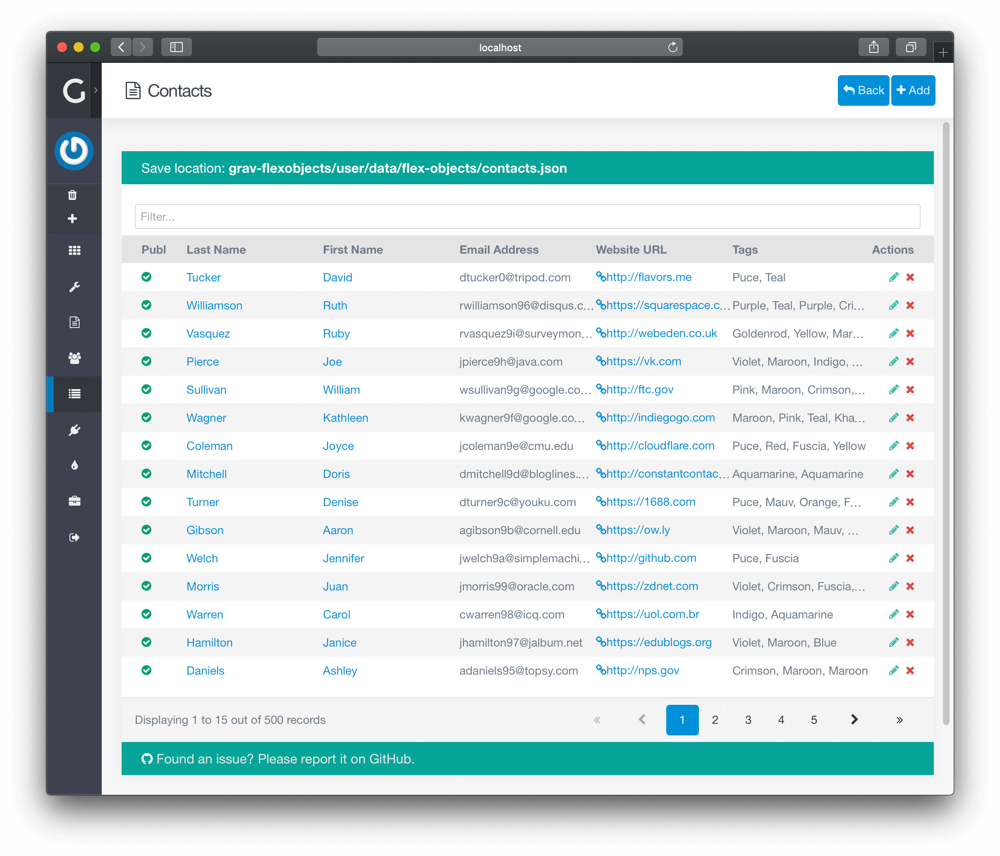

# Список контента

> Знакомство со списком контента в Grav CMS.

**Список контента** обычно содержит разбитый на страницы список вашего контента, но некоторые каталоги, типа **[Страниц](/05.admin-panel/03.page/index)**, могут иметь очень индивидуальный внешний вид.

Здесь вы можете создавать, редактировать и удалять свой контент. На странице также есть мощные инструменты для **Поиска** и **Сортировки** элементов.

## Элементы управления

Вверху страницы вы найдете административные элементы управления. Элементы управления могут отличаться в зависимости от **типа Flex**, но вот список некоторых из наиболее распространенных:

- **Назад**: Вернуться на один уровень вверх, обычно в [**Дашборд**](/05.admin-panel/02.dashboard/index) или **[Список каталогов](/08.advanced/01.flex/01.administration/index?id=Список-каталогов)**
- **Экспорт**: Экспорт содержимого в файл, обычно в CSV
- **Добавить**: Добавить новый элемент содержимого
- [**Настройка**](/08.advanced/01.flex/01.administration/03.configuration/index): Изменить настройки каталога

## Навигация

- **Фильтр**: Ввод текста для поиска
- **Кол-во объектов**: Количество объектов для отображения
- **Порядок**: Щелкните заголовок столбца, чтобы изменить порядок.
- **Пагинация**: Быстро перемещаться по объектам

## Одна строка

- **Столбцы**: Введите определенные столбцы для быстрого обзора объектов
- **Действия**: Действия для одного объекта, обычно: **Предварительный просмотр**, **Изменить**, **Удалить**...

