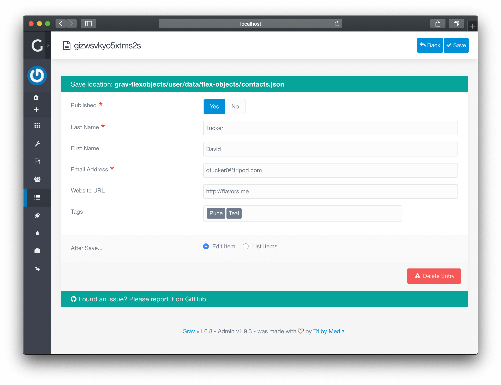

# Редактор контента

> Знакомство с редактором контента в Grav CMS.

**Редактор контента** — мощное представление в **объектах Flex**, которое позволяет создавать и обновлять тип контента.

Редактор может выглядеть по-разному с различными **элементами управления**, **вкладками** и **полями форм**, поскольку все они специфичны для типа каталога, который вы редактируете.

### Элементы управления

В верхней части страницы вы найдете административные элементы управления.

По умолчанию есть три кнопки: **Назад**, **Сохранить** и **Удалить**. Элементы управления могут также включать в себя другие действия, такие как **Предварительный просмотр**, **Экспорт** и т. д...

- **Назад**: Вернуться на страницу **[Список контента](/08.advanced/01.flex/01.administration/01.views-list/index)**
- **Сохранить**: Сохранить объект и вернуться на страницу **[Список контента](/08.advanced/01.flex/01.administration/01.views-list/index)**
- **Удалить**: Удалить объект и вернуться на страницу **[Список контента](/08.advanced/01.flex/01.administration/01.views-list/index)**

### Редактирование формы

Форма обычно организована по **вкладкам** и **разделам**, чтобы облегчить редактирование содержимого.

- [Поля формы](/06.forms/01.blueprints/01.fields-available/index)
- Медиа (изображения и другие файлы)

