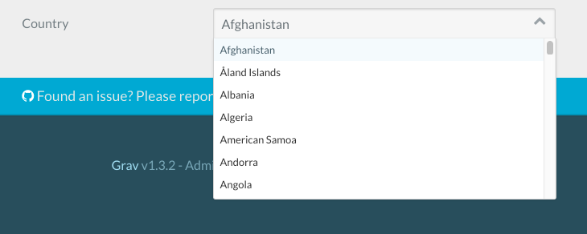

# Рецепты админки

> Инструкция по доработке админки Grav CMS.

Эта страница содержит набор проблем и их решения, связанные с модификациями Grav Admin.

## Добавление пользовательского файла YAML

#### Проблема:

Вы хотите создать для всего сайта группу полей компании, редактируемых пользователем, подобных `system.yaml` или `site.yaml`, но в отдельном файле.

#### Решение:

Как указано в разделе [Основы / Конфигурация](/01.basics/05.grav-configuration/index?id=Другие-параметры-конфигурации-и-файлы), первым шагом является предоставление вашего нового файла данных YAML, например: `user/config/details.yaml`:

```yaml
name: 'ABC Company Limited'
address: '8732 North Cumbria Street, Golden, CO, 80401'
email:
  general: 'hello@abc-company.com'
  support: 'support@abc-company.com'
  sales: 'sales@abc-company.com'
phone:
  default: '555-123-1111'
```

Теперь вам нужно предоставить соответствующий файл схемы для определения формы. Чертеж может быть предоставлен с помощью плагина, но самый простой подход - просто поместить чертеж в файл: `user/blueprints/config/details.yaml`

Если вы хотите предоставить план через плагин, вам сначала нужно добавить этот код в свой плагин сразу после определения класса:

```twig
class MyPlugin extends Plugin
{
    public $features = [
        'blueprints' => 1000,
    ];
    protected $version;
    ...
```

Затем добавьте этот код в свой метод `onPluginsInitialized()`:

```twig
if ($this->isAdmin()) {
    // Store this version and prefer newer method
    if (method_exists($this, 'getBlueprint')) {
        $this->version = $this->getBlueprint()->version;
    } else {
        $this->version = $this->grav['plugins']->get('admin')->blueprints()->version;
    }
}
```

Затем создайте файл с именем `user/plugins/myplugin/blueprints/config/details.yaml`

Фактический файл чертежа должен содержать определение формы, которое соответствует данным конфигурации:

```yaml
title: Company Details
form:
    validation: loose
    fields:

        content:
            type: section
            title: 'Details'
            underline: true
        name:
            type: text
            label: 'Company Name'
            size: medium
            placeholder: 'ACME Corp'

        address:
            type: textarea
            label: 'Address'
            placeholder: '555 Somestreet,\r\nNewville, TX, 77777'
            size: medium

        email:
            type: array
            label: 'Email Addresses'
            placeholder_key: Key
            placeholder_value: Email Address

        phone:
            type: array
            label: 'Phone Numbers'
            placeholder_key: Key
            placeholder_value: Phone Number
```

Использование типа поля `array` позволит вам добавлять произвольные поля электронной почты и телефона по мере необходимости.

## Добавление модального окна для создания пользовательской страницы

#### Проблема:

Вы хотите предоставить простой способ создания нового сообщения в блоге или страницы изображений галереи. Для этого примера мы рассмотрим сообщение в блоге. Предположим, вы хотите создать блог и легко создать сообщение в нужной папке, нажав кнопку.

#### Решение:

Прежде всего, создайте форму для нашего модального окна. Создайте новый файл: `user/blueprints/admin/pages/new_post.yaml`.

```twig
form:
  validation: loose
  fields:
    section:
        type: section
        title: Add Post

    title:
      type: text
      label: Post Title
      validate:
        required: true

    folder:
      type: hidden
      default: '@slugify-title'

    route:
      type: hidden
      default: /posts

    name:
      type: hidden
      default: 'post'

    visible:
      type: hidden
      default: ''

    blueprint:
      type: blueprint
```

Эта форма имитирует модальную форму по умолчанию `Add Page`. Как видите, для **папки** у нас есть специальное значение: `@slugify-title`. Это означает, что **папка** будет по умолчанию использовать сокращенную версию ввода формы **title**. **route** - это `/posts`, поэтому он будет помещен в папку `/posts`.

**name** это `post`, поэтому он будет использовать схему страницы `post`.

Второй шаг - отредактировать конфигурацию плагина админки. Чтобы добавить собственный код в файл конфигурации `admin.yaml` плагина админки, создайте файл `user/config/plugins/admin.yaml` и добавьте этот фрагмент:

```twig
add_modals:
  -
    label: Add Post
    blueprint: admin/pages/new_post
    show_in: bar
```

Ключи/значения конфигурации, доступные для `add_modals`:

- `label` - текст, который будет отображаться на кнопке
- `show_in` (по умолчанию: bar) (значения: bar|dropdown) - показывать ли кнопку на **bar** или **dropdown**
- `blueprint` - чертеж, используемый шаблоном
- `template` - шаблон, используемый модальным (по умолчанию: partials/blueprints-new.html.twig)
- `with` - данные, которые передаются в шаблон
- `link_classes` - классы для добавления к элементу ссылки
- `modal_classes` - классы для добавления к модальному элементу

## Добавление настраиваемого поля выбора

#### Проблема:

Вы хотите добавить поле выбора с большим списком значений. В этом примере мы предположим, что вы хотите отобразить список стран.

#### Решение:

Вы можете создать статическую функцию и вызвать массив из вашего чертежа. Вы можете закодировать эту функцию либо в php-файле вашей темы, либо в настраиваемом плагине.

В этом примере мы добавим функцию к теме Antimatter, таким образом мы отредактируем файл `antimatter.php`, который находится в папке `user/themes/antimatter`.

```php
<?php
namespace Grav\Theme;

use Grav\Common\Theme;

class Antimatter extends Theme
{
    public static function countryCodes()
    {
        return array (
            'AF' => 'Afghanistan',
            'AX' => 'Åland Islands',
            'AL' => 'Albania',
            'DZ' => 'Algeria',
            'AS' => 'American Samoa',
            'AD' => 'Andorra',
            'AO' => 'Angola',
            'AI' => 'Anguilla',
            'AQ' => 'Antarctica',
            'AG' => 'Antigua & Barbuda',
            'AR' => 'Argentina',
            'AM' => 'Armenia',
            'AW' => 'Aruba',
            'AC' => 'Ascension Island',
            'AU' => 'Australia',
            'AT' => 'Austria',
            'AZ' => 'Azerbaijan',
            'BS' => 'Bahamas',
            'BH' => 'Bahrain',
            'BD' => 'Bangladesh',
            'BB' => 'Barbados',
            'BY' => 'Belarus',
            'BE' => 'Belgium',
            'BZ' => 'Belize',
            'BJ' => 'Benin',
            'BM' => 'Bermuda',
            'BT' => 'Bhutan',
        );
    }
}
```


?> Это урезанный список для удобства просмотра, но вы можете скопировать/вставить полный список стран из [<i class="fa fa-github"></i>umpirsky/count-list](https://github.com/umpirsky/country-list/blob/master/data/en_US/country.php)

Затем мы вызываем функцию из чертежа или определения формы внешнего интерфейса следующим образом:

```yaml
country:
  type: select
  label: Country
  data-options@: '\Grav\Theme\Antimatter::countryCodes'
```

Вот как это будет выглядеть в админке


