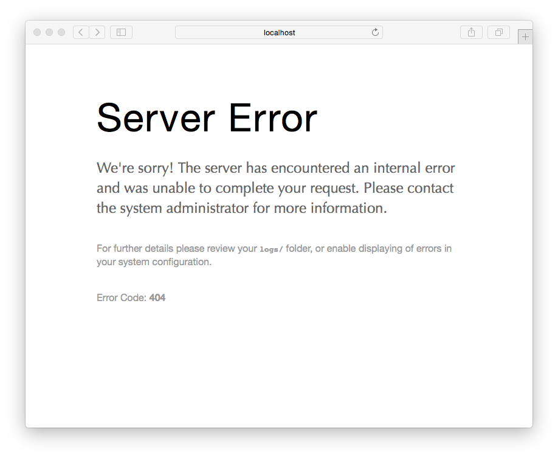

# Ошибка сервера

> Описание ошибки сервера в Grav CMS. Причины возникновения.



Ошибки сервера почти всегда вызваны неправильной конфигурацией Grav. Случилось что-то неожиданное, и из-за этого CMS не может восстановиться и обслуживать страницу.

Когда вы видите это сообщение, это означает, что ваш сервер работает в режиме `Production`, чтобы скрыть потенциально конфиденциальную информацию от отображения вашим пользователям.  Сама ошибка будет сохранена в файле `logs/grav.log`.  Пожалуйста, изучите этот файл, чтобы определить точный характер ошибки.

Возможные причины включают в себя:

* Ошибки сервера вызваны устаревшей конфигурацией
* Неправильные права доступа к файлам, которые не позволяют Grav записывать данные
* Изменения в файловой системе, о которых Grav ещё не знает
* Ошибки при разборе конфигурации из-за неверно отформатированных конфигурационных файлов


!> Если у вас установлен плагин **Grav Administration**, вы можете просмотреть ошибки сервера оттуда. Щелкнув по отдельным ошибкам, вы можете увидеть страницы отладки, даже если отладчик был выключен.

## Устаревшая конфигурация

Первое, что вы должны сделать, это очистить кэш, чтобы убедиться, что конфигурация обновлена:

```bash
bin/grav clear-cache
```

> Прежде чем двигаться дальше, убедитесь, что у вас нет других проблем с разрешениями файлов, подобных этой.

## Проблемы с установкой и настройкой

- системное требование
- файловое разрешение
- проблемы с установкой
- проблемы конфигурации
