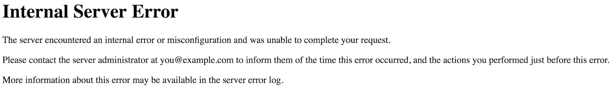

### .htaccess

> Использование файла .htaccess для работы Grav CMS.

Grav поставляется в комплекте с собственным файлом `.htaccess`. Этот файл позволяет Grav работать должным образом и должен храниться в его корневой папке. Вы можете столкнуться с проблемами, которые можно решить с помощью файла `.htaccess`.

Apache — одно из самых популярных серверных решений, доступных сегодня. Это бесплатно и широко доступно практически везде. К сожалению, Apache несовершенен, и иногда файл `.htaccess` может вызвать у вас головную боль. Не волнуйтесь, это почти всегда поправимо.

## Как редактировать .htaccess в Windows и macOS

Файл .htaccess является скрытым, что означает, что по умолчанию пользователи macOS и Windows не смогут увидеть этот файл в диспетчере файлов (Finder), если они не включат просмотр скрытых файлов.

В **macOS**:

1. Откройте **Terminal**.
2. Введите команду `defaults write com.apple.finder AppleShowAllFiles YES` и нажмите **return**.
3. Введите команду `killall Finder` и нажмите **return**.

Теперь вы должны увидеть файл `.htaccess` в корневом каталоге распакованной папки Grav. Вы можете вернуть свои настройки в исходное скрытое состояние, повторив процесс и введя `NO` в конце шага 2 вместо `YES`.

В **Windows 10**:

1. Откройте **Проводник**.
2. Выберите вкладку **Вид**.
3. Установите флажок **Скрытые элементы**.

Если снять этот флажок, эти скрытые файлы будут снова скрыты, а **Проводник** вернется в состояние по умолчанию.

## Тестирование .htaccess

Допустим, вы заходите в свой браузер, переходите на свой новый сайт Grav и ... его там нет! Большое жирное сообщение с надписью `Not Found` - это место, где должен быть ваш красивый сайт Grav. Это не забавная проблема, но решение может быть таким же простым, как настройка вашего файла `.htaccess`.

Первым шагом в устранении проблем с файлом `.htaccess` должно быть обеспечение того, чтобы файл действительно был получен и использован сервером. Убедитесь, что файл находится в корневом каталоге вашего сайта Grav, где он должен быть, и что он правильно назван `.htaccess` с начальной точкой (`.`).

Если файл есть, ваш следующий шаг - протестировать его и убедиться, что ваш сервер его обнаруживает. Это простой процесс, который включает добавление одной строки в начало файла.

Для проверки откройте файл `.htaccess` в текстовом редакторе. Затем вам нужно создать новую первую строку и поместить текст `Test` и сохранить.



Эта ошибка сама по себе не решает вашу проблему, но позволяет узнать, что файл `.htaccess` в корневом каталоге вашего сайта Grav - это тот файл, который анализирует ваш сервер.

Если вы не получаете эту ошибку, убедитесь, что файл находится в корневом каталоге вашего сайта. Это должен быть файл, включенный в исходную установку Grav. Это одна из причин, по которой мы рекомендуем распаковать заархивированный каталог Grav и переместить этот каталог в то место, где вы хотите разместить свой сайт на вашем сервере, вместо того, чтобы копировать файлы и вставлять их. Это гарантирует, что все файлы и структура каталогов остаются неизменными, что позволяет избежать подобных проблем.

## Устранение неполадок с поврежденным .htaccess

Если ничего не изменилось при редактировании файла .htaccess, возможно, вам нужно убедиться, что включен `.htaccess`. В противном случае ваш сервер даже не будет его искать.

Вот что вы можете сделать:

Найдите и откройте файл `httpd.conf` или `apache.conf` в текстовом редакторе. В Windows это, вероятно, будет Блокнот или текстовый редактор, предназначенный для разработки. Текстовые редакторы могут добавлять ненужную информацию, что может усугубить проблему.

Затем вы захотите найти в файле область `Directory`. Должен быть такой блок текста:

```text
    #
    # AllowOverride controls what directives may be placed in .htaccess files.
    # It can be "All", "None", or any combination of the keywords:
    #   Options FileInfo AuthConfig Limit
    #
    AllowOverride All
```

Если для `AllowOverride` установлено значение `None` или любое другое значение, кроме `All`, вам нужно будет изменить его на `All` и сохранить. Это изменение потребует перезагрузки вашего сервера Apache для регистрации.

Как только вы это сделаете, дайте своему сайту ещё один тест.

Мы также включили руководства по устранению неполадок, которые помогут вам, если вы столкнетесь с внутренней ошибкой сервера [404](/11.troubleshooting/01.page-not-found/index) или [500](/11.troubleshooting/03.internal-server-error/index) во время работы с Grav.
