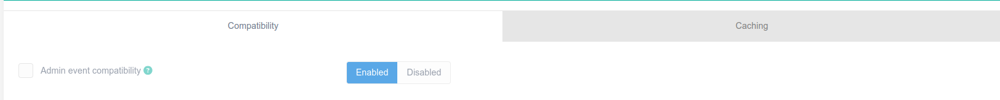
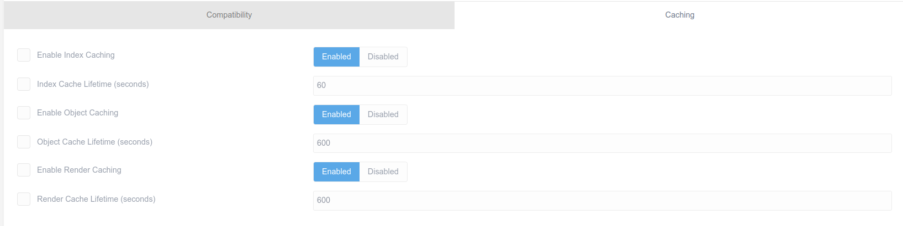

# Настройка

| Параметр                                 | Описание                                                                                 |
| :--------------------------------------- | :--------------------------------------------------------------------------------------- |
| **Совместимость событий администратора** | Включает события `onAdminSave` и `onAdminSaveAfter` для плагинов. Включено по умолчанию. |

Дополнительные сведения см. в разделе [Объекты Flex](/advanced/flex).

| Параметр                                     | Описание                                                                                     |
| :------------------------------------------- | :------------------------------------------------------------------------------------------- |
| **Включить кэширование индекса**             | Кэширование индекса ускоряет поиск за счёт создания временных индексов поиска для запросов.  |
| **Срок службы кэша индекса (в секундах)**    | Время жизни для кэширования индекса в секундах.                                              |
| **Включить кэширование объектов**            | Кэширование объектов ускоряет загрузку данных и изображений объекта..                        |
| **Срок службы кэша объектов (в секундах)**   | Время жизни для кеширования объектов в секундах.                                             |
| **Включить кэширование рендеринга**          | Кэширование рендеринга ускоряет отрисовку контента за счёт кэширования результирующего HTML. |
| **Время жизни кэша рендеринга (в секундах)** | Срок службы кэширования рендеринга в секундах.                                               |

Если визуализируемый HTML-код содержит динамическое содержимое, кэш рендеринга можно отключить из шаблона Twig с помощью ``.
