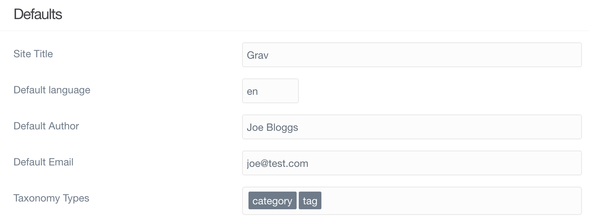
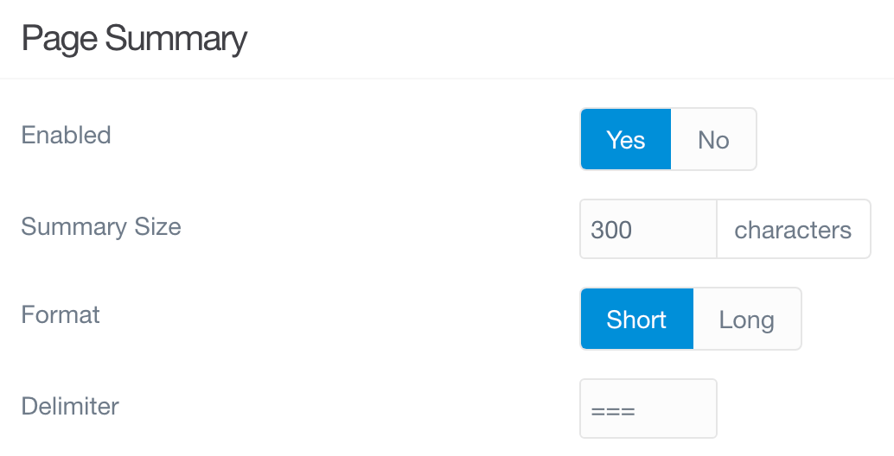

# Настройка (сайт)

Страница **Настройка** дает вам доступ к настройкам конфигурации **Система** и **Сайт** вашего сайта. Кроме того, вы можете просмотреть разбивку свойств вашего сервера по ряду областей, включая PHP, SQL, серверную среду и другие различные компоненты, которые определяют работу вашего сайта.

!!! warning ""

    Конфигурация требует уровня доступа `access.admin.super` или `access.admin.configuration` и `access.admin.configuration_site`.

Вкладка **Сайт** позволяет вам настроить параметры, найденные в файле `/user/config/site.yaml`. Эта вкладка дает вам доступ к параметрам и полям, которые определяют связанные с сайтом переменные, такие как имя, автор по умолчанию и метаданные, используемые на вашем сайте.

Ниже приводится разбивка различных разделов конфигурации, которые отображаются на вкладке **Сайт**.

### Значения по умолчанию

В этом разделе вы устанавливаете значения по умолчанию для основных параметров сайта.

| Параметр                | Описание                                                                                   |
| :-----                  | :-----                                                                                     |
| **Заголовок сайта**     | Заголовок по умолчанию для вашего сайта, часто используемый темами.                        |
| **Автор по умолчанию**  | Имя автора по умолчанию, часто используется в темах или содержимом страницы.               |
| **Имейл по умолчанию**  | Электронная почта по умолчанию для ссылки в темах или на страницах.                        |
| **Типы таксономии**     | Типы таксономии должны быть определены здесь, если вы хотите использовать их на страницах. |

### Тизер

Тизер - отличный способ сделать небольшой предварительный просмотр содержимого страницы. Вы можете использовать разделитель на странице, чтобы установить точку отсечения между итоговым содержанием и всем основным содержанием страницы. Эти настройки дают вам возможность

| Параметр           | Описание                                                                                                                                         |
| :-----             | :-----                                                                                                                                           |
| **Включено**       | Включить сводку страницы (сводка будет такой же, как и содержимое страницы)                                                                      |
| **Размер тизера**  | Количество символов на странице для использования в качестве сводки содержания.                                                                  |
| **Формат**         | **short** = использовать первое вхождение разделителя или размера; **long** = разделитель тизера игнорируется                                    |
| **Разделитель**    | Разделитель сводки (по умолчанию '==='). Обычно вы размещаете это после вступительного абзаца, а все, что до него, появляется в сводке страницы. |

### Метаданные

Метаданные - важная часть закулисного оформления страницы. Он может улучшить SEO, то, как ваши ссылки будут отображаться в различных поисковых системах и социальных сетях, и многое другое. Здесь вы можете установить различные свойства метаданных.

| Параметр       | Описание                                                                                                    |
| :-----         | :-----                                                                                                      |
| **Метаданные** | Значения метаданных по умолчанию, которые будут отображаться на каждой странице, если страница не отменена. |

### Перенаправления и маршруты

Перенаправления и маршрутизация никогда не были такими простыми. Просто настройте все это в этом разделе, и все готово.

| Параметр                             | Описание                                                                     |
| :-----                               | :-----                                                                       |
| **Пользовательские перенаправления** | Пути перенаправления на другие страницы. Допустима стандартная замена Regex. |
| **Пользовательская маршрутизация**   | Пути к псевдонимам других страниц. Допустима стандартная замена Regex.       |

