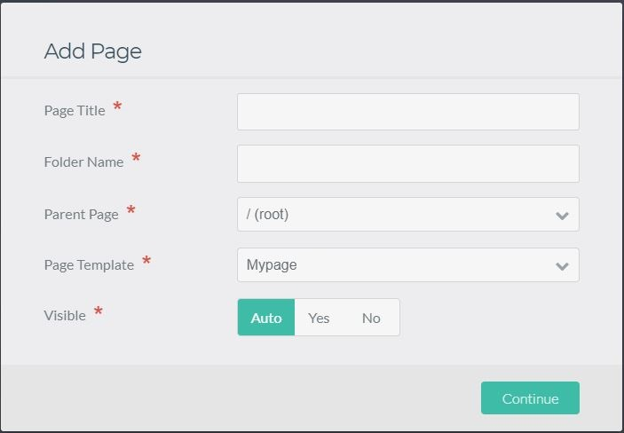

# Расширение админки

На этой странице представлены инструкции по расширению панели админки, а также примеры расширений.

### Понимание тем админки

Как и при расширении или изменении обычной темы Grav, вы будете переопределять шаблоны, чтобы изменить структуру и внешний вид подключаемого модуля админки. Это означает, что шаблоны, которые ваш плагин объявляет для использования вместо шаблонов по умолчанию, должны точно отражать структуру темы админки. Например, если мы хотим изменить аватар в левой части навигации, мы должны изменить `nav-user-avatar.html.twig`.

В подключаемом модуле админки путь к шаблонам следующий: `user/plugins/admin/themes/grav/templates`, в дальнейшем именуемый *ADMIN_TEMPLATES*. Файл, который мы ищем, это `ADMIN_TEMPLATES/partials/nav-user-avatar.html.twig`, который содержит ``.

В вашем плагине путь к шаблонам должен быть: `user/plugins/myadminplugin/admin/themes/grav/templates`, в дальнейшем именуемый *PLUGIN_TEMPLATES*. Соответствующий файл должен быть `PLUGIN_TEMPLATES/partials/nav-user-avatar.html.twig`, который будет содержать что-то вроде ``.

Таким образом, мы переопределяем путь к шаблону, но без разрушения. Мы нацелены только на соответствующий шаблон таким образом, чтобы не переопределять ненужные шаблоны и не мешать другим темам администратора регистрировать свои альтернативные шаблоны для того же использования. Для этого прописываем путь в нашем плагине вот так:

```php
<?php

public static function getSubscribedEvents()
{
    return [
        'onAdminTwigTemplatePaths' => ['onAdminTwigTemplatePaths', 0]
    ];
}

public function onAdminTwigTemplatePaths($event)
{
    $paths = $event['paths'];
    $paths[] = __DIR__ . '/admin/themes/grav/templates';
    $event['paths'] = $paths;
}
```

Важно помнить, что тема, используемая в плагине админки, чувствительна к доступным шаблонам. Как правило, вам следует изменять шаблоны только со *слабым воздействием*, то есть вносить изменения, которые не нарушат интерфейс для любого пользователя, устанавливающего ваш плагин. В этом смысле лучше переопределить `nav-user-avatar.html.twig`, чем `nav.html.twig`, поскольку последний содержит гораздо больше функций, но использует ``, чтобы включить первый.

!!! tip ""

    В файлах шаблонов админки включено автоматическое экранирование. Вам не нужно добавлять фильтр `|e` для экранирования HTML-содержимого, но требуется добавлять `|raw` при вводе HTML.

### Добавление пользовательского поля

Чтобы создать пользовательское поле, мы добавим его в `PLUGIN_TEMPLATES/forms/fields/myfield`. В папке *myfield* нам нужен шаблон Twig, который объявляет, как будет работать поле. Самый простой способ добавить поле — найти аналогичное поле в `ADMIN_TEMPLATES/forms/fields` и скопировать его, чтобы увидеть, как они структурированы. Например, чтобы добавить слайдер диапазона HTML, мы создаем `PLUGIN_TEMPLATES/forms/fields/range/range.html.twig`. В этом файле мы добавляем:

```twig



    type="range"
    min="{{ field.validate.min }}"
    max="{{ field.validate.max }}"
    step="{{ field.validate.step }}"
    {{ parent() }}

```

Это добавляет тип поля под названием «диапазон» с типом *диапазон*, который позволяет пользователю выбирать значение, сдвигая кнопку. Чтобы использовать новое поле в чертеже, мы просто добавим его в [*blueprints.yaml*](/plugins/plugin-tutorial/#neobkhodimye-elementy-dlia-raboty):

```yaml
form:
  fields:
    radius:
      type: range
      label: Radius
      id: radius
      default: 100
      validate:
        min: 0
        max: 100
        step: 10
```

Это дает нам ползунок со значением по умолчанию 100, где допустимые значения находятся в диапазоне от 0 до 100, и каждое значение увеличивается на 10, когда мы его перемещаем.

Мы могли бы расширить это, используя доступные блоки `prepend` или` append`, например, добавив визуальный индикатор выбранного значения. Мы изменяем `range.html.twig`, чтобы он содержал следующее:

```twig



    type="range"
    style="display: inline-block;vertical-align: middle;"
    
        oninput="{{ field.id|e }}_output.value = {{ field.id|e }}.value"
    
    min="{{ field.validate.min }}"
    max="{{ field.validate.max }}"
    step="{{ field.validate.step }}"
    {{ parent() }}


  
    <output
        name="{{ (scope ~ field.name)|fieldName }}"
        id="{{ field.id|e }}_output"
        style="display: inline-block;vertical-align: baseline;padding: 0 0.5em 5px 0.5em;"
    >
    {{ value|join(', ')|e('html_attr') }}
    </output>
  

```

Таким образом, мы добавляем тег `<output>`, который будет содержать выбранное значение, и добавляем к нему и самому полю простой стиль для их правильного выравнивания. Мы также добавляем в поле атрибут `oninput`, чтобы при изменении значений автоматически обновлялся тег `<output>` со значением. Для этого требуется, чтобы каждое поле, использующее ползунок диапазона, имело уникальное свойство `id`, например, `id: radius`, которое мы объявили выше, которое должно быть чем-то вроде `id: myadminplugin_radius`, чтобы избежать конфликтов.

!!Если этот новый шаблон будет доступен для фронтенда и панели админки (например, при использовании папки `PLUGIN_TEMPLATES`), вам нужно экранировать все переменные с помощью `|e`. В качестве альтернативы вы можете просто перейти к параметру `Настройка` > `Система` > `Шаблонизация Twig` > `Экранирование переменных` и включить его.

### Создание пользовательских шаблонов страниц

Как упоминалось в [Основах тем](/themes/theme-basics/#stranitsy-kontenta-i-shablony-twig), существует прямая связь между **страницами** в Grav и **файлами шаблонов Twig**, предоставленными в плагине/теме.
Чтобы создать настраиваемый шаблон страницы, вам понадобится файл чертежа для определения полей для плагина админки и файл шаблона для визуализации содержимого.

#### Добавление пользовательского шаблона страниц в тему/плагин
В корне папки темы или плагина создайте папку с именем `templates`. Внутри этой папки создайте новый файл `mypage.html.twig`. Это будет шаблон Twig для нового шаблона страницы «mypage».

Пример mypage.html.twig:

```twig



    {{ page.header.newTextField }}
    {{ page.content}}

```

Дополнительную информацию о темах Twig можно найти в разделе [Twig Primer](/themes/twig-primer).

Темы автоматически находят файлы шаблонов в папке `templates` темы. Если шаблон добавляется через плагин, вам нужно добавить шаблон через событие`onTwigTemplatePaths`:

```php
<?php

public function onPluginsInitialized()
{
    // If in an Admin page.
    if ($this->isAdmin()) {
        return;
    }
    // If not in an Admin page.
    $this->enable([
        'onTwigTemplatePaths' => ['onTwigTemplatePaths', 1],
    ]);
}

/**
 * Add templates directory to twig lookup paths.
 */
public function onTwigTemplatePaths()
{
    $this->grav['twig']->twig_paths[] = __DIR__ . '/templates';
}
```


#### Добавление пользовательского чертежа страницы в тему/плагин

Чтобы плагин админки предоставил новую опцию страницы `mypage`, создайте папку с именем` blueprints` в корне темы/плагина. Внутри этой папки создайте новый файл `mypage.yaml`. Здесь вы определите настраиваемые поля для плагина админки, которые будут отображаться при создании новой страницы. Доступные поля формы можно найти в главе [Формы](/forms).

Пример чертежа `mypage.yaml` ниже расширяет шаблон страницы по умолчанию, а затем добавляет `header.newTextField` под вкладкой содержимого:

```yaml
title: My Page Blueprint
'@extends':
    type: default
    context: blueprints://pages

form:
  fields:
    tabs:
      type: tabs
      active: 1
      fields:
        content:
          type: tab
          fields:
             header.newTextField:
              type: text
              label: 'New Text Field'

```

Подобно папке `templates`, тема автоматически добавит все yaml-файлы чертежей, найденные в папке `blueprints`. Если чертеж добавляется через плагин, вам нужно добавить чертеж через событие `onGetPageTemplates`:

```php
<?php

public function onPluginsInitialized()
{
    // If in an Admin page.
    if ($this->isAdmin()) {
        $this->enable([
            'onGetPageBlueprints' => ['onGetPageBlueprints', 0],
            'onGetPageTemplates' => ['onGetPageTemplates', 0],
        ]);
        return;
    }

/**
    * Add blueprint directory.
    */
public function onGetPageBlueprints(Event $event)
{
    $types = $event->types;
    $types->scanBlueprints('plugin://' . $this->name . '/blueprints');
}

/**
    * Add templates directory.
    */
public function onGetPageTemplates(Event $event)
{
    $types = $event->types;
    $types->scanTemplates('plugin://' . $this->name . '/templates');
}
```

#### Создание новой страницы

После определения файлов чертежей и шаблонов создайте новую страницу в панели админки, нажав **Добавить** и выбрав «Моя страница»:


В форме редактирования админки теперь отображается новое настраиваемое поле «Новое текстовое поле»:

