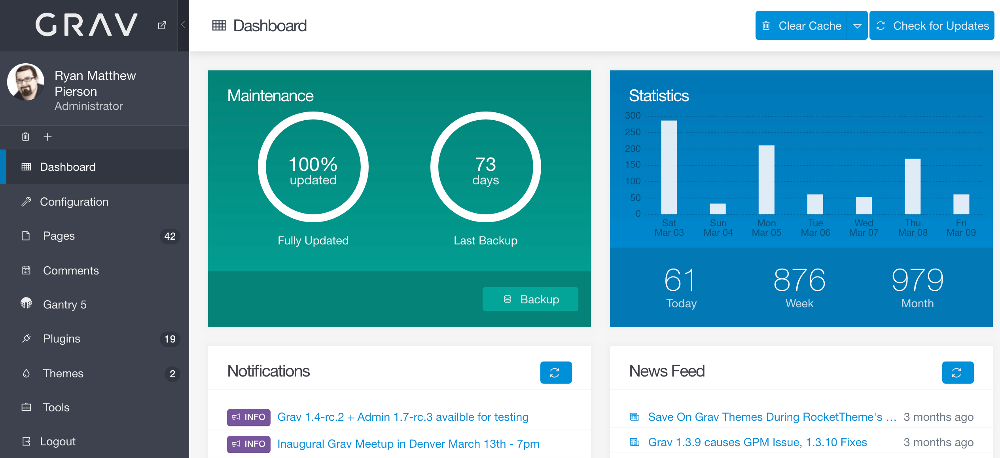

# Введение

Плагин **административной панели** для [Grav](https://github.com/getgrav/grav) представляет собой веб-интерфейс (графический пользовательский интерфейс), который обеспечивает удобный способ настройки Grav и легкого создания и изменения страниц. Это останется полностью необязательным плагином, который никоим образом не требуется и не нужен для эффективного использования Grav. Фактически, интерфейс админки предоставляет намеренно ограниченный вид, чтобы он оставался простым в использовании и не перегружал. Опытные пользователи по-прежнему предпочтут работать напрямую с файлами конфигурации.



### Особенности

* Логин пользователя с автоматическим хешированием пароля
* Функция забытого пароля
* Управление зарегистрированным пользователем
* Обновление ядра Grav в один клик
* Панель инструментов со статусом обслуживания, активностью сайта и последними обновлениями страниц
* Возможность резервного копирования на базе Ajax
* Возможность очистки кэша на основе Ajax
* Управление конфигурацией системы
* Управление конфигурацией сайта
* Нормальный и экспертный режимы, которые позволяют редактировать через формы или YAML
* Листинг страниц с фильтрацией и поиском
* Создание, редактирование, перемещение, копирование и удаление страниц
* Мощный редактор кода с подсветкой синтаксиса с мгновенным предварительным просмотром на основе Grav
* Функции редактора, горячие клавиши, панель инструментов и полноэкранный режим без отвлекающих факторов
* Загрузка медиафайлов страниц с помощью перетаскивания, включая размещение в редакторе методом перетаскивания
* Обновление тем и плагинов в один клик
* Менеджер плагинов, который позволяет перечислять и настраивать установленные плагины
* Менеджер тем, который позволяет перечислять и настраивать установленные темы
* Установка новых плагинов и тем с помощью GPM
* ACL для доступа администраторов к функциям

### Поддержка

Панель администратора - это довольно амбициозный плагин с множеством функций, который даст вам большую мощность и гибкость при создании ваших сайтов Grav. Поэтому, если у вас есть какие-либо вопросы, проблемы, предложения или вы обнаружите в нем одну из этих редких ошибок, воспользуйтесь одним из следующих способов получить от нас поддержку.

Для **живого чата** используйте [Discord Chat Server](https://chat.getgrav.org) для обсуждений, связанных с плагином админки.

Для **ошибок, функций, улучшений** [создайте issue в репозитории GitHub](https://github.com/getgrav/grav-plugin-admin).

### Установка

Сначала убедитесь, что у вас установлена ​​последняя версия Grav **{{grav_version}} или более поздняя**. Это необходимо для правильной работы плагина админки. Проверьте наличие новых версий Grav и обновитесь до них (`-f` принудительно обновляет индекс GPM):

```bash
bin/gpm version -f
bin/gpm selfupgrade
```

плагину админки на самом деле требуется помощь 3 других плагинов, поэтому для того, чтобы плагин **Admin** работал, вам сначала нужно установить плагины **login**, **forms** и **email**. Они доступны через GPM, и поскольку у плагина есть зависимости, вам просто нужно продолжить и установить плагин админки и согласиться, когда будет предложено установить другие:

```bash
bin/gpm install admin
```

Вы также можете [установить плагин вручную](../faq/#ruchnaia-ustanovka-adminki), если не можете использовать GPM в своей системе.

### Создание пользователя

В последней версии админки вам будет предложено создать учетную запись администратора, когда вы укажете в браузере свой сайт. Вы должны выполнить этот шаг, чтобы сразу убедиться, что действующий пользователь-администратор находится под вашим контролем.


Просто заполните форму и нажмите кнопку `Создать пользователя`.

Информация о пользователе хранится в папке `user/accounts/` вашей установки Grav. Вы можете редактировать значения вручную или через сам плагин админки. Вы также можете создавать новых пользователей вручную или с помощью CLI-команды `bin/plugin login newuser`. Более подробная информация содержится в [FAQ для администраторов](../faq/#dobavlenie-i-upravlenie-polzovateliami).

### Сложность имени пользователя и пароля

Шаблоны регулярных выражений для имен пользователей и паролей определены в `system/config/system.yaml`.

Шаблон по умолчанию для пользователей (`system.username_regex`) состоит только из символов нижнего регистра, цифр, дефисов и подчеркиваний. Имена пользователей должны содержать от 3 до 16 символов.

Шаблон по умолчанию для паролей (`system.pwd_regex`) состоит как минимум из восьми (8) символов, включая как минимум одну цифру, одну заглавную и одну строчную букву.

### Использование

По умолчанию вы можете получить доступ к администратору, указав в своем браузере на `http://yoursite.com/admin`. Вы можете просто войти в систему, используя `имя_пользователя` и `пароль`, заданные в YAML-файле, который вы настроили ранее.

!!! warning ""

    После входа в систему ваш **открытый текстовый пароль** будет удален и заменен **зашифрованным**.
