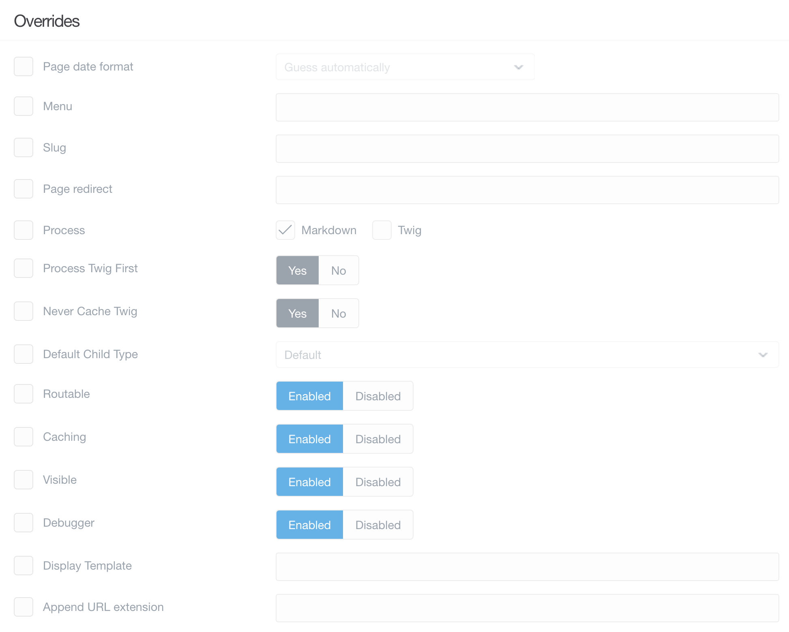
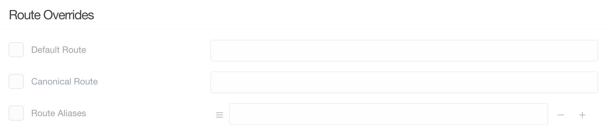

# Редактор (экспертный)

**Редактор страниц** в админке — мощный текстовый редактор и менеджер страниц, который позволяет вам создавать контент вашей страницы (включая медиафайлы), его параметры публикации и таксономии, настройки, переопределения и параметры для конкретной темы.

По сути, это универсальный инструмент для управления определенной страницей.

На этой странице мы рассмотрим функции и возможности вкладки **Дополнительно** в **Редакторе страницы**.

!!! warning ""

    Для доступа к функциям страницы требуется уровень доступа `access.admin.super` или `access.admin.pages.list`. См. [Учётные записи](/admin-panel/accounts/users) и [Группы пользователей](/admin-panel/accounts/groups)

!!! info ""

    Вы можете заметить флажки слева от некоторых параметров в этой области администратора. Эти поля указывают на то, что вы хотите изменить значения по умолчанию для этой страницы. Если их не отмечать, возвращается к пустому состоянию или состоянию по умолчанию.

### Настройки

В области **Настройки** рассматриваются различные важные параметры вашей страницы. Здесь вы можете изменить имя папки, в которой хранится страница, её родительский элемент и шаблон, используемый при отображении страницы.

| Параметр         | Описание                                                                                                                                                            |
| :-----           | :-----                                                                                                                                                              |
| Числовой префикс | Числовой префикс, который обеспечивает настраиваемый порядок страниц и подразумевает видимость.                                                                     |
| Имя папки        | Задает имя папки, в которой содержится страница.                                                                                                                    |
| Родитель         | Устанавливает родителя текущей страницы. Это может быть - Корневая - для страниц верхнего уровня или определённые страницы, чтобы они отображались как подстраницы. |
| Шаблон страницы  | Устанавливает шаблон (предоставленный темой) для применения к странице. Это напрямую влияет на внешний вид страницы.                                                |
| Класс страницы   | Классы, введенные в это поле, применяются к основной части страницы.                                                                                                |

### Порядок

Раздел **Порядок** дает вам возможность настроить порядок страниц ненумерованных папок.

| Параметр             | Описание                                                                       |
| :-----               | :-----                                                                         |
| Сортируемые страницы | Позволяет настроить порядок страницы.                                          |

### Переопределения

Переопределения - это те параметры, которые наделяют вашу страницу дополнительной функциональностью, устанавливают для ее заголовка значение, отличное от значения по умолчанию, на основе имени папки, настроек кэширования, видимости навигации и делают страницу недоступной по прямому URL-адресу.

Вы также можете использовать эту область для включения и выключения различных процессов для страницы, таких как Twig, который позволяет вам вставлять Twig в содержимое вашей страницы и выполнять его рендеринг.

| Параметр           | Описание                                                                                                                                |
| :-----             | :-----                                                                                                                                  |
| Меню               | Строка, которая будет использоваться в меню. Если не установлен, будет использоваться **Заголовок**.                                    |
| Псевдоним          | Позволяет вам специально установить часть URL-адреса страницы.                                                                          |
| Обработка          | Процессы, которые вы хотели бы запустить и сделать доступными в содержимом страницы.                                                    |
| Шаблон отображения | Устанавливает тип страницы по умолчанию для дочерних страниц.                                                                           |
| Маршрутизируемая   | Устанавливает, доступна ли эта страница по URL-адресу. Если этот параметр отключен, страница не будет доступна для внешнего интерфейса. |
| Кэширование        | Включает или отключает кэширование для страницы.                                                                                        |
| Видимая            | Определяет, отображается ли страница в навигации.                                                                                       |

### Переадресация маршрута

| Параметр             | Описание                                                                             |
| :-----               | :-----                                                                               |
| Маршрут по умолчанию | Введите новый маршрут по умолчанию.                                                  |
| Канонический маршрут | Введите новое значение, которое будет использоваться для канонической маршрутизации. |
| севдонимы маршрута   | Создайте псевдонимы маршрута.                                                        |

### Специальные переопределения

| Параметр                             | Описание                                                                                                  |
| :-----                               | :-----                                                                                                    |
| Порядок отображения дочерних страниц | Установите порядок отображения дочерних элементов. Вы можете выбрать имя папки или определение коллекции. |
