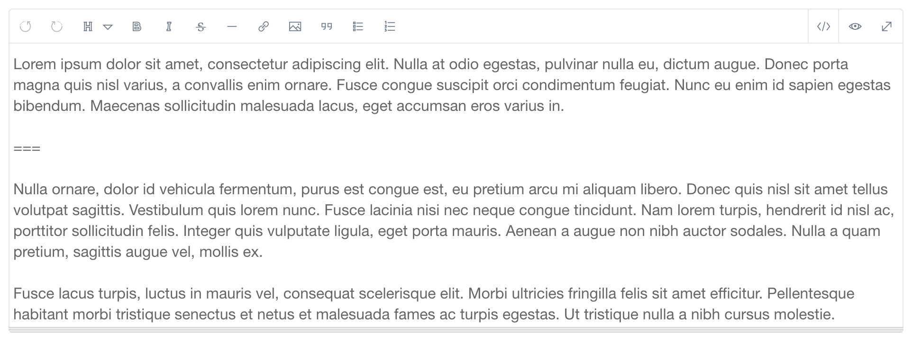
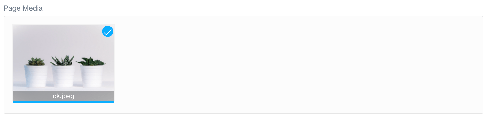

# Редактор (содержание)

**Редактор страницы** в админке — это мощный текстовый редактор и менеджер страниц, который позволяет вам создавать контент вашей страницы (включая медиафайлы), его параметры публикации и таксономии, настройки, переопределения и параметры для конкретной темы.

По сути, это универсальный инструмент для управления определенной страницей.

!!! warning ""

    Для доступа к функциям страниц требуется уровень доступа `access.admin.super` или `access.admin.pages.list`. См [Учётные записи](/admin-panel/accounts/users) и [Группы пользователей](/admin-panel/accounts/groups)

Вкладки, которые появляются в **Редакторе страниц**, не универсальны. Существует стандартный набор полей форм, которые обычно встречаются в темах Grav, однако они могут различаться в зависимости от темы. Администратор извлекает информацию о поле формы из ряда источников, включая тему и шаблон, используемые для конкретной страницы.

!!! warning ""

    Вкладки и параметры, представленные в этой документации, используются по умолчанию. Разработчики тем имеют возможность добавлять свои собственные параметры на эти вкладки или даже отказаться от этих вкладок и заменить их чем-то совершенно другим. Мы документируем распространенный сценарий, основанный на теме Antimatter, чтобы служить в качестве примера.

На этой странице мы рассмотрим функции и возможности вкладки **Содержание** в **Редакторе страницы**.

### Управление

Вверху страницы вы найдете административные элементы управления, которые позволяют сохранять, удалять, копировать и перемещать вашу страницу. Кроме того, вы можете нажать кнопку **Назад**, чтобы вернуться в основную область **Страницы** админки.

Кнопки **Сохранить** и **Удалить** говорят сами за себя. Они соответственно сохраняют и удаляют текущую страницу.

При нажатии кнопки **Переместить** открывается всплывающее окно, в котором вы можете назначить странице нового родителя. У вас есть такая же опция на вкладке **Дополнительно**.

**Копировать** создает дубликат вашей текущей страницы, добавляя «-2» (или другой числовой префикс, если «-2» уже используется) в конце имени папки. Вы можете изменить имя и заголовок папки по своему усмотрению.

### Заголовок

Заголовок страницы обычно задается во время создания этой страницы, однако вы можете редактировать его постфактум здесь. Обратите внимание, что изменение заголовка страницы здесь не окажет прямого влияния на имя папки (которое используется для целей навигации), но изменит то, что люди видят во внешнем интерфейсе.

### Содержимое редактора страниц

Это сердце редактора страниц. Здесь пишется и редактируется тело содержимого вашей страницы. В нем есть множество мощных инструментов, которые обычно можно найти только в текстовых редакторах премиум-класса на базе браузера.

Например, вы можете переключаться между режимами редактирования и предварительного просмотра с помощью кнопок :fontawesome-solid-code: и :fontawesome-solid-eye:, расположенных в верхнем правая область редактора.

Поскольку контент Grav в основном основан на Markdown, ярлыки редактирования автоматически добавляют теги Markdown к вашему контенту. Например, выделение блока текста и выбор значка **B** окружают выделенную область полужирными тегами **(выделенная область)**.

Вот список инструментов редактора контента:

| Инструмент                        | Описание                                                                      |
| :-----                            | :-----                                                                        |
| :fontawesome-solid-bold:          | Добавляет **жирный текст**.                                                   |
| :fontawesome-solid-italic:        | Добавляет _курсив_.                                                           |
| :fontawesome-solid-strikethrough: | Добавляет ~~зачёркивание~~.                                                   |
| :fontawesome-solid-link:          | Добавляет [ссылки](https://getgrav.org).                                      |
| :fontawesome-solid-image:         | Добавляет медиа.                                                              |
| :fontawesome-solid-quote-right:   | Добавляет цитаты.                                                             |
| :fontawesome-solid-list-ul:       | Создает неупорядоченный список.                                               |
| :fontawesome-solid-list-ol:       | Создает упорядоченный список.                                                 |
| :fontawesome-solid-code:          | Активирует правку кода.                                                       |
| :fontawesome-solid-eye:           | Активирует предварительный просмотр кода.                                     |
| :material-arrow-expand:           | Переключает между полноэкранным редактированием и предварительным просмотром. |

### Вложения

Секция **Вложения** в нижней части вкладки **Содержание** посвящена медиафайлам вашей страницы. Эти файлы находятся в той же папке, что и файл страницы. Загрузить новые медиафайлы так же просто, как **перетащить** файл или **коснуться** белой области секции. Это вызовет селектор файлов, который позволит вам выбрать файлы для загрузки.

У вас уже есть медиафайлы, которые вы хотите вставить на свою страницу? Просто наведите курсор мыши на миниатюру изображения и **перетащите** изображение в редактор.

Вы также можете выбрать **Вставить** на миниатюре изображения. Это вставит медиа прямо в контент вашей страницы.

Вы также можете удалить медиафайлы, выбрав **Удалить**.
