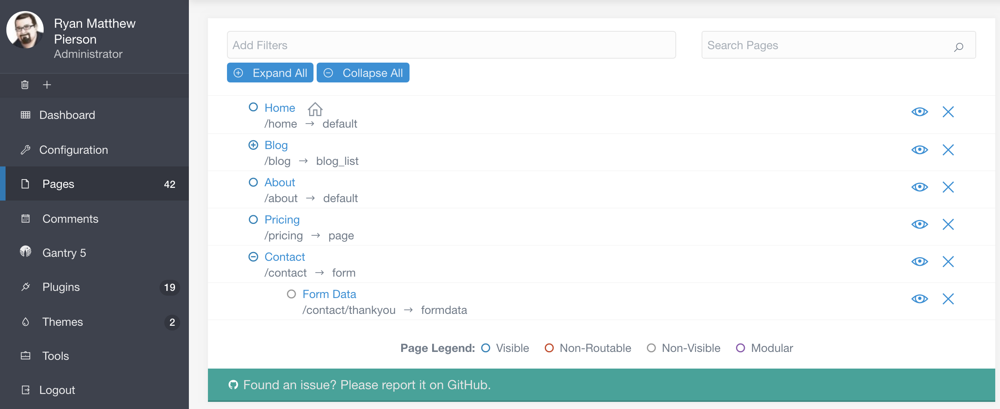
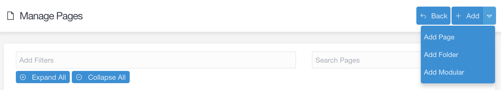
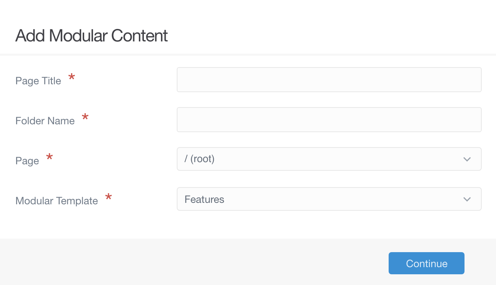

# Страницы

Раздел **Страницы** предоставляет вам быстрый редакторский доступ к содержанию вашего сайта. Здесь можно получить доступ к редактору страницы, удалить страницы, создать новые страницы и сразу узнать, отображается ли страница.

!!! warning ""

    Для доступа к функциям страниц требуется уровень доступа `access.admin.super` или `access.admin.pages.list`. См. [Учётные записи](../accounts/users) и [Группы пользователей](../accounts/groups)

Если вы часто создаете или изменяете контент на своем сайте, эта область админки станет вам хорошо знакома.

### Добавление новых страниц

Три кнопки расположены в верхней части административной панели **Управление страницами**. Кнопка **Назад** возвращает вас на **главную страницу** админки, а кнопки **Добавить страницу** и **Добавить модульный блок** инициируют создание новых страниц для вашего сайта.

Ниже мы рассмотрим параметры, доступные при нажатии этих кнопок.

#### Добавление страницы

Кнопка **Добавить страницу** создает немодульную страницу для вашего сайта. После выбора появится всплывающее окно, позволяющее ввести **Заголовок** и **Имя папки**, назначить **Родительскую страницу** и **Шаблон отображения**, а также указать, должна ли страница быть видимой или скрытой.

| Параметр              | Описание                                                                                                              |
| :-----                | :-----                                                                                                                |
| Заголовок страницы    | Здесь вы вводите заголовок создаваемой страницы.                                                                      |
| Имя папки             | Вы можете установить собственное имя папки для страницы или оставить автоматически созданное имя на основе заголовка. |
| Родительская страница | Это устанавливает родительскую страницу для новой страницы. Может быть дочерним элементом другой страницы (например, домашней страницы или блога) или быть в корне вашего сайта. Установив значение опции `child_type` в начале родительской страницы, автоматически будет установлен `Шаблон отображения` по умолчанию. selected.                                                                                                                                       |
| Шаблон страницы       | Вы можете выбрать, какой шаблон из темы вы хотите применить к странице.                                               |
| Видимая               | Устанавливает, хотите ли вы, чтобы страница была видна в навигации. Можно установить на **Авто**, чтобы это определялось за вас. При автоматической настройке, если есть другая страница-брат, использующая числовой префикс, она использует его и поэтому видна. В противном случае он его не отображает.          |

После того, как вы заполнили эту информацию, выбрав **Продолжить**, вы перейдете в редактор новой страницы. Мы рассмотрим **Редактор страниц** более подробно в [следующем руководстве](editor).

!!! warning ""

    Отображение страницы в этих настройках влияет только на навигацию. Возможность посещения страницы браузером определяется [настройками публикации](/content/headers/#status-publikatsii).

#### Добавление модульной страницы

Вторая кнопка в верхней части области **Страницы** позволяет добавить модульную подстраницу на ваш сайт. Модульные страницы отличаются от обычных страниц, потому что на самом деле они представляют собой набор страниц, упорядоченных и отображаемых как одна страница. Эта кнопка специально позволяет создавать подстраницы и назначать их родительской модульной странице.

Вот разбивка полей и параметров, которые появляются во всплывающем окне кнопки **Добавить модульный блок**.

| Параметр           | Описание                                                                                                                                                    |
| :-----             | :-----                                                                                                                                                      |
| Заголовок страницы | Устанавливает заголовок для модульной страницы.                                                                                                             |
| Имя папки          | Вы можете установить собственное имя папки для страницы или оставить автоматически созданное имя на основе заголовка.                                       |
| Страница           | Устанавливает родительскую страницу для новой модульной подстраницы. Это страница, на которой будет отображаться содержимое вашей новой модульной страницы. |
| Модульный шаблон   | Отображает список шаблонов, предоставленных темой для модульных страниц, из которых вы можете выбрать для новой страницы.                                   |

После того, как вы заполнили эту информацию, выбрав **Продолжить**, вы перейдете в редактор новой страницы. Мы рассмотрим редактор страниц более подробно в [следующем руководстве](editor).

### Список страниц

Список страниц, который отображается в этой области, дает вам быстрый доступ ко всем вашим текущим страницам, а также быстрый способ узнать, видны ли страницы или нет.

Выбор заголовка любой страницы приведет вас прямо к редактору этой страницы. Большой значок **X** справа от каждой страницы позволяет удалить страницу.

Если вы наведете курсор на значок слева от страницы, он сообщит вам её текущий статус. Например, он может сказать **Страница • Маршрутизируемая • Видимая**, если страница является маршрутизируемой (видимой через URL-адрес) и видимой (отображается в меню навигации).

Вы можете **фильтровать** и **искать** свои страницы, чтобы упростить поиск именно той страницы, которую вы ищете. Например, используя параметр **Добавить фильтры**, вы можете фильтровать страницы по типу, чтобы в списке отображались только **модульные**, **видимые** и/или **маршрутизируемые** страницы.

Если у вас есть определённый заголовок страницы (или часть заголовка), вы можете использовать панель поиска, чтобы быстро найти конкретную страницу, которую вы ищете.
