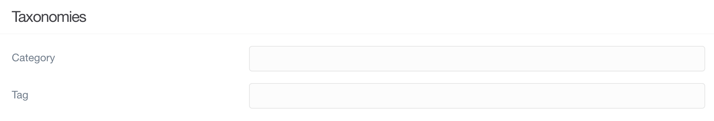

# Редактор (опции)

**Редактор страницы** в админке — это мощный текстовый редактор и менеджер страниц, который позволяет вам создавать контент вашей страницы (включая медиафайлы), его параметры публикации и таксономии, настройки, переопределения и параметры для конкретной темы.

По сути, это универсальный инструмент для управления определенной страницей.

На этой странице мы рассмотрим функции и возможности вкладки **Опции** в **Редакторе страницы**.

!!! warning ""

    Для доступа к функциям страницы требуется уровень доступа `access.admin.super` или `access.admin.pages.list`. См. [Учётные записи](/admin-panel/accounts/users) и [Группы пользователей](/admin-panel/accounts/groups)

!!! info ""

    Вы можете заметить флажки слева от некоторых параметров в этой области администратора. Эти поля указывают на то, что вы хотите изменить значения по умолчанию для этой страницы. Если их не отмечать, возвращается к пустому состоянию или состоянию по умолчанию.

### Публикация

Этот раздел посвящен управлению тем, как публикуется ваш контент. Вы можете публиковать (или отменять публикацию) контента, устанавливать даты публикации, а также даты и время отмены публикации и создавать значения метаданных, специфичные для страницы.

| Параметр                 | Описание                                                                                                                                       |
| :-----                   | :-----                                                                                                                                         |
| Опубликовано             | По умолчанию страница публикуется, если вы явно не указали `Publish: false` или через `publish_date` в будущем или `unpublish_date` в прошлом. |
| Дата                     | Переменная даты позволяет вам специально установить дату, связанную с этой страницей.                                                          |
| Дата публикации          | Это официальная дата публикации страницы. Он может предоставить дату для автоматического запуска публикации.                                   |
| Дата снятия с публикации | Это дата/время, которые вы хотите отметить, чтобы страница автоматически запускала отмену публикации.                                          |
| Метаданные               | Значения метаданных по умолчанию, которые будут отображаться на каждой странице, если страница не отменена.                                    |

### Таксономии

В области «Таксономии» вы можете настроить организационные свойства своей страницы. Здесь можно настроить категории, в которых будет отображаться страница, её теги и многое другое.

| Параметр | Описание                                                                                                                                                                 |
| :-----   | :-----                                                                                                                                                                   |
| Category | Это поле позволяет вам установить одну или несколько категорий для страницы. Это полезно при сортировке и фильтрации контента.                                           |
| Tag      | Теги — отличный способ дать представление о том, о чем ваша страница. Это полезно для сайтов, ориентированных на контент, в качестве механизма организации и фильтрации. |
| Month    |                                                                                                                                                                          |

### Карта сайта

Наличие хорошей и чистой карты сайта важно по нескольким причинам. Среди них - пользовательская навигация и поисковая оптимизация (SEO). Наличие карты сайта делает ваш сайт более удобным для поисковых систем, что может иметь прямое влияние на рейтинг.

Эта область страницы параметров доступна, только если вы установили [плагин Sitemap](https://github.com/getgrav/grav-plugin-sitemap).

| Параметр                       | Описание                                                                |
| :-----                         | :-----                                                                  |
| Частота обновления карты сайта | В этом раскрывающемся списке можно установить частоту обновления карты сайта страницы. Это может время, когда вносятся изменения: ежечасно, ежедневно, еженедельно, ежемесячно, ежегодно или никогда. По умолчанию используются глобальные параметры карты сайта. |
| Приоритет карты сайта          | Устанавливает приоритет этой страницы в вашей карте сайта.              |
