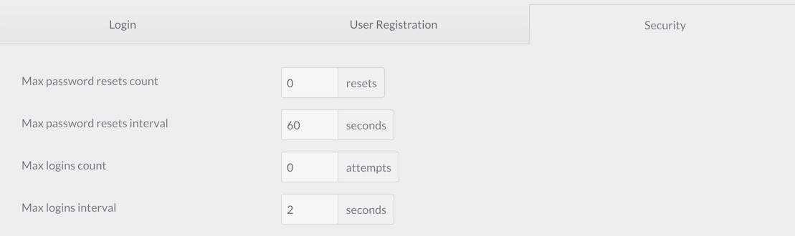

# Защита от флуда

Атаки методом грубой силы — популярный выбор для злоумышленников. Это может происходить в форме того, что кто-то из ваших знакомых пытается угадывать ваш пароль снова и снова, пока наконец не добьется успеха, или бот, наводняющий ваш сайт попытками входа в систему, пока в конечном итоге пароль не будет обнаружен.

Функция защиты Grav от флуда (также известная как ограничение скорости) делает такие атаки исключительно сложными. Это позволяет вам установить количество неудачных попыток входа в систему в течение определенного периода времени, прежде чем учетная запись будет временно заблокирована. Кроме того, вы можете ограничить количество запросов на сброс пароля, применяемых к учетным записям, прежде чем блокировать эту функцию.

## Что вам понадобится

Эта функция управляется с помощью плагина [**Login**](https://github.com/getgrav/grav-plugin-login). Требуются **Login версии 2.4** или выше, **Grav 1.3.3** или выше и **Admin Panel 1.6.0** или выше.

## Как это настроить

Настройки для защиты от флуда находятся в плагине Login. Просто перейдите по вкладке **Admin > Плагины > Login** и выберите вкладку **Безопасность**.

Здесь вы можете установить следующее:

* Максимальное количество сбросов пароля перед блокировкой.
* Максимальный интервал сброса пароля
* Максимальное количество неудачных входов до блокировки
* Максимальный неудачный интервал входа в систему

Это позволит вам определить, сколько неудачных попыток сброса пароля или входа в систему разрешены за определенное количество времени до того, как произойдет блокировка. Этот выход является временным и длится до тех пор, пока не будет установлен интервал.

