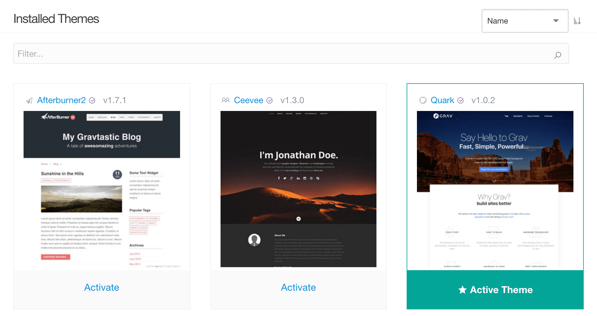

# Темы

**Темы** в админке - это то место, куда вы можете перейти, чтобы добавить темы вашего сайта и управлять ими.

На этой странице мы узнаем, как управлять существующими темами и добавлять новые на ваш сайт.

!!! warning ""

    Для доступа к функциям тем требуется уровень доступа `access.admin.super` или` access.admin.themes`.

### Управление

В верхней части области **Темы** админки вы найдете кнопки :material-reply: **Назад**, :material-plus: **Добавить** и :material-refresh: **Проверить наличие обновлений**.

:material-reply: **Назад** просто вернет вас либо на **главную страницу админки**, либо на **главную страницу тем**, если вы глубже погрузились в эту область админки.

:material-refresh: **Проверить наличие обновлений** проверяет установленные темы на наличие обновлений.

#### Добавление новой темы

:material-plus: **Добавить** вызывает отображение доступных в настоящее время тем Grav, которые вы можете добавить на свой сайт. Это быстрый и простой способ установить новую тему. Просто выберите кнопку :material-plus: **Установить**.

Вы перейдете на панель **Информация** новой темы, которая содержит более подробную информацию о теме, а также любые параметры, установленные в файле *blueprints*. Если вас устраивают любые изменения настроек, просто нажмите кнопку :material-check: **Сохранить**, чтобы сохранить изменения.

Вы также можете удалить тему со своего сайта, нажав красную кнопку :warning: **Удалить тему** в правом нижнем углу панели.

### Установленные темы

В разделе **Установленные темы** отображаются установленные вами темы. При выборе эскиза темы вы попадете на информационную страницу для этой темы, а серая кнопка **Активировать** внизу каждой миниатюры дает вам возможность установить эту тему в качестве активной темы по умолчанию для вашего сайта.

Текущая активная тема обозначается значком :material-star: **Активная тема**.

Вверху каждого эскиза вы увидите название и номер текущей версии каждой темы. Фиолетовый значок флажка :material-check-circle: указывает на то, что тема была создана командой Grav. Темы без этого значка создаются и поддерживаются сторонними разработчиками.
