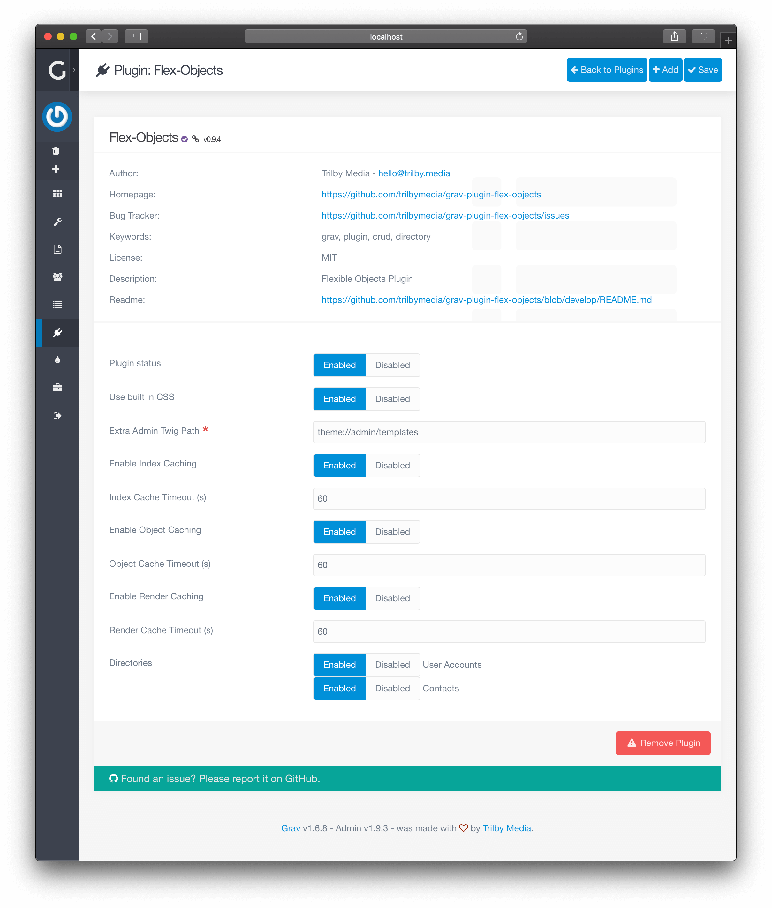
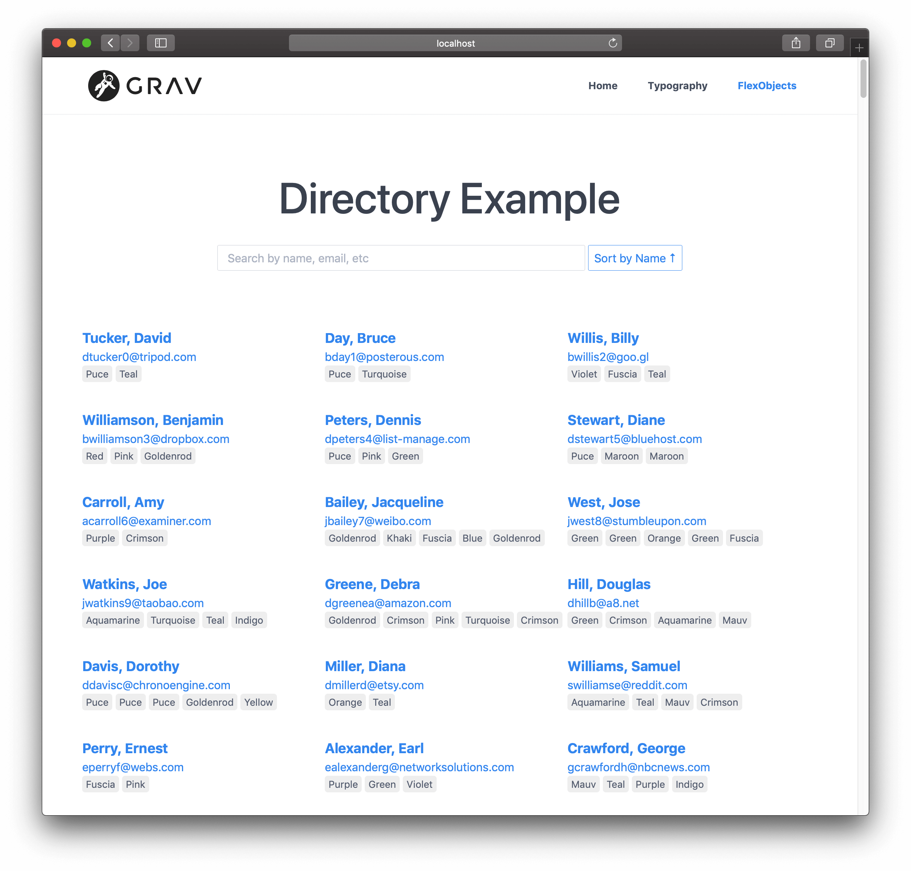

# Первые шаги

В этом разделе описано, как быстро включить существующий **Каталог** и как отобразить его в админке Grav. В наших примерах мы используем каталог **Контакты**, который поставляется в комплекте с плагином **Flex Objects** в демонстрационных целях.

## Включение каталога

Чтобы включить настраиваемый **Flex-каталог**, вам необходимо перейти в **Плагины** > **Flex Objects**.

В нижней части страницы вы увидите параметр конфигурации **Каталоги**. В этом параметре перечислены все обнаруженные **Flex-каталоги** в вашем проекте.



Найдите каталоги, которые вы хотите включить, и убедитесь, что опция **Enabled** (_Включено_) отмечена.

Для этой демонстрации давайте включим директорию **Контакты** и нажмем **Сохранить** в верхней части страницы.

После перезагрузки страницы вы должны увидеть новый пункт в меню админки, под названием **Контакты**.

## Установка демо-данных (необязательно)

В нашем примере мы предполагаем, что вы скопировали образец набора данных для **Каталога контактов**:

```shell
$ cp user/plugins/flex-objects/data/flex-objects/contacts.json user/data/flex-objects/contacts.json
```

## Создание страницы

Перейдите в раздел **[Страницы](/admin-panel/page)** и [добавьте новую страницу](/admin-panel/page/#dobavlenie-novykh-stranits). Введите следующие значения:

- **Заголовок страницы**: `Flex-Objects`
- **Шаблон страницы**: `Flex-objects`

После этого вы можете нажать кнопку **Продолжить**.

В **[Редакторе контента](../views-edit)** войдите в каталог и добавьте контент:

- **Flex-каталог**: `Contacts`
- **Контент**:
  ```twig
  # Directory Example
  ```

Убедитесь, что ввели всё правильно, затем нажмите **Сохранить**.

!!! tip ""

    Если вы не укажете `Flex-каталог`, на странице будут перечислены все каталоги вместо отображения записей из одного каталога.

## Отображение страницы

Перейдите на созданную вами страницу. Вы увидите следующую страницу, содержащую **Контакты**:



В случае, если вы не выбрали какой-либо каталог, вместо этого вы увидите следующее:


