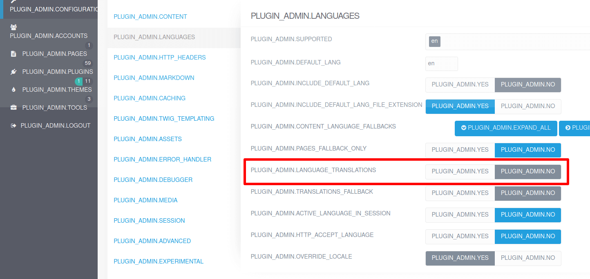

# Руководство по обновлению до Grav 1.7

Grav 1.7 представляет несколько новых функций, улучшений, исправлений ошибок и предоставляет множество архитектурных изменений, которые прокладывают путь к Grav 2.0. Вот несколько основных моментов:

* **Flex-объекты**: Новый способ создания собственных типов данных.
* **Сервер Symfony**: Запуск Grav без установки веб-сервера.
* **Улучшена поддержка нескольких языков**: Админка получила улучшение поддержки нескольких языков.
* **Улучшена поддержка нескольких сайтов**: Админка получила улучшение поддержки нескольких сайтов.
* **Улучшена ACL админки**: Полная поддержка CRUD для пользователей и страниц.
* **Улучшена поддержка медиа**: Поддежка формата изображений `webp`, ленивая загрузка и многое другое.
* **Улучшено кэширование**: Новый тег `` и улучшение производительности, особенно в админке.
* **Обнаружение XSS в формах**: Формы не будут отправлены, если в них обнаружен потенциальный XSS. См. [документацию](/forms/forms/form-options/#proverka-xss) о том, как отключить проверки.
* **Лучшие инструменты отладки**: интеграция [Clockwork](https://underground.works/clockwork/), профилирование Twig и поддержка [Tideways XHProf](https://github.com/tideways/php-xhprof-extension) — расширения для профилирования PHP.

!!! danger ""

    Для большинства людей Grav 1.7 должно быть простым обновлением без каких-либо проблем, но, как и любое обновление, рекомендуется **сделать резервную копию** вашего сайта и **протестировать обновление в тестовой среде** перед обновлением вашего действующего сайта.

### Наиболее частые проблемы

1.  #### HTML отображается на вашем сайте как **код**, а не как HTML, как предполагалось.
    Такое поведение является результатом нового значения по умолчанию **auto-escaping**, которое истинно в Grav 1.7. Это усиление безопасности, и если вы обновляетесь с версии до 1.7, мы автоматически включаем параметр **Совместимость с Twig** в конфигурации системы, чтобы ваш старый код Twig продолжал работать. Если вы вручную обновляете сайт до 1.7 или обновляете каким-либо способом, который не проходит через процесс самостоятельного обновления GPM, вам следует установить этот параметр самостоятельно.

    Ознакомьтесь с секцией [Twig](#twig) этого руководства для получения полной информации...

2.  #### Получение ошибок о недопустимом YAML.
    Поскольку мы обновились до более новой версии фреймворка Symfony, синтаксический анализатор YAML стал строже, чем в версиях до 1.7.Чтобы справиться с этим, мы включили старую версию парсера, которая доступна при включении параметра **Совместимость с Yaml**. Это выполняется автоматически, если вы обновляетесь до Grav 1.7 через GPM, но если вы выполняли обновление вручную, вам нужно будет установить это значение самостоятельно.

    Ознакомьтесь с секцией [YAML](#yaml) этого руководства для получения полной информации...

3.  #### Админка отображается с непереведенными строками

   Если в вашей админке где-нибудь отображаются непереведенные строки, скорее всего, это связано с тем, что вы ранее отключили функцию **переводов**. Это было ошибкой в предыдущих версиях Grav и отключение его, на самом деле не отключало переводы во всей админке, как это было задумано. Это **исправлено** в Grav 1.7, и этот параметр выполняет то, для чего он предназначен, показывает коды перевода в верхнем регистре, а не сами переведенные строки.

   Обратитесь к секции [Устранение возникших проблем](#ustranenie-voznikshikh-problem) на этой странице.

4. #### Ошибки при сохранении или неработающие плагины админки.
   В Grav 1.7 мы представили **Flex Pages** в качестве нового пользовательского интерфейса управления страницами по умолчанию. Кроме того, для оптимизации производительности мы перестали инициализировать страницы при каждом вызове администратора. Возврат к обычным **Grav Pages** может временно решить вашу проблему. Это делается путем редактирования плагина **Flex Objects** и отключения **Pages (Admin)**.

   Чтобы должным образом решить эту проблему, пользовательские плагины должны быть обновлены для поддержки **страниц Grav** и **страниц Flex** с использованием `PageInterface`, а также должны быть явными Pages при необходимости.

   Ознакомьтесь с секцией [Страницы](#stranitsy) и секцией [Админка](#adminka) этого руководства для получения полной информации...

   Также были обнаружены некоторые специфические проблемы с плагинами. Обратитесь к секции [Устранение возникших проблем](#ustranenie-voznikshikh-problem) на этой странице.

5. #### Чертежи страниц перестают работать или выдают ошибку о цикле
   **Grav 1.7.8** добавляет поддержку для определения любого **чертежа** в вашей теме. Это означает, что если у вас есть чертежи страниц в папке `blueprints/pages/`, то используются стандартные расположения чертежей, как и в плагинах. К сожалению, некоторые старые темы могут иметь смесь файлов в `blueprints/` и `blueprints/pages`, что нарушает определение и приводит либо к отсутствию полей в админке при редактировании страниц, либо к фатальной ошибке: `Loop detected while extending blueprint file`.

   При возникновении любой из этих ошибок обратитесь к секции [Устранение возникших проблем](#ustranenie-voznikshikh-problem).

### Руководство по быстрому обновлению

!!! warning ""

    **Grav 1.7** требует **PHP 7.3.6** или выше. Рекомендуемая версия — **PHP 7.4**.

### YAML

!!! danger ""

    Парсер Grav 1.7 YAML более строг, и ваш сайт может сломаться, если у вас есть синтаксические ошибки в ваших файлах конфигурации или заголовках страниц. Однако, если вы обновляете свой существующий сайт с помощью `bin/gpm` или `плагина админки`, процесс обновления сохраняет большую часть сломанного синтаксиса YAML.

Чтобы вернуться к старому поведению, вам необходимо убедиться, что у вас есть следующие настройки в `user/config/system.yaml`:

```yaml
strict_mode:
  yaml_compat: true
```

или в админке в разделе **Настройка** → **Дополнительно** -> **Совместимость с YAML**


!!! tip ""

    **Руководство по обновлению Grav 1.6** имеет специальную секцию **[Парсинг YAML](../grav-16-upgrade-guide/#parsing-yaml)**, чтобы помочь вам решить эти проблемы.

По умолчанию Grav 1.7 использует **синтаксический анализатор YAML Symfony 4.4**, который более точно соответствует [стандартной спецификации YAML](https://yaml.org/spec), чем более старые версии Grav. Это означает, что файлы YAML, которые раньше работали нормально, могут вызывать ошибки, связанные с недопустимым YAML. Тем не менее, Grav по умолчанию все равно будет использовать более старую версию парсера 3.4, чтобы ваш сайт продолжал работать.

!!! tip ""

    Вам нужно запустить **команду CLI** `bin/grav yamllinter` или перейти в раздел **Админка** > **Сервис** > **Отчёты** до и после обновления и исправления всех предупреждений и ошибок, связанных с YAML.

### Twig

!!! danger ""

    Grav 1.7 по умолчанию включает **автоэкранирование Twig**. Однако, если вы обновляете существующий сайт с помощью `bin/gpm` или `плагина админки`, процесс обновления сохраняет существующие настройки автоматического выхода.

Чтобы вернуться к старому поведению, вам необходимо убедиться, что у вас есть следующие настройки в `user/config/system.yaml`:

```yaml
twig:
  autoescape: false
strict_mode:
  twig_compat: true
```

или в админке в разделе **Настройка** → **Дополнительно** -> **Совместимость с TWIG**

И, пожалуйста, не забудьте очистить кэш после этого!


!!! tip ""

    **Руководство по обновлению Grav 1.6** имеет специальную секцию **[Twig](../grav-16-upgrade-guide/#twig)**. Обязательно с ней ознакомьтесь!

Шаблонизатор Twig обновлен до версии 1.43, но также поддерживает Twig 2.13. Чтобы поддерживать эту новую версию Twig, вам необходимо обновить любой старый синтаксис в ваших шаблонах Twig. **Руководство по обновлению Grav 1.6** поможет вам в этом.

Дополнительные изменения в шаблонах:

* Добавлен новый тег Twig ``, устраняющий необходимость в расширении `twigcache`.
* Добавлена Twig-функция `array_diff()`
* Добавлена Twig-функция `template_from_string()`
* Добавлена Twig-функция `svg_image()` чтобы упростить включение исходного кода SVG в Twig
* Улучшена Twig-функция `url()`, принимающая третий параметр (`true`) чтобы вернуться URL-адрес несуществующего файла, вместо того, чтобы возвращать `false`
* Улучшен Twig-фильтр `|array` для работы с итераторами и объектами с методом `toArray()`
* Улучшена Twig-функция `authorize()` чтобы лучше работать с вложенными параметрами правил
* Улучшен Twig-фильтр `|yaml_serialize`: добавлена поддержка объектов `JsonSerializable` и других объектов, подобных массивам
* Добавлены шаблоны по умолчанию для `external.html.twig`, `default.html.twig` и `modular.html.twig`
* **НАРУШЕНИЕ ОБРАТНОЙ СОВМЕСТИМОСТИ**: Используйте `` вместо сломанного `in 'bottom'`

## Формы

!!! danger ""

    Grav 1.7 изменяет поведение **строгой проверки**. Однако, если вы обновляете существующий сайт с помощью `bin/gpm` или `плагина админки`, процесс обновления сохраняет существующее поведение в строгом режиме.

**Улучшения строгого режима**: Внутри форм объявление `validation: strict` было не таким строгим, как мы надеялись, из-за ошибки. Строгий режим должен предотвращать отправку форм любых дополнительных полей, и это было исправлено в Grav 1.7. К сожалению, многие старые формы объявлены строгими, даже если в них есть дополнительные данные.

Чтобы вернуться к старому поведению, вам необходимо убедиться, что у вас есть следующие настройки в`user/config/system.yaml`:

```yaml
strict_mode:
  blueprint_compat: true
```

**Обнаружение инъекции XSS** теперь по умолчанию включено во всех формах интерфейса. См. [документацию](/forms/forms/form-options/#proverka-xss) о том, как отключить или настроить проверки для каждой формы и поля.

По этой причине мы добавили новую опцию конфигурации `system.strict_mode.blueprint_compat: true` для сохранения старого поведения `validation: strict`. Рекомендуется отключить этот параметр для повышения безопасности сайта, но перед этим выполните поиск по всем своим формам, если вы использовали функцию `validation: strict`. Если да, удалите строку или проверьте, работает ли форма.

!!! note ""

    Этот резервный механизм обратной совместимости будет удален в Grav 2.0.

### Среды и мультисайты

!!! danger ""

    Grav 1.7 перемещает [настройки окружения](/advanced/environment-config) в папку `user://env`. Старое местоположение по-прежнему работает, но лучше переместить среду в одно местоположение, в будущем функции могут полагаться на него.

Grav 1.7 также добавляет поддержку [конфигурации среды на основе сервера](/advanced/environment-config/#konfiguratsiia-sredy-na-osnove-servera) и [серверной многосайтовой конфигурации](/advanced/multisite-setup/#servernaia-mnogosaitovaia-konfiguratsiia). Эта функция пригодится, если вы хотите использовать, например, контейнеры докеров и хотите сделать их независимыми от домена, который вы используете. Или если вы не хотите хранить секреты в конфигурации, а хранить их в настройках вашего сервера.

Кроме того, файл setup.php теперь может находиться либо в `GRAV_ROOT/setup.php`, либо в `GRAV_ROOT/GRAV_USER_PATH/setup.php`. Второе расположение упрощает использование сред с репозиториями git, содержащими только папку пользователя.

### Учётные записи

В админке теперь есть новое [управление учётными записями](/admin-panel/accounts), использующее **Flex-пользователей**:

* [Менеджер учетных записей пользователей](/admin-panel/accounts/users)
* [Менеджер групп пользователей](/admin-panel/accounts/groups)

!!! note ""

    Функция Flex-пользователей ещё не используется во внешнем интерфейсе вашего сайта.

### Страницы

Существующее [администрирование страниц](/admin-panel/page) было значительно улучшено с **Flex-страницами**:

* Переработанный список: гораздо лучшая поддержка больших сайтов.
* Лучший контроль доступа: [CRUD ACL](/admin-panel/page/permissions) поддержка владельцев страниц
* Лучшая многоязычная поддержка

!!! warning "НАРУШЕНИЕ ОБРАТНОЙ СОВМЕСТИМОСТИ"

    Мы исправили ошибку 404 страницы, когда вы переходите на не маршрутизируемую страницу с маршрутизируемыми, видимыми дочерними страницами под ней. Теперь вы перенаправляетесь на первую маршрутизируемую, видимую дочернюю страницу. Это, вероятно, то, что вы хотели в первую очередь.

!!! note ""

    Функция Flex-страниц ещё не используется во внешнем интерфейсе вашего сайта.

### Мультиязычность

Grav 1.7 изменил поведение того, как работают многоязычные резервные копии для страниц.

Ранее, если страница не существовала с запрошенным языком, старая реализация искала следующий Поддерживаемый язык. Это означало, что непереведенная страница всегда отображалась, но страница могла использовать какой-то неизвестный читателю язык.

Новое поведение — возврат только к языку сайта по умолчанию. Это поведение по умолчанию можно изменить, установив резервные языки для каждого языка с помощью параметра конфигурации `system.languages.content_fallback`.

Если страница не существует ни на одном из резервных языков, вместо нее будет отображаться **404 Not Found**.

!!! warning "НАРУШЕНИЕ ОБРАТНОЙ СОВМЕСТИМОСТИ"

    Пожалуйста, добавьте правильные резервные языки для содержимого страницы в `system.yaml` или в админке: **Настройка** > **Система** > **Языки** > **Резервный язык содержимого**.

### Медиа

В Grav 1.7 значительно улучшена обработка мультимедиа. Некоторые основные моменты:

* Поддержка формата изображений `webp`
* Markdown: добавлена ​​поддержка собственных атрибутов `loading=lazy` для изображений. Может быть установлена в `system.images.defaults` или как параметр в Markdown: `?loading=lazy`
* Добавлена ​​возможность отключения обработки (`noprocess`) определенных элементов только в фрагментах ссылок/изображений, например `http://foo.com/page?id=foo&target=_blank&noprocess=id`

### CLI

Некоторые основные моменты:

* Все команды интерфейса командной строки теперь принимают параметры `--env` и `--lang`, чтобы установить окружение и используемый язык соответственно (`-e` больше не работает).
* Добавлена ​​новая команда CLI `bin/grav server` для легкого запуска встроенных веб-серверов Symfony или PHP.
* Улучшенная проверка команды cron в `Scheduler` и более полезная информация из интерфейса командной строки.
* Добавлен новый параметр `-r <job-id>` для команды CLI планировщика для принудительного запуска задания.
* Улучшена команда CLI `bin/grav yamllinter`, добавлена ​​опция поиска проблем с линтингом YAML на всем сайте или в пользовательской папке.
* Ошибки команд CLI/GPM теперь возвращают ненулевой код (что позволяет обнаруживать ошибки в случае сбоя команды).

### Конфигурация

Добавлен новый параметр конфигурации для сохранения языка по умолчанию в файлах `.md`, если он установлен в `false`:
    * system.yaml: `languages.include_default_lang_file_extension`: **true**|false
    * Админка: **Настройка** > **Система** > **Языки** > **Include default language in file extension**

Добавлен новый параметр конфигурации, позволяющий устанавливать резервные языки содержимого индивидуально для каждого языка:
    * system.yaml: `languages.content_fallback`: См. [Конфигурацию языков](/content/multi-language/#konfiguratsiia-iazykov)
    * Админка: **Настройка** > **Система** > **Языки** > **Content Language Fallback**

Добавлена новая опция конфигурации для выбора между debugbar и clockwork
    * system.yaml: `debugger.provider`: **clockwork**|debugbar
    * Админка: **Настройка** > **Система** > **Отладчик** > **Debugger Provider**

Добавлена новая опция конфигурации для скрытия потенциально конфиденциальной информации
    * system.yaml: `debugger.censored`: **false**|true
    * Админка: **Настройка** > **Система** > **Отладчик** > **Censor Sensitive Data**

Добавлен новый параметр конфигурации для сохранения старого поведения `validation: strict`
    * system.yaml: `strict_mode.blueprint_compat`: **true**|false
    * Админка: **Настройка** > **Система** > **Дополнительно** > **Blueprint Compatibility**

Добавлена ​​поддержка конфигурации системы для заголовков HTTP_X_FORWARDED (хост отключен по умолчанию)
    * system.yaml: `http_x_forwarded.protocol`: **true**|false
    * Админка: **Настройка** > **Система** > **Дополнительно** > **HTTP_X_FORWARDED_PROTO Enabled**
    * system.yaml: `http_x_forwarded.host`: true|**false**
    * Админка: **Настройка** > **Система** > **Дополнительно** > **HTTP_X_FORWARDED_HOST Enabled**
    * system.yaml: `http_x_forwarded.port`: **true**|false
    * Админка: **Настройка** > **Система** > **Дополнительно** > **HTTP_X_FORWARDED_PORT Enabled**
    * system.yaml: `http_x_forwarded.ip`: true|**false**
    * Админка: **Настройка** > **Система** > **Дополнительно** > **HTTP_X_FORWARDED IP Enabled**

Добавлен новый параметр конфигурации security.sanitize_svg для удаления потенциально опасного кода из файлов SVG.
    * security.yaml: `sanitize_svg`: **true**|false
    * Admin: **Configuration** > **Security** > **Sanitize SVG**

## РАЗРАБОТЧИКАМ

### Отладка

* Добавлена ​​поддержка для инструментов разработчика [Clockwork](https://underground.works/clockwork) (теперь отладчик по умолчанию)
* Добавлена ​​поддержка для [Tideways XHProf](https://github.com/tideways/php-xhprof-extension), расширения для профилирования PHP
* Добавлено профилирование Twig для отладчика Clockwork.

### Использование автозагрузчика композера

* Обновлен `bin/composer.phar` до `2.0.2`, самой новой и быстрой
* Пожалуйста, добавьте файл `composer.json` в свой плагин и запустите `composer update --no-dev` (и не забывайте обновлять его):

    ```json title="composer.json"
    {
        "name": "getgrav/grav-plugin-example",
        "type": "grav-plugin",
        "description": "Example plugin for Grav CMS",
        "keywords": ["example", "plugin"],
        "homepage": "https://github.com/getgrav/grav-plugin-example",
        "license": "MIT",
        "authors": [
            {
                "name": "...",
                "email": "...",
                "homepage": "...",
                "role": "Developer"
            }
        ],
        "support": {
            "issues": "https://github.com/getgrav/grav-plugin-example/issues",
            "docs": "https://github.com/getgrav/grav-plugin-example/blob/master/README.md"
        },
        "require": {
            "php": ">=7.1.3"
        },
        "autoload": {
            "psr-4": {
                "Grav\\Plugin\\Example\\": "classes/",
                "Grav\\Plugin\\Console\\": "cli/"
            },
            "classmap":  [
                "example.php"
            ]
        },
        "config": {
            "platform": {
                "php": "7.1.3"
            }
        }
    }
    ```

    См. [Composer schema](https://getcomposer.org/doc/04-schema.md)

* Пожалуйста, используйте автозагрузку вместо `require` в коде:

    ```php title="example.php"
    <?php

    /**
     * @return array
     */
    public static function getSubscribedEvents(): array
    {
        return [
            'onPluginsInitialized' => [
                // This is only required in Grav 1.6. Grav 1.7 automatically calls $plugin->autolaod() method.
                ['autoload', 100000],
            ]
        ];
    }

    /**
     * Composer autoload.
     *
     * @return \Composer\Autoload\ClassLoader
     */
    public function autoload(): \Composer\Autoload\ClassLoader
    {
        return require __DIR__ . '/vendor/autoload.php';
    }
    ```

* Плагины и темы: `$plugin->autoload()` и `$theme->autoload()` вызываются автоматически при инициализации объекта
* Убедитесь, что ваш код не использует `require` или `include` для загрузки классов

### Чертежи плагинов/тем (`blueprints.yaml`)

* Пожалуйста, добавьте:
    ```yaml
    slug: folder-name
    type: plugin|theme
    ```
* Убедитесь, что вы обновили свои зависимости. Я рекомендую установить Grav либо на 1.6, либо на 1.7 и обновить ваш код/vendor до PHP 7.1
    ```yaml
    dependencies:
        - { name: grav, version: '>=1.6.0' }
    ```

* Добавлены `themes` для кэшированных чертежей и конфигурации
**Grav 1.7.8** добавляет поддержку для определения любого **чертежа** в вашей теме. Переместите все файлы и папки из `blueprints/` в `blueprints/pages/`, чтобы сохранить совместимость с вашей темой. Также не забудьте обновить минимальную зависимость Grav на `>=1.7.8`.

### Сессии

* Идентификатор сеанса теперь изменяется при входе в систему, чтобы предотвратить проблемы с фиксацией сеанса
* Добавлен метод `Session::refreshrateId()` для правильного предотвращения проблем с фиксацией сеанса

### Контроль доступа

* `user.authorize()` теперь требует, чтобы пользователь был авторизован (прошел проверку 2FA), если правило не содержит `login` в своем имени.
* Добавлена ​​поддержка более продвинутого ACL (CRUD)

* **НАРУШЕНИЕ ОБРАТНОЙ СОВМЕСТИМОСТИ** у `user.authorize()` и Flex `object.isAuthorized()` теперь есть два состояния отказа: `false` и `null`.

    Убедитесь, что у вас нет строгой проверки на ложность: `$user->authorize($action) === false` (PHP) или `user.authorize(action) is same as(false)` (Twig).

    Для отрицательных проверок вы должны использовать `!user->authorize($action)` (PHP) или `not user.authorize(action)` (Twig).

    Изменение было сделано, чтобы разрешить строгие правила отказа путем объединения действий, если предыдущие не совпадают: `user.authorize(action1) ?? user.authorize(action2) ?? user.authorize(action3)`.

    Обратите внимание, что функция Twig `authorize()` по-прежнему **сохраняет** прежнее поведение!

### Страницы

* Добавлены шаблоны по умолчанию для `external.html.twig`, `default.html.twig` и `modular.html.twig`
* Админка использует `Flex-страницы` по умолчанию (можно отключить в плагине `Flex-Objects`)
* Добавлена ​​поддержка разрешений администратора для конкретных страниц для `Flex Pages`
* Добавлена ​​поддержка корневой страницы для `Flex Pages`


* Исправлен неправильный вызов `Pages::dispatch()` вместо `Pages::find()`
* Добавлен метод `Pages::getCollection()`
* Перемещена логика `collection()` и `evaluate()` из класса `Page` в класс `Pages`

* **УСТАРЕЛО** `$page->modular()` в пользу `$page->isModule()`
* **УСТАРЕЛО** `PageCollectionInterface::nonModular()` в пользу `PageCollectionInterface::pages()`
* **УСТАРЕЛО** `PageCollectionInterface::modular()` в пользу `PageCollectionInterface::modules()`

* **НАРУШЕНИЕ ОБРАТНОЙ СОВМЕСТИМОСТИ** Исправлено возвращение `null` методами `Page::modular()` и `Page::modularTwig()` для папок и других неинициализированных страниц. Не должно влиять на ваш код, если вы не проверяли его на `false` или `null`.
* **НАРУШЕНИЕ ОБРАТНОЙ СОВМЕСТИМОСТИ** Всегда используйте `\Grav\Common\Page\Interfaces\PageInterface` вместо `\Grav\Common\Page\Page` в сигнатурах методов
* Админка теперь использует `Flex-страницы` по умолчанию, коллекция будет вести себя немного по-другому
* **НАРУШЕНИЕ ОБРАТНОЙ СОВМЕСТИМОСТИ** `$page->topParent()` может возвращать саму страницу вместо null
* **НАРУШЕНИЕ ОБРАТНОЙ СОВМЕСТИМОСТИ** `$page->header()` может возвращать объект `\Grav\Common\Page\Header` вместо `stdClass`, вам нужно обрабатывать оба (Flex против обычного)

### Медиа

* Добавлен метод `MediaTrait:: freeMedia()` для свободных носителей (и памяти)
* Добавлена поддержка загрузки и удаления изображений непосредственно в `Media` с помощью PSR-7
* Скорректированные типы активов для расширения активов в классе
* **НАРУШЕНИЕ ОБРАТНОЙ СОВМЕСТИМОСТИ** Медиа больше не расширяются `Getters`, доступ через `$media->$filename` больше не работает, используйте `$media[$filename]`!

### Markdown

* **НАРУШЕНИЕ ОБРАТНОЙ СОВМЕСТИМОСТИ** Обновлен Parsedown до 1.7 для Parsedown-Extra 0.8. Плагины, расширяющие Parsedown, могут нуждаться в исправлении для рендеринга в виде HTML
* Добавлен новый метод `Excerpts::processLinkHtml()`

### Пользователи

* Добавлена экспериментальная поддержка `Flex-пользователей` в интерфейсе (пока не рекомендуется использовать)
* Админка использует `Flex-пользователей` по умолчанию (можно отключить в плагине `Flex-Objects`)
* Улучшены `Flex-пользователи`: подчинение схемам и разрешение использовать Flex только в админке
* Улучшены `Flex-пользователи`: ACL пользователя и группы теперь поддерживает запрет разрешений
* Метод `UserInterface::authorize()` при возврате `null` имеет то же значение, что и `false`, если доступ запрещен из-за отсутствия правила соответствия
* **УСТАРЕЛО** `\Grav\Common\User\Group` в пользу `$grav['user_groups']`, который содержит коллекцию Flex UserGroup
* **НАРУШЕНИЕ ОБРАТНОЙ СОВМЕСТИМОСТИ** Всегда используйте `\Grav\Common\User\Interfaces\UserInterface` вместо `\Grav\Common\User\User` в сигнатурах методов

### Flex

* Не используйте классы Flex `Framework` напрямую, лучше использовать или расширять классы под пространством имен `Grav\Common\Flex\Types\Generic`
* Добавлен `$grav['flex']` для доступа ко всем зарегистрированным каталогам Flex
* Добавлено событие `FlexRegisterEvent`, который срабатывает при первом обращении к `$grav['flex']`
* Добавлен метод `hasFlexFeature()` для проверки, реализует ли `FlexObject` или `FlexCollection` заданную функцию
* Добавлен метод `getFlexFeatures()` для возврата всех функций, которые реализует `FlexObject` или `FlexCollection`
* Добавлен метод `FlexObject::refresh()` для проверки, что объект обновлен
* Добавлен метод `FlexStorage::getMetaData()` для получения обновленной метаинформации объекта для перечисленных ключей
* Добавлен интерфейс `FlexDirectoryInterface`
* Добавлен параметр поиска `same_as` для объектов Flex
* Метод `$page->header()` объекта `Flex Pages` возвращает объект `\Grav\Common\Page\Header`, прежний класс `Page` по-прежнему возвращает `stdClass`
* Переименован метод `PageCollectionInterface::nonModular()` в `PageCollectionInterface::pages()`, прежний метод объявлен устаревшим
* Переименован метод `PageCollectionInterface::modular()` в `PageCollectionInterface::modules()`, прежний метод объявлен устаревшим
* `FlexDirectory::getObject()` теперь можно вызывать без каких-либо параметров для создания нового объекта
* Реализована настраиваемая конфигурация для каждого типа гибкого каталога
* **УСТАРЕЛИ** `FlexDirectory::update()` и `FlexDirectory::remove()`
* **НАРУШЕНИЕ ОБРАТНОЙ СОВМЕСТИМОСТИ** Все классы типов Flex перемещены в пространство `Grav\Common\Flex`
* **НАРУШЕНИЕ ОБРАТНОЙ СОВМЕСТИМОСТИ** `FlexStorageInterface::getStoragePath()` и `getMediaPath()` теперь могут возвращать `null`
* **НАРУШЕНИЕ ОБРАТНОЙ СОВМЕСТИМОСТИ** Объекты Flex больше не возвращают временный ключ, если у них его нет; вместо этого возвращается пустой ключ
* **НАРУШЕНИЕ ОБРАТНОЙ СОВМЕСТИМОСТИ** Добавлен аргумент перезагрузки в `FlexStorageInterface::getMetaData()`
* Вы можете добавить файл `edit_list.html.twig` в поле формы, чтобы настроить внешний вид в представлении списка

### Мультиязычность

* Улучшенная языковая поддержка для класса `Route`
* Переводы: переименуйте MODULAR в MODULE везде
* Добавлен метод `Language::getPageExtensions()`, чтобы получить полный список поддерживаемых расширений языка страниц
* **НАРУШЕНИЕ ОБРАТНОЙ СОВМЕСТИМОСТИ** Исправлен метод `Language::getFallbackPageExtensions()` для возврата к языку по умолчанию, вместо переключения на все языки

### Мультисайт

* Добавлена ​​поддержка размещения всех сайтов/сред в папке `user/env`

### Сериализация

* Все классы теперь используют сериализацию PHP 7.4. Старые методы `Serializable` теперь являются завершёнными (`final`) и не могут быть отменены.

### Чертежи

* Добавлен фильтр `flatten_array`, чтобы формировать проверку поля
* Добавлена поддержка `security@: or: [admin.super, admin.pages]` в чертежах (поддержка вложенного режима И/ИЛИ)
* Проверка чертежей: добавлена `validate: value_type: bool|int|float|string|trim` в `array` для фильтрации всех значений внутри массива
* Если в ваших плагинах есть папка с чертежами, инициализировать её в этом случае будет слишком поздно. Вместо этого сделайте это:

    ```php
    <?php
    class MyPlugin extends Plugin
    {
        /** @var array */
        public $features = [
            'blueprints' => 0, // Use priority 0
        ];
    }
    ```

### События

* Используйте `Symfony EventDispatcher` напрямую вместо обертки `rockettheme/toolbox`.
* Добавлен метод `$grav->dispatchEvent()` для событий PSR-14
* Добавлено событие `PluginsLoadedEvent`, которое срабатывает после того, как плагины были загружены, но ещё не инициализированы
* Добавлено событие `SessionStartEvent`, которое срабатывает при запуске сеанса
* Добавлено событие `FlexRegisterEvent`, которое срабатывает при первом доступе к `$grav['flex']`
* Добавлено событие `PermissionsRegisterEvent`, которое срабатывает при первом доступе к `$grav['permissions']`
* Добавлено событие `onAfterCacheClear`
* Проверьте событие `onAdminTwigTemplatePaths`, так не должно быть:

    ```php
    <?php
    public function onAdminTwigTemplatePaths($event)
    {
        // This code breaks all the other plugins in admin, including Flex Objects
        $event['paths'] = [__DIR__ . '/admin/themes/grav/templates'];
    }
    ```
    но:
    ```php
    <?php
    public function onAdminTwigTemplatePaths($event)
    {
        // Add plugin template path for admin.
        $paths = $event['paths'];
        $paths[] = __DIR__ . '/admin/themes/grav/templates';
        $event['paths'] = $paths;
    }
    ```

### JavaScript

* Обновлен пакет JQuery до последней версии `3.5.1`

### Разное

* Добавлен `Utils::functionExists()`: Совместимость с PHP 8 `function_exists()`
* Добавлены хелперы `Utils::isAssoc()` и `Utils::isNegative()`
* Добавлен метод `Utils::simpleTemplate()` для очень простого создания шаблонов переменных
* Добавлен метод `Utils::fullPath()` для получения полного пути к файлу, потоку и т. д.
* Поддержка настраиваемой замены нулевого символа в `CSVFormatter::decode()`
* Добавлена функция `Security::sanitizeSVG()`
* Добавлен метод `$grav->close()`, чтобы правильно завершать запрос ответом
* Добавлен метод `Folder::countChildren()`, чтобы определить, есть ли в папке дочерние папки
* Поддержка символических ссылок при сохранении `File`
* Добавлен метод `Route::getBase()`
* **НАРУШЕНИЕ ОБРАТНОЙ СОВМЕСТИМОСТИ** Делаем объекты `Route` неизменными. Это означает, что вам нужно сделать: `` (для всех методов `withX`) для хранения обновленных версий.
* Лучшая обработка `Content-Encoding` в Apache, когда сжатие контента отключено
* Добавлена функция `Uri::getAllHeaders()`
* Разрешить передачу параметров `JsonFormatter` в виде строки

### CLI

* **НАРУШЕНИЕ ОБРАТНОЙ СОВМЕСТИМОСТИ** Многие плагины инициализируют Grav неправильно, поэтому небезопасно инициализировать плагины и тему самостоятельно
    * Следующие вызовы требуют Grav 1.6.21 или более поздней версии, поэтому рекомендуется установить зависимость Grav для этой версии
    * Внутри метода `serve():
    * Вызывайте `$this->setLanguage($langCode);` прежде чем делать что-либо ещё, если вы хотите установить язык (или использовать по умолчанию)
    * Вызывайте один из следующих методов:
        * `$this->initializeGrav();` Уже вызван, если до этого была введена команда `bin/plugin`
        * `$this->initializePlugins();` Это инициализирует grav, плагины (до `onPluginsInitialized`)
        * `$this->initializeThemes();` Это инициализирует grav, плагины и тему
        * `$this->initializePages();` Это инициализирует grav, плагины, тему и все необходимое для страниц.
* Рекомендуется добавлять к классам команд CLI префикс вашего плагина, иначе могут возникнуть конфликты имен (у нас уже есть!)

### Используемые библиотеки

* Компоненты Symfony обновлены до версии 4.4, пожалуйста, обновите все устаревшие функции в своем коде.
* **НАРУШЕНИЕ ОБРАТНОЙ СОВМЕСТИМОСТИ** Пожалуйста, запустите `bin/grav yamllinter`, чтобы найти любые ошибки синтаксического анализа YAML на вашем сайте (включая ваши плагины и темы).

## ПЛАГИНЫ

### Админка

* Добавлена опция `редактор контента` в проект учётной записи пользователя

* **НАРУШЕНИЕ ОБРАТНОЙ СОВМЕСТИМОСТИ** админка больше не будет инициализировать frontend-страницы, это было сделано для того, чтобы значительно ускорить работу плагина админки.

    Пожалуйста, вызывайте `$grav['admin']->enablePages()` или `` если вам нужно получить доступ к интерфейсным страницам. Этот вызов можно безопасно делать несколько раз.

    Если вы используете `Flex-страницы`, используйте каталог Flex вместо них, это сделает ваш код намного быстрее.

* Админка теперь использует Flex для редактирования `учетных записей` и `страниц`. Если ваш плагин подключается к любому из них, пожалуйста, убедитесь, что они все ещё работают.

* Кэширование админки включено по умолчанию, убедитесь, что ваш плагин очищает кэш при необходимости. Пожалуйста, избегайте очистки всего кэша!

### Ядро шорткода

* **УСТАРЕЛО** Каждый шорткод должен иметь метод `init()`, классы без него в будущем перестанут работать.

## Устранение возникших проблем

### `ОШИБКА: Шаблон flex-objects.html.twig для страницы не найден`

Если вы получаете эту ошибку после обновления до Grav 1.7, это может быть связано с плагином `content-edit`. Если отключить этот плагин, ошибка должна исчезнуть сама собой. См. [описание проблемы #3169](https://github.com/getgrav/grav/issues/3169)

### Непереведённая админка

Если ваша админка выглядит так:


Исправление очень простое и может быть сделано даже при неполном переводе. Просто перейдите к `PLUGIN_ADMIN.CONFIGURATION`, а потом в `PLUGIN_ADMIN.LANGUAGES`, измените параметр `PLUGIN_ADMIN.LANGUAGE_TRANLATIONS` на `PLUGIN_ADMIN.YES`:



### Чертежи страниц перестают работать в админке

Если вы не видите свои пользовательские поля при редактировании страницы, ваша тема использует два противоречивых места для чертежей страниц.

Если тема была создана не вами, пожалуйста, сообщите об ошибке автору темы.

Чтобы исправить ошибку, вам необходимо переместить все файлы и папки вашей темы из `blueprints/` в `blueprints/pages/` (требуется **Grav 1.7.8+**). В противном случае, если тема должна поддерживать более старые версии Grav, сделайте наоборот.

### Ошибка: Loop detected while extending blueprint file

Самым простым исправлением ошибки цикла является перемещение файлов в нужное место, см. вышеуказанный вопрос.

В качестве альтернативы вы можете исправить проблему, изменив чертеж неработающей страницы с этого блока:

```yaml
extends@:
    type: [NAME]
    context: 'blueprints://pages'
```

где `[NAME]` — имя файла (без расширения) самого чертежа, на этот блок

```yaml
extends@: self@
```

### Отсутствуют стили CSS в админке

Сообщалось, что после обновления до последней версии Grav 1.7 и Admin 1.10 некоторые страницы администратора выглядят сломанными и не полностью стилизованными. Это может быть связано с плагином `imagecreate`. Недостаточно отключить этот плагин, вы должны **полностью удалить** его, после чего ошибка должна исчезнуть сама собой. См. [описание проблемы #2035](https://github.com/getgrav/grav-plugin-admin/issues/2035)

## Возврат к последней версии Grav 1.6

Хотя мы рекомендуем решить любые проблемы, которые могут возникнуть у вас, чтобы гарантировать, что Grav 1.7 и будущие обновления будут легким обновлением, будут сценарии, в которых у вас есть настраиваемые функции плагина или нет ресурсов разработчика под рукой, и вам просто нужно вернуться к Grav 1.6 быстро.

Если у вас есть доступ к сайту через интерфейс командной строки, это можно сделать, выполнив следующие команды из **корня вашего сайта Grav 1.7**:

```bash
wget -q https://getgrav.org/download/core/grav-update/1.6.31 -O tmp/grav-update-v1.6.31.zip
wget -q https://getgrav.org/download/plugins/admin/1.9.19 -O tmp/grav-plugin-admin-v1.9.19.zip
unzip tmp/grav-update-v1.6.31.zip -d tmp
unzip tmp/grav-plugin-admin-v1.9.19.zip -d tmp
cp -rf tmp/getgrav-grav-plugin-admin-5d86394/* user/plugins/admin/
cp -rf tmp/grav-update/* ./
```

По сути, здесь выполняется **прямая установка** последней версии Grav 1.6 и Admin 1.9 поверх вашей текущей установки. Папку `user/` это не затрагивает, поэтому ваш контент и плагины не пострадают.

Для тех, у кого нет доступа к CLI, скачайте файлы [grav-update-v1.6.31.zip](https://github.com/getgrav/grav/releases/download/1.6.31/grav-update-v1.6.31.zip) и [grav-plugin-admin-1.9.19.zip](https://github.com/getgrav/grav-plugin-admin/archive/1.9.19.zip). Разархивируйте файлы в свою файловую систему. Затем используйте свой любимый FTP/SFTP-клиент, чтобы скопировать все файлы Grav в ваш `WEBROOT` и файлы админки в `WEBROOT/user/plugins/admin`.
