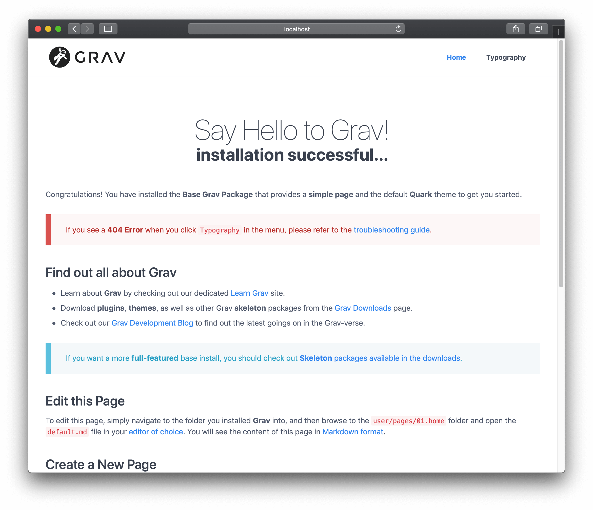

# Установка

Установка Grav — крайне простой процесс. На самом деле, реальная установка не требуется. У вас есть несколько вариантов для установки Grav. Первый и самый простой способ — скачать **zip**-архив и распаковать его. Второй способ — установка через **Composer**. Третий способ — клонировать исходный проект непосредственно из **GitHub**, а затем запустить скрипт для установки необходимых зависимостей. Существуют [дополнительные способы](#further-options), которые включают в себя запуск поставляемых скриптов.

## Проверка версии PHP

Grav невероятно прост в настройке и запуске. Убедитесь, что на сервере установлен PHP версии 7.3.6+, зайдя в терминал и набрав `php -v`:

```bash
php -v
PHP 7.2.15 (cli) (built: Feb  7 2019 20:10:03) ( NTS )
Copyright (c) 1997-2018 The PHP Group
Zend Engine v3.2.0, Copyright (c) 1998-2018 Zend Technologies
    with Zend OPcache v7.2.15, Copyright (c) 1999-2018, by Zend Technologies
```


## Вариант 1: установка из ZIP-пакета

Самый простой способ установить Grav — это скачать ZIP-архив и распаковать его:

1. Загрузите самую последнюю версию пакета **[Grav](https://getgrav.org/download/core/grav/latest)** или **[Grav + Admin](https://getgrav.org/download/core/grav-admin/latest)**.
2. Распакуйте ZIP-файл в корень сайта, например: `~/webroot/grav`.

!!! tip ""

	Можно воспользоваться [каркасами](https://getgrav.org/downloads/skeletons) — это пакеты, которые включают в себя Grav, примеры страниц, плагины и конфигурацию. Просто выберите понравившийся пакет и выполните шаги, описанные выше.

Вы также можете скачать любой из [готовых релизов](https://github.com/getgrav/grav/tags) с getgrav.org. Используйте формат `https://getgrav.org/download/TYPE/PACKAGE/VERSION`.

- [getgrav.org/download/core/grav/1.7.0](https://getgrav.org/download/core/grav/1.7.0) загрузка базового пакета Grav v1.7.0
- [getgrav.org/download/core/grav/1.7.0-rc.10?testing=true](https://getgrav.org/download/core/grav/1.7.0-rc.10?testing=true) загрузка базового пакета Grav v1.7.0-rc.10, тестовый релиз
- [getgrav.org/download/core/grav-admin/1.7.0](https://getgrav.org/download/core/grav-admin/1.7.0) загрузка базового пакета Grav v1.7.0 с плагином админки
- [getgrav.org/download/core/grav-admin/1.7.0-rc.10?testing=true](https://getgrav.org/download/core/grav-admin/1.7.0-rc.10?testing=true) загрузка базового пакета Grav v1.7.0-rc.10 с плагином админки, тестовый релиз
- [getgrav.org/download/core/grav-update/1.7.0](https://getgrav.org/download/core/grav-update/1.7.0) загрузка пакета обновления для Grav
- [getgrav.org/download/plugins/flex-objects-json/0.1.0](https://getgrav.org/download/plugins/flex-objects-json/0.1.0) загрузка плагина Flex Objects JSON v0.1.0
- [getgrav.org/download/themes/quark/2.0.3](https://getgrav.org/download/themes/quark/2.0.3) загрузка темы Quark v2.0.3

!!! danger ""

	Если вы загрузили ZIP-файл, а затем планируете переместить его в корень сайта, переместите **ВСЁ СОДЕРЖИМОЕ ПАПКИ**, поскольку без некоторых скрытых файлов (таких как `.htaccess`) Grav не сможет работать нормально.

## Вариант 2: установка через Composer

Альтернативный метод — установить Grav через [Composer](https://getcomposer.org/doc/00-intro.md#installation-linux-unix-osx):

```bash
composer create-project getgrav/grav ~/webroot/grav
```

Для установки экспериментальной версии Grav добавьте `1.x-dev` в качестве параметра (например, `1.7-dev`):

```bash
composer create-project getgrav/grav ~/webroot/grav 1.x-dev
```

## Вариант 3: установка с GitHub

Другой способ — клонировать Grav из репозитория GitHub, а затем запустить простой скрипт установки зависимостей:

1. Клонируйте репозиторий Grav из [GitHub](https://github.com/getgrav/grav) в корневую папку вашего сервера, например: `~/webroot/grav`. Запустите **терминал** или **консоль** и перейдите в корень сайта:

	```bash
	cd ~/webroot
	git clone -b master https://github.com/getgrav/grav.git
	```

2. Установите требуемые **зависимости** через [Composer](https://getcomposer.org/doc/00-intro.md#installation-linux-unix-osx):

	```bash
	cd ~/webroot/grav
	composer install --no-dev -o
	```

3. Установите **плагины** и **темы** через [консольное приложение Grav](/cli-console) `bin/grav`:

	```bash
	cd ~/webroot/grav
	bin/grav install
	```

	Это автоматически **клонирует** необходимые зависимости из GitHub непосредственно в текущую установку.

## Дополнительные варианты

### Установка с помощью Docker

[Docker](https://ru.wikipedia.org/wiki/Docker) — это чрезвычайно эффективный способ загрузки платформ и сервисов как на серверах, так и в локальных средах. Если вы создаете несколько сред, которые должны быть одинаковыми, или работаете совместно, это простой способ обеспечить согласованность между установками. Если вы разрабатываете несколько сайтов Grav, вы можете упростить их настройку с помощью Docker.

Доступны стабильные образы Docker, использующие веб-серверы [Apache](https://github.com/getgrav/docker-grav) (официальный образ), [Nginx](https://github.com/dsavell/docker-grav) и [Caddy](https://github.com/hughbris/grav-daddy). Если вы поищете, то найдете ещё больше вариантов, которые вы можете попробовать. При использовании любого образа убедитесь, что вы создали тома для хранения папок Grav `user`, `backups` и `logs`. (Резервные копии и журналы необязательны, если вам не нужно хранить эти данные).

## Вариант 4: установка на Cloudron

Cloudron — это комплексное решение для запуска приложений на вашем сервере и поддержания их в актуальном и безопасном состоянии. На вашем Cloudron вы можете установить Grav несколькими щелчками мыши. Если у вас несколько сайтов, вы можете установить их полностью изолированно друг от друга на одном сервере.

[](https://cloudron.io/store/org.getgrav.cloudronapp.html)

Исходный код пакета можно найти [здесь](https://git.cloudron.io/cloudron/grav-app).

### Установка через Linode Marketplace

Если вы используете серверы Linode, существует [простой, документированный метод с использованием Linode Marketplace](https://www.linode.com/docs/marketplace-docs/guides/grav/). Это позволит создать новый сайт Grav на новом выделенном виртуальном сервере Linode. За использование виртуального сервера взимается периодическая плата.

## Веб-серверы

#### Apache/IIS/Nginx

Использование Grav с веб-сервером, таким как Apache, IIS или Nginx, так же просто, как извлечение Grav в корневую папку. Всё, что требуется для работы — это PHP 7.3.6+, поэтому вы должны убедиться, что ваш экземпляр сервера соответствует этому требованию. Более подробную информацию о требованиях Grav можно найти в главе [Требования](../requirements) данного руководства.

Если ваш веб-корень, например, `~/public_html`, вы можете извлечь его в эту папку и перейти к нему через `http://localhost`. Если вы извлечете его в `~/public_html/grav`, вы получите его через `http//localhost/grav`.

!!! tip ""

	Каждый веб-сервер должен быть настроен. Grav поставляется с `.htaccess` для Apache и с некоторыми [файлами конфигурации](https://github.com/getgrav/grav/tree/master/webserver-configs) для `nginx`, `caddy server`, `iis` и `lighttpd`. Используйте их при необходимости.

#### Запуск Grav со встроенным PHP-сервером

Вы можете запустить Grav, используя простую команду из терминала/командной строки, используя встроенный сервер PHP, доступный для любой системы с установленным PHP.

Всё, что вам нужно сделать, это перейти к корню вашей установки Grav с помощью терминала или командной строки и ввести `bin/grav server`.

!!! warning ""

	Хотя технически всё, что вам нужно, это установить PHP, если вы установите приложение [Symfony CLI](https://symfony.com/download), сервер предоставит SSL-сертификат, чтобы вы могли использовать `https://` и PHP-FPM для повышения производительности.

Ввод этой команды предоставит вам вывод, подобный следующему:

```bash
➜ bin/grav server

Grav Web Server
===============

Tailing Web Server log file (/Users/joeblow/.symfony/log/96e710135f52930318e745e901e4010d0907cec3.log)
Tailing PHP-FPM log file (/Users/joeblow/.symfony/log/96e710135f52930318e745e901e4010d0907cec3/53fb8ec204547646acb3461995e4da5a54cc7575.log)
Tailing PHP-FPM log file (/Users/joeblow/.symfony/log/96e710135f52930318e745e901e4010d0907cec3/53fb8ec204547646acb3461995e4da5a54cc7575.log)

[OK] Web server listening
The Web server is using PHP FPM 8.0.8
https://127.0.0.1:8000


[Web Server ] Jul 30 14:54:53 |DEBUG  | PHP    Reloading PHP versions
[Web Server ] Jul 30 14:54:54 |DEBUG  | PHP    Using PHP version 8.0.8 (from default version in $PATH)
[PHP-FPM    ] Jul  6 14:40:17 |NOTICE | FPM    fpm is running, pid 64992
[PHP-FPM    ] Jul  6 14:40:17 |NOTICE | FPM    ready to handle connections
[PHP-FPM    ] Jul  6 14:40:17 |NOTICE | FPM    fpm is running, pid 64992
[PHP-FPM    ] Jul  6 14:40:17 |NOTICE | FPM    ready to handle connections
[Web Server ] Jul 30 14:54:54 |INFO   | PHP    listening path="/usr/local/Cellar/php/8.0.8_2/sbin/php-fpm" php="8.0.8" port=65140
[PHP-FPM    ] Jul 30 14:54:54 |NOTICE | FPM    fpm is running, pid 73709
[PHP-FPM    ] Jul 30 14:54:54 |NOTICE | FPM    ready to handle connections
[PHP-FPM    ] Jul 30 14:54:54 |NOTICE | FPM    fpm is running, pid 73709
[PHP-FPM    ] Jul 30 14:54:54 |NOTICE | FPM    ready to handle connections
```

Ваш терминал также будет предоставлять вам в режиме реального времени обновления любой активности на этом специальном сервере. Вы можете скопировать URL-адрес, указанный в строке `[OK] Web server listening`, и вставить его в используемый браузер, чтобы получить доступ к своему сайту, включая админку.

```
https://127.0.0.1:8000
```

!!! danger ""

	Это полезный инструмент для быстрой разработки, который **не** следует использовать вместо выделенного веб-сервера, такого как Apache или Nginx.

## Успешная установка

При первой загрузке Grav предварительно компилирует некоторые файлы. Если вы сейчас обновите свой браузер, вы получите более быструю кэшированную версию.



!!! warning ""

	В предыдущих примерах **$** представляет командную строку. Это может выглядеть по-разному на разных платформах.

По умолчанию в Grav есть несколько примеров страниц, чтобы вы могли с чего-то начать. Ваш сайт уже полностью функционален, и вы можете настраивать его, добавлять контент, расширять или настраивать его по своему усмотрению.

## Проблемы с установкой и настройкой

Если во время начальной загрузки страницы обнаружатся какие-либо проблемы (или после события очистки кэша), вы можете увидеть страницу ошибки:


Пожалуйста, обратитесь к разделу [Решение проблем](/troubleshooting/common-problems/) для получения помощи по конкретным вопросам.

!!! info ""

	Если у вас возникли проблемы с правами доступа к файлам, обратитесь к разделу [Разрешения](/troubleshooting/permissions). Кроме того, вы можете посмотреть [Документацию по хостингу](/webservers-hosting), в которой содержатся конкретные инструкции для различных сред хостинга.

## Обновление Grav

Чтобы поддерживать ваш сайт в актуальном состоянии, пожалуйста, прочтите [Обновление Grav и плагинов](../updates).
