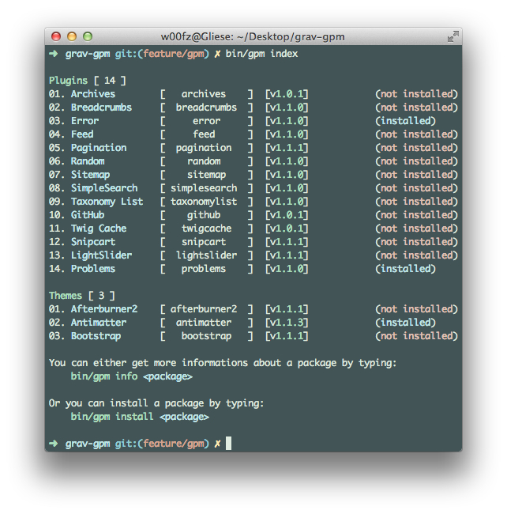
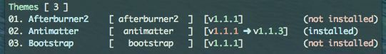
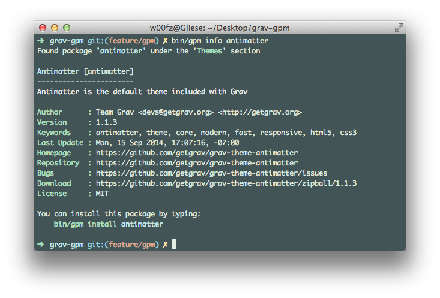
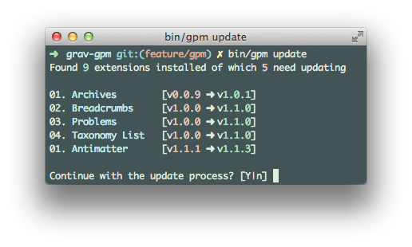
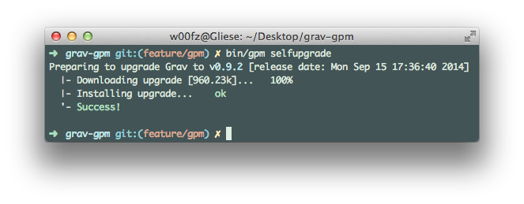

# Команды GPM

Начиная с версии **0.9.3**, Grav включает _GPM_ (Grav Package Manager), который позволяет вам устанавливать, обновлять, удалять и перечислять все темы и плагины, доступные в репозитории Grav, а также обновлять сам Grav. до последней версии.

Подобно [Grav CLI](../grav-cli), _GPM_ — это инструмент командной строки, который требует, чтобы пользователь запускал команды через интерфейс командной строки, например **Терминал** в MacOS. Команды стиля UNIX изначально недоступны в Windows cmd. Установка пакета [Git SCM](https://gitforwindows.org) в Windows добавляет [Git](https://git-scm.com/) и Git BASH, который является альтернативой командной строке, делая доступными команды UNIX.

Чтобы начать работу с _GPM_, вы можете запустить следующую команду, чтобы получить список всех доступных на данный момент команд:

```bash
bin/gpm list
```

Чтобы получить справку по конкретной команде, вы можете добавить справку в строку перед командой:

```bash
bin/gpm help install
```

!!! warning ""

    Чтобы иметь возможность выполнять **установку**, **обновление** и **самообновление**, в PHP должно быть включено расширение `php_openssl`. Если при загрузке вы получаете фатальную ошибку, вероятно, это причина.

## Информация о PHP CGI-FCGI

Чтобы определить, запущен ли на вашем сервере cgi-fcgi в командной строке, введите следующее:

```bash
php -v
PHP 5.5.17 (cgi-fcgi) (built: Sep 19 2014 09:49:55)
Copyright (c) 1997-2014 The PHP Group
Zend Engine v2.5.0, Copyright (c) 1998-2014 Zend Technologies
    with the ionCube PHP Loader v4.6.1, Copyright (c) 2002-2014, by ionCube Ltd.
```

Если вы видите ссылку на `(cgi-fcgi)`, вам нужно будет поставить перед всеми командами `bin/gpm` префикс `php-cli`. В качестве альтернативы вы можете настроить псевдоним в своей оболочке с помощью чего-то вроде: `alias php="php-cli"`, который обеспечит запуск **CLI** версии PHP из командной строки.

## Как это работает?

_GPM_ загружает метаданные репозитория с **GetGrav.org**. Репозиторий содержит все сведения о доступных пакетах, и _GPM_ также может определить, установлены ли уже какие-либо из этих пакетов и нуждаются ли они в обновлении.

Сам репозиторий кэшируется локально на машине экземпляра Grav, на которой выполняется команда, на 24 часа. Любые дальнейшие запросы после создания кэша не будут связываться с сервером **GetGrav.org**, а будут обслуживаться из локально сохраненного репозитория. Такой подход гарантирует гораздо более быстрый ответ.

Большинство команд (перечисленных ниже) поставляются с параметром `--force (-f)`, который позволяет принудительно выполнить повторную выборку репозитория. Это может быть чрезвычайно полезно в случае, если известно, что существует обновление, и пользователь не хочет ждать полный 24-часовой цикл, прежде чем кэш будет очищен.

## Команды

Ниже мы разбили все команды, доступные для _GPM_. Чтобы выполнить команду, запустите ваше любимое приложение-терминал и в корне вашего экземпляра Grav введите `bin/gpm <command>`.

### index

Команда `index` показывает список всех доступных ресурсов в репозитории Grav, организованный по _themes_ и _plugins_.



В каждой строке отображается **имя**, **ярлык**, **версия** и указано, установлено ли оно уже или нет.

В этом представлении вы также можете быстро определить, есть ли новая версия каких-либо ресурсов, которые вы уже установили.

Например, если у нас была очень старая версия Antimatter (v1.1.1), но последняя версия была v1.1.3, она появится в указателе, как показано ниже.



!!! warning ""

    Вы можете использовать опцию `--installed-only`, чтобы показать состояние **только установленных** плагинов и тем.

### info

Команда `info` отображает подробную информацию о желаемом пакете, такую ​​как описание, автор, домашняя страница и т. д.



!!! warning ""

    Вам также будет предложено просмотреть **список изменений** плагина/темы с помощью этой опции.

### install

Команда `install` делает именно то, что заявляет. Он устанавливает ресурс из репозитория в ваш текущий экземпляр Grav с помощью простой команды.

Команда также определит, установлен ли ресурс уже или связан ли он символически, и предложит вам, что делать.

Вы также можете установить несколько ресурсов одновременно, разделив ярлыки пробелом.


!!! warning ""

    Вы можете использовать параметр `--all-yes (-y)`, чтобы пропустить любые запросы. Существующие ресурсы будут переопределены, а если они являются символическими ссылками, будут автоматически пропущены.

### update

Команда `update` показывает список обновляемых ресурсов и работает аналогично` install`.




Кроме того, вы можете ограничить обновления только определёнными ресурсами.


### uninstall

Команда `uninstall` удаляет установленную тему или плагин и очищает кэш. Поскольку Grav - это чисто файловая система, удаление темы или плагина означает физическое удаление папки.

Команда также определит, связан ли ресурс символически, и предложит вам, что делать.

Вы также можете удалить сразу несколько ресурсов, разделив ярлыки пробелом.

!!! warning ""

    Вы можете использовать параметр `--all-yes (-y)`, чтобы пропустить любые запросы. Если ресурс определяется как символическая ссылка, он будет автоматически пропущен.

### self-upgrade

`self-upgrade` (самообновление) позволяет вам обновить Grav до последней доступной версии. Если обновление не требуется, об этом будет сообщено в сообщении, в котором также будет указано, какая версия у вас установлена ​​в данный момент и когда выпуск был опубликован.

Настоятельно рекомендуется всегда делать резервную копию перед выполнением самостоятельного обновления (см. _Создание резервной копии_ в [разделе CLI](../grav-cli)).

!!! warning ""

    Самостоятельное обновление обновляет только части вашего экземпляра Grav, такие как папка system/, папка vendor/, index.php и другие. Ваши папки **`user`** и **`images`** никогда не будут затронуты.




## Важная информация для разработчиков

### Чертежи

С введением _GPM_ у нас теперь есть строгие правила в отношении допустимых `чертежей`. Независимо от того, разрабатываете ли вы _theme_ или _plugin_, вы всегда должны убедиться, что секция `blueprints` отформатирована правильно.

Чертёж может служить нескольким различным целям, включая определение вашей идентичности ресурса. Пожалуйста, обратитесь к главе [Чертежи](/forms/blueprints) для более подробной документации о том, что такое чертежи и как они должны быть скомпилированы.

### Релизы

Репозиторий Grav обновляется каждый час и автоматически определяет, когда появляются новые выпуски. Это означает, что как разработчик вы следовали нашим требованиям [сотрудничества](https://github.com/getgrav/grav#contributing).

Со своей стороны, всё, что вам нужно сделать, это убедиться, что вы обновили чертежи новой версией, отметили и выпустили новую версию. Репозиторий Grav сделает все остальное за вас, и как только ваш релиз будет выпущен, он станет доступен всем через веб-сайт Grav или через _GPM_.

### Добавьте свой ресурс в репозиторий

`advanced/grav-development#themeplugin-release-process`

Следуйте инструкциям в разделе [Процесс выпуска темы/плагина](/advanced/grav-development/#protsess-vypuska-temy-plagina).

Чтобы добавить ваш новый плагин/тему в репозиторий Grav, откройте Grav Issue на GitHub. Вы также можете [использовать эту предварительно скомпилированную ссылку](https://github.com/getgrav/grav/issues/new?title=[add-resource]%20New%20Plugin/Theme&body=I%20would%20like%20to%20add%20my%20new%20plugin/theme%20to%20the%20Grav%20Repository.%0AHere%20are%20the%20project%20details:%20**user/repository**). Укажите свой репозиторий вместо `user/repository`.

Более подробная информация о том, что делает плагин/тема, приветствуется и может быть размещена в этом выпуске.

Также имейте в виду, что перед добавлением репозитория команда Grav проверит ваш плагин/тему, чтобы убедиться, что он соответствует стандартам Grav. Команда может также отвечать на запросы о предоставлении дополнительной информации, предлагать незначительные улучшения и т. д. до закрытия вопроса и добавления плагина/темы.
