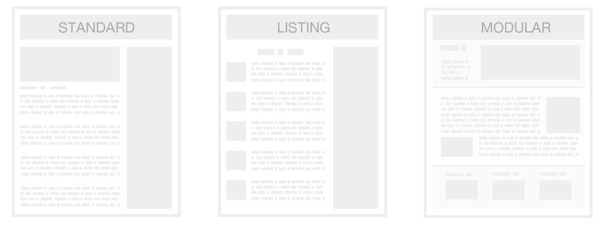
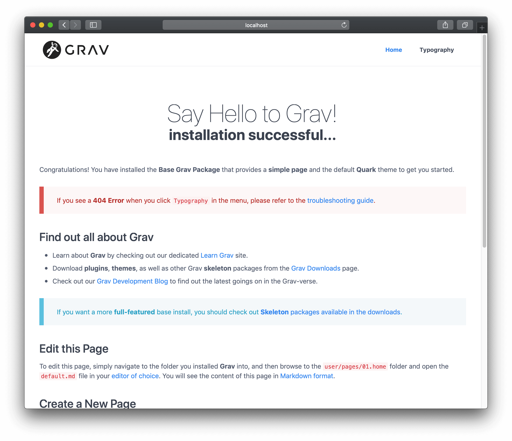
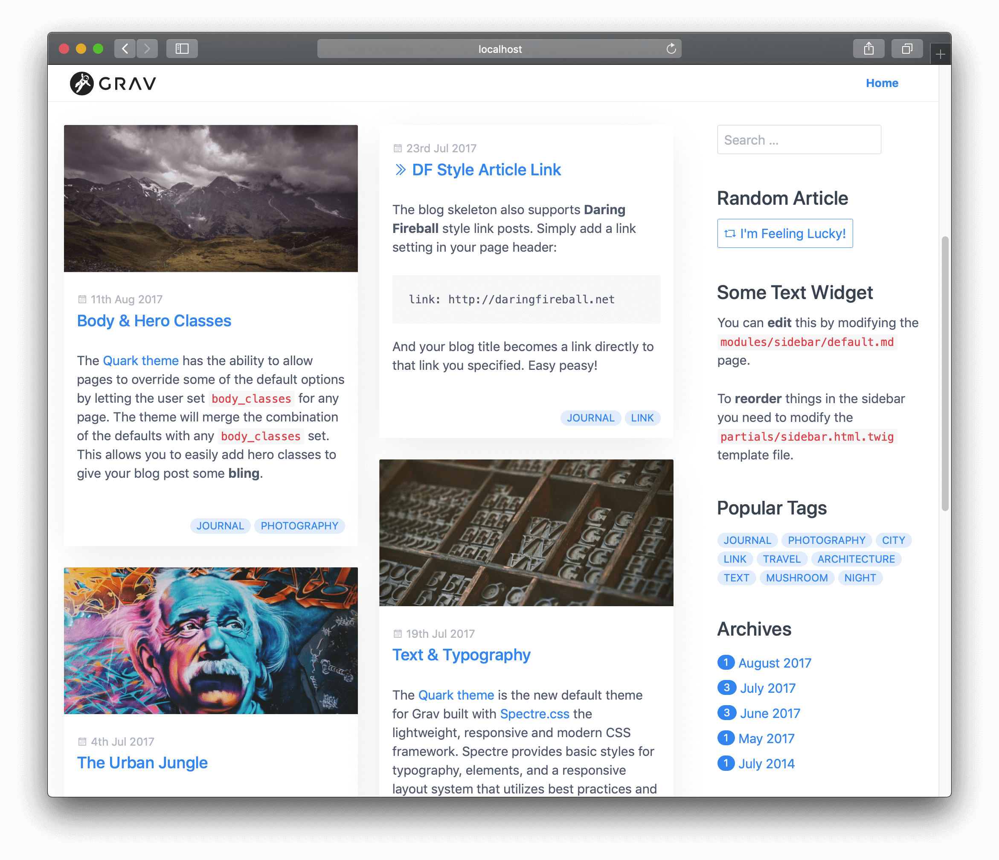

# Страницы

**Страницы** в Grav являются фундаментальными строительными блоками вашего сайта. Они содержат контент и обеспечивают навигацию в системе Grav.

Комбинация контента и навигации гарантирует, что система интуитивно понятна в использовании даже для самых неопытных авторов. Однако эта система в сочетании с мощными возможностями таксономии по-прежнему достаточно мощна для обработки сложных требований к контенту.

Grav изначально поддерживает **3 типа страниц**, которые позволяют создавать сайты, богатые веб-контентом. Перечислим эти типы:



#### Обычная страница



Обычная страница представляет собой одну страницу, такую как **запись блога**, **контактная форма**, **страница ошибки** и т. д. Это самый распространенный тип создаваемых страниц. По умолчанию любая страница считается обычной, если вы не скажете Grav об обратном.

При скачивании и установке пакета **Grav core** вас приветствует стандартная страница. Создание простой страницы мы подробно рассматриваем в [Кратком руководстве](/basics/basic-tutorial).

#### Листинг



Это расширение обычной страницы. Это страница, имеющая ссылку на коллекцию страниц.

Самый простой подход к настройке — создать **дочерние страницы** для страницы-списка. Примером этого может служить **листинг блога**, в которой перечисляются записи блога, существующие как дочерние страницы по отношению к текущей.

Также существуют такие параметры конфигурации, как **управление порядком** списка страниц, **ограничение на количество элементов**, и **пагинация**.

!!! info ""

    Пример **каркаса блога**, использующего **листинг**, можно найти на [странице загрузок Grav](https://getgrav.org/downloads/skeletons).

#### Модульная страница


Модульная страница — особый тип страницы-списка, поскольку **каждая модульная страница** строится из **дочерних модульных подстраниц**. Это позволяет создавать очень сложные **одностраничные макеты** из модулей. Это достигается путем построения **модульной страницы** из нескольких **модульных папок подстраниц**, найденных в основной папке модульной страницы.

!!! info ""

    Пример **каркаса одностраничника**, использующего **модульную страницу**, можно найти на [странице загрузок Grav](https://getgrav.org/downloads/skeletons).

Каждый из этих типов страниц следует одной и той же базовой структуре, поэтому, прежде чем мы сможем перейти к деталям каждого типа, мы должны объяснить, как строятся страницы в Grav.

!!! warning ""

    Модуль, поскольку он предназначен для того, чтобы быть частью другой страницы, по своей сути не является страницей, на которую вы можете попасть непосредственно через URL-адрес. Из-за этого все модульные страницы по умолчанию задаются как **не маршрутизируемые**.

## Папки

Весь контент сайта находится в директории `/user/pages`. Каждая **страница** должна быть расположена в своей собственной папке.

!!! warning ""

    Имена папок также должны быть действительными **слагами**. Слаги должны состоять из строчных символов латинского алфавита, а пробельные символы должны заменяться на тире или подчеркивание, чтобы избежать их кодирования.

Grav понимает, что любое целочисленное значение, за которым следует точка, будет предназначено исключительно для упорядочивания, и удаляется внутри системы. Например, если у вас есть папка с именем `01.home`, Grav будет обрабатывать эту папку как `home`, но будет гарантировать, что с упорядочением по умолчанию, она идет раньше `02.blog` (в меню и в иных подобных структурах).

```text
/user
└── /pages
    ├── /01.home
    │   ├── /_header
    │   ├── /_features
    │   ├── /_body
    ├── /02.blog
    │   ├── /blog-item-1
    │   ├── /blog-item-2
    │   ├── /blog-item-3
    │   ├── /blog-item-4
    │   └── /blog-item-5
    ├── /03.about-us
    └── /error
```

Ваш сайт должен иметь точку входа, чтобы браузер отображал соответствующую страницу при переходе на главную страницу. Например, при переходе по адресу `http://yoursite.com` Grav ожидает отображения ресурса с алиасом `home/`, но вы можете переопределить это поведение, изменив настройку `home.alias` в [файле конфигурации](/basics/grav-configuration).

**Модульные подстраницы** обозначаются подчеркиванием (`_`) перед именем папки. Это специальный тип папки, который предназначен для использования только с **модульным содержимым**. Они **не маршрутизируются** и **не видны** в навигации. Примером модульной настройки страницы может быть папка, такая как `user/pages/01.home`. Страница `home` настроена как **модульная страница**, которая будет содержать коллекцию дочерних страниц и будет создана из модульных подстраниц `_header`,` _features` и `_body`.

Текстовое имя каждой папки по умолчанию равно _slug_, которое система использует как часть URL. Например, если у вас есть папка, такая как `/user/pages/02.blog`, для этой страницы слаг будет по умолчанию `blog`, а полный URL-адрес будет `http://yoursite.com/blog`. Страница элемента блога, расположенная в `/user/pages/02.blog/blog-item-5`, будет доступна через `http://yoursite.com/blog/blog-item-5`.

Если в качестве префикса имени папки не указан номер, страница считается **невидимой** и не будет отображаться в навигации. Примером этого может быть страница `error` в приведенной выше структуре папок.

!!! info ""

    На самом деле это можно переопределить на самой странице, установив [параметр visible](../headers#visible) в заголовках.

## Порядок

При работе с коллекциями существует несколько параметров, позволяющих управлять порядком папок. Наиболее важный параметр задается в `content.order.by` настроек конфигурации страницы. Варианты:

| Свойство | Описание |
| -------- | ----------- |
| **default**  | Порядок основан на файловой системе, то есть `01.home` располагается перед `02.advark` |
| **title**    | Порядок основан на заголовке, как определено на каждой странице. |
| **basename** | Порядок основан на алфавитной папке без числового порядка |
| **date**     | Порядок основан на дате, определенной на каждой странице. |
| **modified** | Порядок основан на дате изменения каждой страницы. |
| **folder**   | Порядок основан на имени папки с любым числовым префиксом, т. е. `01.`, удалено |
| **header.x** | Порядок основан на любом поле заголовка страницы, например: `header.taxonomy.year`. Значение по умолчанию можно добавить через вертикальную черту: `header.taxonomy.year|2015` |
| **manual**   | Порядок основан на переменной `order_manual` |
| **random**   | Случайный порядок |

Вы можете определить порядок вручную, указав список параметров для параметра конфигурации `content.order.custom`. Это будет работать в сочетании с `content.order.by`, потому что сначала он пытается упорядочить страницы вручную, но любые страницы, не указанные в ручном порядке, будут сброшены и упорядочены в соответствии с предоставленным порядком.

!!! info ""

    Вы можете переопределить **поведение по умолчанию** для упорядочения папок и направления, в котором происходит упорядочение, установив параметры `pages.order.dir` и `pages.order.by` в [системном файле конфигурации](/basics/grav-configuration).

## Файл страницы

В папке страницы мы создаем фактический файл страницы. Имя файла должно заканчиваться на `.md`, чтобы указать, что это файл в формате Markdown. Технически, это Markdown с блоком метаданных YAML, что звучит впечатляюще, но на самом деле не имеет большого значения. Мы скоро рассмотрим детали файловой структуры.

Важно понимать, что имя файла напрямую ссылается на имя файла шаблона темы, который будет использоваться для визуализации. Стандартное имя для основного файла шаблона — **default**, поэтому файл будет называться `default.md`.

Конечно, вы можете назвать свой файл как угодно, например: `document.md`, что заставит Grav искать файл шаблона **document.html.twig** в соответствующей теме.

!!! info ""

    Это поведение можно изменить на странице, установив [параметр template](../headers#template) в заголовках.

Пример файла страницы:

```yaml
---
title: Заголовок страницы
taxonomy:
    category: blog
---
```

```markdown
# Заголовок страницы

Lorem ipsum dolor sit amet, consectetur adipiscing elit. Pellentesque porttitor eu
felis sed ornare. Sed a mauris venenatis, pulvinar velit vel, dictum enim. Phasellus
ac rutrum velit. **Nunc lorem** purus, hendrerit sit amet augue aliquet, iaculis
ultricies nisl. Suspendisse tincidunt euismod risus, _quis feugiat_ arcu tincidunt
eget. Nulla eros mi, commodo vel ipsum vel, aliquet congue odio. Class aptent taciti
sociosqu ad litora torquent per conubia nostra, per inceptos himenaeos. Pellentesque
velit orci, laoreet at adipiscing eu, interdum quis nibh. Nunc a accumsan purus.
```

Настройки между парой маркеров `---` называются блоком метаданных YAML и состоят из основных настроек YAML для страницы.

В этом примере мы явно устанавливаем заголовок, а также таксономию **blog**, чтобы можно было отфильтровать её позже. Содержимое после второго `---` - это фактическое содержимое, которое будет скомпилировано и отображено на вашем сайте в виде HTML. Это написано в [Markdown](../markdown), который будет подробно рассмотрен в следующей главе. Просто знайте, что маркеры `#`, `**` и `_` переводятся в **заголовок 1**, **полужирный** и **курсив** соответственно.

!!! warning ""

    Убедитесь, что вы сохранили файлы `.md` как файлы в кодировке `UTF-8`. Это обеспечит их работу со специальными символами для конкретного языка.

### Размер тизера и разделитель

В файле `site.yaml` есть настройка, позволяющая определить размер тизера по умолчанию (в символах), который можно использовать через `page.summary()` для отображения тизера или краткого обзора страницы. Это особенно полезно для блогов, где вы хотите иметь список, содержащий только сводную информацию, а не весь контент страницы.

По умолчанию это значение равно `300` символам. Вы можете переопределить это в вашем файле `user/config/site.yaml`, но ещё более полезный подход заключается в использовании **тизерного разделителя**: `===`.

Убедитесь, что добавили этот разделитель в свой контент с пустыми строками **до** и **после**. Пример:

```markdown
Lorem ipsum dolor sit amet, consectetur adipisicing elit, sed do eiusmod
tempor incididunt ut labore et dolore magna aliqua. Ut enim ad minim veniam,
quis nostrud exercitation ullamco laboris nisi ut aliquip ex ea commodo
consequat.

===

Duis aute irure dolor in reprehenderit in voluptate velit esse
cillum dolore eu fugiat nulla pariatur. Excepteur sint occaecat cupidatat non
proident, sunt in culpa qui officia deserunt mollit anim id est laborum. Lorem ipsum dolor sit amet, consectetur adipisicing elit, sed do eiusmod
tempor incididunt ut labore et dolore magna aliqua. Ut enim ad minim veniam,
quis nostrud exercitation ullamco laboris nisi ut aliquip ex ea commodo
consequat. Duis aute irure dolor in reprehenderit in voluptate velit esse
cillum dolore eu fugiat nulla pariatur. Excepteur sint occaecat cupidatat non
proident, sunt in culpa qui officia deserunt mollit anim id est laborum.
```

При этом будет использоваться текст над разделителем, на который ссылается `page.summary()` и полное содержание страницы, когда на нее ссылаются через `page.content()`.

!!! info ""

    При использовании `page.summary()` будет использоваться параметр размера тизера, если разделитель не найден в содержимом страницы.

### Поиск других страниц

Grav имеет полезную функцию, которая позволяет вам находить другую страницу и выполнять действия на этой странице. Это можно сделать с помощью метода `find()`, который просто берет текущий **маршрут** и возвращает объект другой страницы.

Это позволяет вам выполнять широкий спектр функциональных возможностей с любой страницей вашего сайта. Например, вы можете предоставить список всех текущих проектов на конкретной странице сведений о проекте:

```twig
# Все проекты
<ul>
    
        <li><a href="{{p.url}}">{{ p.title }}</a></li>
    
</ul>
```

!!! info ""

    Объект `pages-object` недоступен при обработке Twig непосредственно в Markdown-контенте. Однако объект `page-object` и унаследованный от него метод `find()` - доступны, поэтому вы можете использовать `` в качестве замены вышеприведённому. Обратите внимание, что `pages` относится ко всем страницам, доступным Grav, а `page` относится к одной, часто текущей, странице.

В следующем разделе мы продолжим подробно разбираться в особенностях страниц.

### contentMeta

Ссылки на страницы и контент просты, но как насчет контента, который не отображается вместе с остальной частью страницы?

Когда Grav считывает содержимое страницы, он сохраняет это содержимое в кэше. Таким образом, при следующем отображении страницы не нужно будет читать всё содержимое из файла `.md`. Как правило, всё это содержимое выводится на передний план. Однако есть случаи, когда полезно иметь некоторые дополнительные данные, хранящиеся рядом со страницей в кэше.

Вот тут-то и появляется `contentMeta()`. Он используется в плагине [Shortcode](https://github.com/getgrav/grav-plugin-shortcode-core) для [извлечения разделов с других страниц](https://github.com/getgrav/grav-plugin-shortcode-core#sections-from-other-pages), использующих шорт-коды. Пример:

```twig
<div id="author">{{ page.find('/my/custom/page').contentMeta.shortcodeMeta.shortcode.section.author }}</div>
```

Мы использовали это в ядре Shortcode для хранения CSS и JS, требующихся на странице. Однако эта функция может быть использована для хранения практически любой структуры данных, которая вам нужна.
