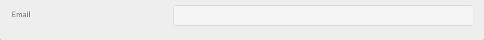

# Ссылка: указатель полей формы

## Общие атрибуты полей

Каждое поле принимает список атрибутов, которые вы можете использовать. Каждое поле может иметь общие атрибуты, но отдельные поля могут их игнорировать. Лучший способ проверить, какие атрибуты разрешены в поле - это проверить описание поля на этой странице и увидеть, какие атрибуты упоминаются.

Этот список обеспечивает общую основу, поэтому нет необходимости повторять описание общего поля.

| Атрибут             | Описание                                                                                                                                                                                                                                                      |
| :------------------ | :------------------------------------------------------------------------------------------------------------------------------------------------------------------------------------------------------------------------------------------------------------ |
| `autocomplete`      | принимает `on` или `off`                                                                                                                                                                                                                                      |
| `autofocus`         | если включено, автофокус на этом поле                                                                                                                                                                                                                         |
| `classes`           | принимает строку с одним или несколькими классами CSS для добавления                                                                                                                                                                                          |
| `default`           | устанавливает значение поля по умолчанию                                                                                                                                                                                                                      |
| `disabled`          | устанавливает отключенное состояние поля                                                                                                                                                                                                                      |
| `help`              | добавляет всплывающую подсказку к полю                                                                                                                                                                                                                        |
| `id`                | устанавливает идентификатор поля. Также устанавливает атрибут `for` для тега `label`                                                                                                                                                                          |
| `label`             | устанавливает метку поля                                                                                                                                                                                                                                      |
| `display_label`     | принимает `true` или `false`                                                                                                                                                                                                                                  |
| `labelclasses`      | принимает строку с одним или несколькими классами CSS для добавления                                                                                                                                                                                          |
| `sublabel`          | устанавливает текст поля под меткой                                                                                                                                                                                                                           |
| `sublabelclasses`   | принимает строку с одним или несколькими классами CSS для добавления                                                                                                                                                                                          |
| `name`              | устанавливает имя поля                                                                                                                                                                                                                                        |
| `novalidate`        | устанавливает состояние novalidate поля                                                                                                                                                                                                                       |
| `outerclasses`      | классы, добавленные в div, включающий тег `label` и поле                                                                                                                                                                                                      |
| `wrapper_classes`   | Классы, добавленные в оболочку, которая включает описание и поле                                                                                                                                                                                              |
| `placeholder`       | устанавливает значение заполнителя поля                                                                                                                                                                                                                       |
| `readonly`          | устанавливает состояние поля только для чтения                                                                                                                                                                                                                |
| `size`              | устанавливает размер поля, которое, в свою очередь, добавляет класс в свой контейнер. Допустимые значения: `large`, `x-small`, `medium`, `long`, `small`. Вы, конечно, можете добавить больше в шаблон, который вы видите, когда он используется во фронтенде |
| `style`             | устанавливает стиль поля                                                                                                                                                                                                                                      |
| `title`             | устанавливает значение заголовка поля                                                                                                                                                                                                                         |
| `type`              | устанавливает тип поля                                                                                                                                                                                                                                        |
| `validate.required` | если установлено положительное значение, устанавливает поле как обязательное                                                                                                                                                                                  |
| `validate.pattern`  | устанавливает шаблон валидации                                                                                                                                                                                                                                |
| `validate.message`  | устанавливает сообщение, отображаемое в случае сбоя валидации                                                                                                                                                                                                 |

Чтобы добавить пользовательские атрибуты, вы можете использовать:

```
attributes:
  key: value
```

Чтобы добавить пользовательские значения data-\*, вы можете использовать:

```
datasets:
  key: value
```

Указанные выше определения `атрибутов` и `наборов данных` приводят к следующему определению поля:

```
<input name="data[name]" value="" type="text" class="form-input " key="value" data-key="value">
```

!!! note ""

    Положительные значения можно установить несколькими способами: `'on'`, `true`, `1`. Остальные значения интерпретируются как отрицательные..

---

## Доступные поля

### Поле Basic-Captcha

Добавлено в Forms `7.0.0` в качестве локальной альтернативы полю Google ReCaptcha. Это поле особенно удобно при работе со СПАМом в контактных формах, когда вы не хотите иметь дело с хлопотами или, возможно, ограничениями GPDR, которые приходят с предложением Google. В нем используются **OCR-устойчивые** шрифты для предотвращения атак, и его можно настроить с помощью кодов для копирования или простых математических вопросов.


Тип поля `basic-captcha` полностью настраивается как глобально, так и на уровне отдельного поля. Глобальная конфигурация задаётся в файле конфигурации форм (обычно `user/config/plugins/form.yaml`), а конфигурация на уровне поля позволяет настраивать отдельные CAPTCHA-поля в ваших формах.

#### Глобальная конфигурация

Глобальные параметры по умолчанию:

```yaml
basic_captcha:
  type: characters            # options: [characters | math | dotcount | position]
  debug: false                # enable debug logging
  image:
    width: 135                # default image width (for math/dotcount/position types)
    height: 40                # default image height (for math/dotcount/position types)
    bg: '#ffffff'             # default background color
  chars:
    length: 6                 # number of chars to output
    font: zxx-xed.ttf         # options: [zxx-xed.ttf | zxx-sans.ttf | zxx-camo.ttf | zxx-noise.ttf]
    size: 24                  # font size in px
    box_width: 200            # image width for character captchas (overrides image.width)
    box_height: 70            # image height for character captchas (overrides image.height)
    start_x: 10               # start position in x direction in px
    start_y: 40               # start position in y direction in px
    bg: '#ffffff'             # background color for character captchas
    text: '#000000'           # text color (hex format)
  math:
    min: 1                    # smallest digit
    max: 12                   # largest digit
    operators: ['+','-','*']  # operators that can be used in math
```

#### Конфигурация на уровне отдельного поля

Начиная с версии Forms `7.1.0` вы можете переопределять глобальные настройки индивидуально для каждого поля. Это позволяет разным формам использовать разные стили, шрифты, цвета и типы капчи.

!!! warning "Важно"

    В конфигурации поля используйте параметр `captcha_type` (а не `type`), чтобы не возникло конфликта с обязательным объявлением `type: basic-captcha`.

**Простой пример:**

```yaml
basic-captcha:
  type: basic-captcha
  placeholder: введите символы
  label: Вы человек?
```

**Расширенный пример с конфигурацией на уровне поля:**

```yaml
basic-captcha:
    type: basic-captcha
    placeholder: введите символы
    label: Вы человек?
    # Field-level configuration overrides global defaults
    captcha_type: characters        # use 'captcha_type' not 'type'
    chars:
        font: zxx-sans.ttf          # cleaner font
        size: 32                    # larger text
        length: 6                   # 6 characters
        box_width: 200              # wider image
        box_height: 70              # taller image
        bg: '#f0f8ff'               # light blue background
        text: '#0066cc'             # dark blue text
        start_x: 20                 # custom X position
        start_y: 50                 # custom Y position
```

**Пример математической капчи:**

```yaml
basic-captcha:
    type: basic-captcha
    placeholder: введите ответ
    label: Решите математическую задачку
    captcha_type: math              # math problem instead of characters
    math:
        min: 1                      # use small numbers
        max: 10
        operators: ['+','-']        # only addition and subtraction
```

#### Доступные типы капчи

При конфигурации на уровне поля тип капчи задаётся параметром `captcha_type`:

- **`characters`** — случайная строка символов (по умолчанию)
- **`math`** — простая математическая задачка (например, «3 + 5 = ?»)
- **`dotcount`** — посчитать точки определённого цвета
- **`position`** — определить положение символа

#### Доступные шрифты

Поле Basic-Captcha содержит четыре устойчивых к OCR шрифта:

- **`zxx-xed.ttf`** — по умолчанию, сбалансированная читаемость и безопасность
- **`zxx-sans.ttf`** — чистый без засечек, легче читается
- **`zxx-camo.ttf`** — стиль «камуфляж», сложнее
- **`zxx-noise.ttf`** — стиль с шумом, максимальная защита

#### Справочник параметров конфигурации

| Параметр          | Тип    | По умолчанию    | Описание                                                   |
|-------------------|--------|-----------------|------------------------------------------------------------|
| `captcha_type`    | string | `characters`    | Тип капчи: `characters`, `math`, `dotcount` или `position` |
| `chars.font`      | string | `zxx-xed.ttf`   | Файл шрифта для символьной капчи                           |
| `chars.size`      | int    | `24`            | Размер шрифта в пикселях                                   |
| `chars.length`    | int    | `6`             | Количество генерируемых символов                           |
| `chars.box_width` | int    | `200`           | Ширина изображения для символьной капчи                    |
| `chars.box_height`| int    | `70`            | Высота изображения для символьной капчи                    |
| `chars.bg`        | string | `#ffffff`       | Цвет фона (hex) для символьной капчи                       |
| `chars.text`      | string | `#000000`       | Цвет текста (hex)                                          |
| `chars.start_x`   | int    | `10`            | Начальная X-позиция текста                                 |
| `chars.start_y`   | int    | `40`            | Начальная Y-позиция текста                                 |
| `math.min`        | int    | `1`             | Минимальное число в математических примерах                |
| `math.max`        | int    | `12`            | Максимальное число в математических примерах               |
| `math.operators`  | array  | `['+','-','*']` | Доступные операторы                                        |
| `image.width`     | int    | `135`           | Ширина изображения по умолчанию (для несимвольных типов)   |
| `image.height`    | int    | `40`            | Высота изображения по умолчанию (для несимвольных типов)   |
| `image.bg`        | string | `#ffffff`       | Цвет фона по умолчанию                                     |

#### Обработка формы

Для этого также требуется соответствующий элемент `process:`, чтобы обеспечить правильную проверку формы.

!!! info ""

    Это должна быть первая запись в разделе `process:` формы, чтобы гарантировать, что форма не будет обработана, если проверка каптчи не прошла.

Пример:

```yaml
process:
  basic-captcha:
    message: Проверка на человечность не прошла, попробуйте ещё раз...
```

### Поле Turnstile Captcha (Cloudflare)

Начиная с версии Form `v7.1.0`, Grav добавляет поддержку нового поля Cloudflare Turnstile. Это поле — новый способ предотвращения СПАМа в формах, и это отличная альтернатива полю Google ReCaptcha и ограничениям **GPDR**, предлагаемым Google. Это поле особенно удобно при работе со СПАМом в контактных формах. [Подробнее о Turnstile](https://blog.cloudflare.com/turnstile-private-captcha-alternative/?target=_blank).

#### Преимущества по сравнению с Google ReCaptcha

1. Соответствие требованиям GDPR и ориентация на защиту частной жизни пользователей
2. Чрезвычайно быстрая проверка вызовов
3. Очень простая реализация как в Cloudflare, так и в Grav, никаких сложных пользовательских интерфейсов или параметров для настройки.
4. Никаких причудливых обходных путей для асинхронной отправки форм (ajax), это просто работает!
5. Исключительный пользовательский опыт по сравнению с ReCaptcha, больше никаких подсчётов машин, светофоров и прочей ерунды
6. Построен на основе машинного обучения, со временем становится лучше и адаптируется к новым векторам атак.
7. Исчерпывающая аналитика эффективности задачи, [см. скриншот](https://blog.cloudflare.com/content/images/2022/09/image1-64.png?target=_blank)

#### Интеграция

Прежде чем интегрировать Grav Forms с Turnstile, вы должны сначала [создать новый сайт Turnstile](https://dash.cloudflare.com/?to=/:account/turnstile?target=_blank), к примеру, с помощью [официальной инструкции "get started"](https://developers.cloudflare.com/turnstile/get-started/?target=_blank).
Здесь вы также можете выбрать тип виджета, который вы хотите использовать, это может быть `управляемый`, `неинтерактивный` или `невидимый`. Важно отметить, что тип виджета можно изменить только в Cloudflare, вы не сможете настроить его через Grav. Однако, если вас не устраивает один из вариантов, вы сможете изменить его позже, если возникнет необходимость. [Подробнее о различных типах виджетов](https://developers.cloudflare.com/turnstile/reference/widget-types/?target=_blank).

!!! info ""

    Убедитесь, что вы добавили все домены, на которых вам может понадобиться использовать поле Turnstile Captcha, включая вашу локальную среду.

После создания сайта вам будут предоставлены `site_key` и `site_secret`, которые нужно будет задать в файле конфигурации формы (обычно `user/config/plugins/form.yaml`). Вы можете игнорировать предложенный тег сценария, так как Grav позаботится об этом за вас.

По умолчанию установлены следующие параметры:

```yaml
turnstile:
  theme: light
  site_key: <Your Turnstile Site Key>
  secret_key: <Your Turnstile Secret Key>
```

Наконец, вам также потребуется соответствующий элемент `process:` для обеспечения правильной проверки формы.

!!! info ""

    Это должна быть первая запись в разделе `process:` формы, чтобы гарантировать, что форма не будет обработана, если проверка captcha не прошла.

#### Пример

Типичный пример контактной формы выглядит следующим образом.

```yaml
form:
  name: contact
  fields:
    name:
      label: Имя
      type: text
      validate:
        required: true
    email:
      label: Имейл
      type: email
      validate:
        required: true
    message:
      label: Сообщение
      type: textarea
      validate:
        required: true
    captcha:
      type: turnstile
      theme: light
  buttons:
    submit:
      type: submit
      value: Отправить
  process:
    turnstile: true
    email:
      subject: '[Acme] {{ form.value.name|e }}'
      reply_to: '{{ form.value.name|e }} <{{ form.value.email }}>'
    message: Спасибо, что обратились к нам!
    reset: true
    display: '/'
```

### Поле Google Captcha (ReCaptcha)

Тип поля `captcha` используется для добавления элемента Google reCAPTCHA в вашу форму. В отличие от других элементов, его можно использовать в форме только один раз.

!!! info ""

    Вы должны настроить конфигурации Google reCAPTCHA в [консоли администратора reCAPTCHA](https://www.google.com/recaptcha/admin)

Начиная с версии `3.0`, поле поддерживает 3 варианта reCAPTCHA. Общая конфигурация reCAPTCHA лучше всего задается в глобальном файле конфигурации формы (обычно `user/config/plugins/form.yaml`). По умолчанию установлены следующие параметры:

```yaml
recaptcha:
  version: 2-checkbox
  theme: light
  site_key:
  secret_key:
```

Эти параметры должны быть установлены на основе следующего:

| Ключ       | Значения                                                                                              |
| ---------- | ----------------------------------------------------------------------------------------------------- |
| version    | По умолчанию `2-checkbox`, но также может быть `2-invisible` или `3`                                  |
| theme      | По умолчанию `light`, но также может быть `dark` (в настоящее время работает только для версии `2-x`) |
| site_key   | Ваш ключ сайта Google                                                                                 |
| secret_key | Ваш секретный ключ Google                                                                             |

!!! warning ""

    Убедитесь, что домен сайта указан в конфигурации Google reCAPTCHA.

В определении формы атрибут `name` поля `captcha` должен быть `g-recaptcha-response'. Причина в том, что Google reCAPTCHA хранит код подтверждения Captcha в поле с именем `g-recaptcha-response`.

Пример:

```yaml
g-recaptcha-response:
  type: captcha
  label: Капча
```

Вы также можете предоставить настраиваемое сообщение об ошибке `recaptcha_not_validated`, но если вы этого не сделаете, сообщение по умолчанию предоставляется подключаемым модулем формы. Если вы хотите установить специфичный для формы ключ `recaptcha_site_key`, а не устанавливать его глобально в конфигурации формы, вы также можете установить это.

```yaml
g-recaptcha-response:
  type: captcha
  label: Капча
  recaptcha_site_key: ENTER_YOUR_CAPTCHA_PUBLIC_KEY
  recaptcha_not_validated: 'Капча не действительна!'
```

| Атрибут                   | Описание                                           |
| :------------------------ | :------------------------------------------------- |
| `recaptcha_site_key`      | Ключ сайта Google reCAPTCHA (необязательно)        |
| `recaptcha_not_validated` | Сообщение, показывающее, что капча недействительна |

| Допустимые общие атрибуты                      |
| :-------------------------------------------- |
| [help](#obshchie-atributy-polei)              |
| [label](#obshchie-atributy-polei)             |
| [name](#obshchie-atributy-polei)              |
| [outerclasses](#obshchie-atributy-polei)      |
| [validate.required](#obshchie-atributy-polei) |

Для этого также требуется соответствующий элемент `process:`, чтобы обеспечить правильную проверку формы.

!!! info ""

    Это должна быть первая запись в разделе `process:` формы, чтобы гарантировать, что форма не будет обработана, если проверка каптчи не прошла.

Пример:

```yaml
process:
  captcha: true
```

##### Проверка Captcha на стороне сервера

Приведённый выше код проверит Captcha во внешнем интерфейсе и предотвратит отправку формы, если она неверна. Чтобы также проверить правильность ввода капчи на стороне сервера, добавьте действие процесса ввода капчи в свои формы:

```yaml
process:
  captcha: true
```

Вы также можете указать необязательное `message` об успешном выполнении, но если вы этого не сделаете, при успешном выполнении не будет отображаться никакого конкретного сообщения. Если вы хотите установить специфичный для формы `recaptcha_secret`, а не устанавливать его глобально в конфигурации формы, вы также можете установить это.

```yaml
process:
  captcha:
    recaptcha_secret: ENTER_YOUR_CAPTCHA_SECRET_KEY
    message: 'Successfully passed reCAPTCHA!'
```

См. [пример контактной формы](/forms/forms/example-form), чтобы увидеть его в действии.

---

### Поле флажка


Тип поля `checkbox` используется для добавления одного флажка в вашу форму.

Пример:

```yaml
agree_to_terms:
  type: checkbox
  label: 'Согласитесь с положениями и условиями'
  validate:
    required: true
```

| Допустимые общие атрибуты                      |
| :-------------------------------------------- |
| [autofocus](#obshchie-atributy-polei)         |
| [classes](#obshchie-atributy-polei)           |
| [default](#obshchie-atributy-polei)           |
| [disabled](#obshchie-atributy-polei)          |
| [id](#obshchie-atributy-polei)                |
| [label](#obshchie-atributy-polei)             |
| [name](#obshchie-atributy-polei)              |
| [novalidate](#obshchie-atributy-polei)        |
| [outerclasses](#obshchie-atributy-polei)      |
| [size](#obshchie-atributy-polei)              |
| [style](#obshchie-atributy-polei)             |
| [validate.required](#obshchie-atributy-polei) |
| [validate.pattern](#obshchie-atributy-polei)  |
| [validate.message](#obshchie-atributy-polei)  |

---

### Поле флажков


Тип поля `checkboxes` используется для добавления группы флажков в вашу форму.

Примеры:

```yaml
pages.process:
  type: checkboxes
  label: PLUGIN_ADMIN.PROCESS
  help: PLUGIN_ADMIN.PROCESS_HELP
  default:
    markdown: true
    twig: true
  options:
    markdown: Markdown
    twig: Twig
  use: keys
```

```yaml
my_field:
  type: checkboxes
  label: Несколько флажков с подсказкой по каждому варианту и отключенным option1
  default:
    - option1
    - option2
  options:
    option1: Вариант 1
    option2: Вариант 2
    help_options:
        option1: Подсказка для варианта 1
        option2: Подсказка для варианта 2
    disabled_options:
        - option1
```

| Атрибут            | Описание                                                                                                                                                         |
| :----------------- | :--------------------------------------------------------------------------------------------------------------------------------------------------------------- |
| `use`              | Если установлено значение `keys`, флажок будет сохранять значение ключа элемента при отправке формы. В противном случае он будет использовать значение элемента. |
| `options`          | Массив разрешённых параметров «ключ-значение».                                                                                                                   |
| `help_options`     | Массив ключей-значений с подсказкой для каждого варианта, определённого в `options`.                                                                             |
| `disabled_options` | Список вариантов, которые будут отображаться в отключенном состоянии.                                                                                            |

| Допустимые общие атрибуты                      |
| :-------------------------------------------- |
| [autofocus](#obshchie-atributy-polei)         |
| [classes](#obshchie-atributy-polei)           |
| [default](#obshchie-atributy-polei)           |
| [disabled](#obshchie-atributy-polei)          |
| [help](#obshchie-atributy-polei)              |
| [id](#obshchie-atributy-polei)                |
| [label](#obshchie-atributy-polei)             |
| [name](#obshchie-atributy-polei)              |
| [outerclasses](#obshchie-atributy-polei)      |
| [size](#obshchie-atributy-polei)              |
| [style](#obshchie-atributy-polei)             |
| [validate.required](#obshchie-atributy-polei) |
| [validate.pattern](#obshchie-atributy-polei)  |
| [validate.message](#obshchie-atributy-polei)  |

!!! note ""

    Поле флажков не поддерживает действие процесса `remember`.

---

### Условное поле

Тип поля `conditional` используется для отображения некоторых других полей в зависимости от заданного условия.

Примеры:

Если ваше условное выражение уже возвращает `true` или `false`, вы можете просто использовать этот упрощённый формат:

```yaml
my_conditional:
  type: conditional
  condition: config.plugins.yourplugin.enabled
  fields: # The field(s) below will be displayed only if the plugin named yourplugin is enabled
    header.mytextfield:
      type: text
      label: Текстовое поле
```

Однако, если вам требуются более сложные условия, вы можете выполнить некоторую логику, которая возвращает `true` или `false` в виде строк, и поле это тоже поймет.

```yaml
my_conditional:
  type: conditional
  condition: "config.site.something == 'custom'"
  fields: # The field(s) below will be displayed only if the `site` configuration option `something` equals `custom`
    header.mytextfield:
      type: text
      label: Текстовое поле
```

| Атрибут     | Описание                                                                                   |
| :---------- | :----------------------------------------------------------------------------------------- |
| `condition` | Состояние оценивается twig. Любая переменная, доступная с помощью twig, может быть оценена |

| Допустимые общие атрибуты             |
| :----------------------------------- |
| [disabled](#obshchie-atributy-polei) |
| [id](#obshchie-atributy-polei)       |
| [label](#obshchie-atributy-polei)    |
| [name](#obshchie-atributy-polei)     |

---

### Поле даты


Тип поля `date` используется для добавления поля ввода HTML5 `date`.

Пример:

```yaml
- type: date
  label: Введите дату
  validate.min: '2014-01-01'
  validate.max: '2018-12-31'
```

| Атрибут        | Описание                                                                                                                                                                                                                                                                  |
| :------------- | :------------------------------------------------------------------------------------------------------------------------------------------------------------------------------------------------------------------------------------------------------------------------ |
| `validate.min` | Устанавливает атрибут `min` поля (см. [Дополнительные атрибуты](https://developer.mozilla.org/ru/docs/Web/HTML/Element/input/date#%D0%B4%D0%BE%D0%BF%D0%BE%D0%BB%D0%BD%D0%B8%D1%82%D0%B5%D0%BB%D1%8C%D0%BD%D1%8B%D0%B5_%D0%B0%D1%82%D1%80%D0%B8%D0%B1%D1%83%D1%82%D1%8B)) |
| `validate.max` | Устанавливает атрибут `max` поля (см. [Дополнительные атрибуты](https://developer.mozilla.org/ru/docs/Web/HTML/Element/input/date#%D0%B4%D0%BE%D0%BF%D0%BE%D0%BB%D0%BD%D0%B8%D1%82%D0%B5%D0%BB%D1%8C%D0%BD%D1%8B%D0%B5_%D0%B0%D1%82%D1%80%D0%B8%D0%B1%D1%83%D1%82%D1%8B)) |

| Допустимые общие атрибуты                      |
| :-------------------------------------------- |
| [autofocus](#obshchie-atributy-polei)         |
| [classes](#obshchie-atributy-polei)           |
| [default](#obshchie-atributy-polei)           |
| [disabled](#obshchie-atributy-polei)          |
| [help](#obshchie-atributy-polei)              |
| [id](#obshchie-atributy-polei)                |
| [label](#obshchie-atributy-polei)             |
| [name](#obshchie-atributy-polei)              |
| [novalidate](#obshchie-atributy-polei)        |
| [outerclasses](#obshchie-atributy-polei)      |
| [readonly](#obshchie-atributy-polei)          |
| [size](#obshchie-atributy-polei)              |
| [style](#obshchie-atributy-polei)             |
| [title](#obshchie-atributy-polei)             |
| [validate.required](#obshchie-atributy-polei) |
| [validate.pattern](#obshchie-atributy-polei)  |
| [validate.message](#obshchie-atributy-polei)  |

---

### Поле отображения


Тип поля `display` используется для отображения текста или инструкций внутри формы. Может принимать Markdown-контент.

Пример:

```yaml
test:
  type: display
  size: large
  label: Instructions
  markdown: true
  content: "This is a test of **bold** and _italic_ in a text/display field\n\nanother paragraph...."
```

| Атрибут    | Описание                                                                    |
| :--------- | :-------------------------------------------------------------------------- |
| `markdown` | логическое значение, которое включает обработку Markdown в поле содержимого |
| `content`  | текстовое содержимое для отображения                                        |

| Допустимые общие атрибуты                 |
| :--------------------------------------- |
| [help](#obshchie-atributy-polei)         |
| [id](#obshchie-atributy-polei)           |
| [label](#obshchie-atributy-polei)        |
| [name](#obshchie-atributy-polei)         |
| [id](#obshchie-atributy-polei)           |
| [outerclasses](#obshchie-atributy-polei) |
| [size](#obshchie-atributy-polei)         |
| [style](#obshchie-atributy-polei)        |

---

### Поле электронной почты



Тип поля `email` используется для представления текстового поля ввода, которое принимает электронную почту, используя элемент input типа [email](https://developer.mozilla.org/en-US/docs/Web/HTML/Element/input/email).

!!! warning ""

    В электронных письмах не учитывается регистр символов. Убедитесь, что логика вашего приложения правильно обрабатывает электронные письма в верхнем, нижнем или смешанном регистре.

Пример:

```yaml
header.email:
  type: email
  autofocus: true
  label: Email
```

| Атрибут        | Описание                        |
| :------------- | :------------------------------ |
| `minlength`    | минимальная длина текста        |
| `maxlength`    | максимальная длина текста       |
| `validate.min` | то же, что и минимальная длина  |
| `validate.max` | то же, что и максимальная длина |

| Допустимые общие атрибуты                      |
| :-------------------------------------------- |
| [autofocus](#obshchie-atributy-polei)         |
| [classes](#obshchie-atributy-polei)           |
| [default](#obshchie-atributy-polei)           |
| [disabled](#obshchie-atributy-polei)          |
| [help](#obshchie-atributy-polei)              |
| [id](#obshchie-atributy-polei)                |
| [label](#obshchie-atributy-polei)             |
| [name](#obshchie-atributy-polei)              |
| [novalidate](#obshchie-atributy-polei)        |
| [outerclasses](#obshchie-atributy-polei)      |
| [readonly](#obshchie-atributy-polei)          |
| [size](#obshchie-atributy-polei)              |
| [style](#obshchie-atributy-polei)             |
| [title](#obshchie-atributy-polei)             |
| [validate.required](#obshchie-atributy-polei) |
| [validate.pattern](#obshchie-atributy-polei)  |
| [validate.message](#obshchie-atributy-polei)  |

---

### Поле файла

С типом поля `file` вы можете позволить пользователям загружать файлы через форму. Поле по умолчанию позволяет **только один файл** типа **изображение** и будет загружено на **текущую** страницу, где была объявлена ​​форма.

```yaml
# Default settings
my_files:
  type: file
  multiple: false
  destination: 'self@'
  accept:
    - image/*
```

| Атрибут       | Описание                                                                                                                                                                                                                                                                                                                                                                                                                                                                                                                                                                                                                                                                                                                          |
| :------------ | :-------------------------------------------------------------------------------------------------------------------------------------------------------------------------------------------------------------------------------------------------------------------------------------------------------------------------------------------------------------------------------------------------------------------------------------------------------------------------------------------------------------------------------------------------------------------------------------------------------------------------------------------------------------------------------------------------------------------------------- |
| `multiple`    | Может быть `true` или `false`, если установлено значение **true**, можно выбрать несколько файлов одновременно time                                                                                                                                                                                                                                                                                                                                                                                                                                                                                                                                                                                                               |
| `destination` | Может быть **@self**, **@page:/route**, **local/rel/path/**, или поток PHP.<br> Если установлено **@self**, файлы будут загружены туда, где была объявлена ​​форма (current .md).<br> При использовании **@page:/route** файлы будут загружаться по указанному маршруту страницы, если существует (например, **@page:/blog/a-blog-post**).<br> Если установлено **'local/rel/path'**, файлы будут загружены в указанное местоположение. Например, `user/images/uploads`. Если путь не существует, он будет создан, поэтому убедитесь, что он доступен для записи.<br> Вы также можете установить в качестве значения любой допустимый поток PHP, распознаваемый Grav, например `user-data://my-form` или `theme://media/uploads`. |
| `accept`      | Принимает массив разрешённых типов MIME. Например, чтобы разрешить только файлы gif и mp4: `accept: ['image/gif', 'video/mp4']`                                                                                                                                                                                                                                                                                                                                                                                                                                                                                                                                                                                                   |

!!! info ""

    Поле `file` в админке немного отличается, что позволяет также удалить файл, загруженный в форму, потому что в админке вариант использования заключается в том, чтобы загрузить, а затем связать файл с полем.

| Допустимые общие атрибуты                 |
| :--------------------------------------- |
| [help](#obshchie-atributy-polei)         |
| [label](#obshchie-atributy-polei)        |
| [name](#obshchie-atributy-polei)         |
| [outerclasses](#obshchie-atributy-polei) |

По умолчанию в админке поле типа `file` будет перезаписывать загруженный файл с тем же именем, что и более новый, содержащийся в той же папке, в которую вы хотите его загрузить, если только вы не установите для параметра `avoid_overwriting` значение `true` в определении поля.

---

### Поле FilePond

Добавлено в Forms `7.0.0`. Поле типа `filepond` — современная альтернатива обычному полю File, работает на базе [JavaScript-библиотеки FilePond](https://pqina.nl/filepond/). Обеспечивает значительно лучший пользовательский опыт: drag-and-drop загрузку, предпросмотр изображений, встроенный редактор изображений (обрезка, изменение размера, поворот) и плавные анимации.

**Когда использовать FilePond:**
- Формы с большим количеством изображений, где нужны предпросмотр и редактирование
- Современные интерфейсы с поддержкой drag-and-drop
- Формы, где требуется оптимизация изображений на стороне клиента перед загрузкой
- Проекты, в которых приоритет — удобство пользователя, а не поддержка старых браузеров

**Когда использовать обычное поле File (Dropzone):**
- Загрузка любых файлов (не только изображений)
- Простая реализация без необходимости редактирования изображений
- Требуется совместимость со старыми браузерами

#### Базовое использование

```yaml
my_images:
    type: filepond
    label: Загрузка изображений
    destination: user/media/uploads
    multiple: true
    limit: 5
    filesize: 10
    accept:
        - image/*
```

#### Параметры конфигурации

| Параметр              | Тип | Описание |
|-----------------------|-----|----------|
| `multiple`            | boolean | Если `true` — разрешает выбор нескольких файлов одновременно (по умолчанию: `false`) |
| `limit`               | integer | Максимальное количество файлов в одном поле (по умолчанию: `10`) |
| `destination`         | string | Путь загрузки. Варианты:<br>• `@self` — загрузка в текущую страницу<br>• `@page:/route` — загрузка в указанную страницу<br>• `user/path/to/folder` — относительный путь от корня Grav<br>• PHP-потоки, например `user-data://uploads` |
| `filesize`            | integer | Максимальный размер файла в МБ. `0` = без ограничений (подчиняется лимитам сервера) (по умолчанию: `0`) |
| `accept`              | array | Массив разрешённых MIME-типов/расширений. Примеры:<br>• `['image/*']` — все изображения<br>• `['image/jpeg', 'image/png']` — только JPEG и PNG<br>• `['application/pdf']` — только PDF |
| `avoid_overwriting`   | boolean | Если `true` — добавляет префикс с датой, чтобы избежать перезаписи файлов (по умолчанию: `false`) |
| `random_name`         | boolean | Если `true` — генерирует случайное имя файла при загрузке (по умолчанию: `false`) |
| `validate.required`   | boolean | Делает поле обязательным для заполнения (по умолчанию: `false`) |

#### Опции трансформации и изменения размера изображений

FilePond предоставляет мощные возможности обработки изображений через ключ конфигурации `filepond`:

```yaml
my_images:
    type: filepond
    label: Загрузка и редактирование изображений
    destination: user/media/uploads
    multiple: true
    filesize: 10
    accept:
        - image/jpeg
        - image/png
        - image/webp
    filepond:
        # Output Format
        allowImageTransform: true
        imageTransformOutputMimeType: 'image/jpeg'
        imageTransformOutputQuality: 85
        imageTransformOutputStripImageHead: true

        # Resize Settings
        allowImageResize: true
        imageResizeTargetWidth: 1024
        imageResizeTargetHeight: 768
        imageResizeMode: 'contain'
        imageResizeUpscale: false

        # Crop Settings
        allowImageCrop: true
        imageCropAspectRatio: '16:9'

        # Preview Settings
        allowImagePreview: true
        imagePreviewHeight: 256

        # UI Customization
        stylePanelLayout: 'compact'
        labelIdle: '<span class="filepond--label-action">Выберите файлы</span> или перетащите их сюда'
```

#### Справочник специфических опций FilePond

| Опция                                 | Тип     | По умолчанию         | Описание                                                                 |
|---------------------------------------|---------|----------------------|--------------------------------------------------------------------------|
| **Трансформация изображений**         |         |                      |                                                                          |
| `allowImageTransform`                 | boolean | `true`               | Включить преобразование изображений перед загрузкой                     |
| `imageTransformOutputMimeType`        | string  | `image/jpeg`         | Формат вывода: `image/jpeg`, `image/png`, `image/webp`                  |
| `imageTransformOutputQuality`         | int     | `90`                 | Качество (0–100) — только для JPEG/WebP                                  |
| `imageTransformOutputStripImageHead`  | boolean | `true`               | Удалять EXIF-метаданные из изображений                                   |
| **Изменение размера**                 |         |                      |                                                                          |
| `allowImageResize`                    | boolean | `true`               | Включить автоматическое изменение размера изображений                   |
| `imageResizeTargetWidth`              | int     | `null`               | Целевая ширина в пикселях (`null` — без изменения)                       |
| `imageResizeTargetHeight`             | int     | `null`               | Целевая высота в пикселях (`null` — без изменения)                       |
| `imageResizeMode`                     | string  | `cover`              | Режим: `cover` (обрезать под размер), `contain` (вписать), `force` (точно)|
| `imageResizeUpscale`                  | boolean | `false`              | Разрешить увеличение изображений меньше целевого размера                 |
| **Обрезка**                           |         |                      |                                                                          |
| `allowImageCrop`                      | boolean | `true`               | Включить инструмент обрезки в предпросмотре                              |
| `imageCropAspectRatio`                | string  | `null`               | Соотношение сторон, например `16:9`, `1:1` или `null` (свободная обрезка) |
| **Предпросмотр**                      |         |                      |                                                                          |
| `allowImagePreview`                   | boolean | `true`               | Показывать предпросмотр изображений с инструментами редактирования       |
| `imagePreviewHeight`                  | int     | `256`                | Высота панели предпросмотра в пикселях                                   |
| **Интерфейс и стиль**                 |         |                      |                                                                          |
| `stylePanelLayout`                    | string  | `compact`            | Стиль панели                                                             |
| `styleLoadIndicatorPosition`          | string  | `center bottom`      | Положение индикатора загрузки                                            |
| `styleProgressIndicatorPosition`      | string  | `center bottom`      | Положение полосы прогресса                                               |
| `styleButtonRemoveItemPosition`       | string  | `right`              | Положение кнопки удаления файла                                          |
| **Подписи (можно использовать HTML)** |         |                      |                                                                          |
| `labelIdle`                           | string  | `Browse or drop files` | Основной текст зоны перетаскивания                              |
| `labelFileTypeNotAllowed`             | string  | `Invalid file type`  | Сообщение «Недопустимый тип файла»                                       |
| `labelFileSizeNotAllowed`             | string  | `File is too large`  | Сообщение «Файл слишком большой»                                         |

#### Полный пример формы

```yaml

---
title: 'Форма загрузки фотографий'
form:
    id: photo-upload
    xhr_submit: true
    fields:
        photos:
            type: filepond
            label: Загрузите ваши фотографии
            help: Можно загрузить до 5 фотографий. Они будут автоматически изменены до размера 1920×1080.
            destination: user/media/galleries
            multiple: true
            limit: 5
            filesize: 15
            accept:
                - image/jpeg
                - image/png
                - image/webp
            validate:
                required: true
            filepond:
                # Optimize images for web
                imageTransformOutputMimeType: 'image/jpeg'
                imageTransformOutputQuality: 85
                imageTransformOutputStripImageHead: true

                # Resize to HD
                allowImageResize: true
                imageResizeTargetWidth: 1920
                imageResizeTargetHeight: 1080
                imageResizeMode: 'contain'

                # Force 16:9 crop
                allowImageCrop: true
                imageCropAspectRatio: '16:9'

                # Custom label
                labelIdle: '<span class="filepond--label-action">Выберите файлы</span> или перетащите их сюда'

    buttons:
        submit:
            type: submit
            value: Загрузка фотографий

    process:
        upload: true
        message: 'Спасибо! Ваши фотографии успешно загружены.'
        reset: true
---

# Загрузка фотографий в галерею

Загружайте свои фотографии — они будут автоматически оптимизированы и изменены до нужного размера.
```

#### Обработка формы

Поле FilePond требует действия `upload` для сохранения загруженных файлов:

```yaml
process:
    upload: true
    message: 'Файлы успешно загружены!'
```

Файлы загружаются через AJAX и сохраняются в указанную папку `destination`. Все трансформации изображений (изменение размера, обрезка, конвертация формата) происходят прямо в браузере до отправки — это снижает нагрузку на сервер и ускоряет загрузку.

#### Интеграция с AJAX-отправкой форм

FilePond идеально работает с AJAX-отправкой форм (`xhr_submit: true`). Поле автоматически:
- блокирует отправку формы, пока файлы загружаются
- корректно переинициализируется после обновления формы
- сохраняет уже загруженные файлы при ошибках валидации
- удаляет временные файлы после успешной отправки формы

#### Краткое описание возможностей

* ✅ **Современный drag-and-drop интерфейс** — плавные анимации и визуальная обратная связь
* ✅ **Предпросмотр изображений** — просмотр с зумом и панорамированием до загрузки
* ✅ **Встроенный редактор изображений** — обрезка, изменение размера, поворот прямо в браузере
* ✅ **Оптимизация на стороне клиента** — уменьшение размера файлов перед отправкой
* ✅ **Конвертация форматов** — преобразование в JPEG, PNG или WebP
* ✅ **Мгновенная валидация** — проверка типа и размера файлов с моментальной обратной связью
* ✅ **Индикаторы прогресса** — полоски загрузки для каждого файла
* ✅ **Поддержка множественной загрузки** — несколько файлов в одном поле
* ✅ **Адаптивный дизайн** — отлично работает на десктопах, планшетах и смартфонах
* ✅ **Доступность** — поддержка клавиатуры и экранных читалок

#### Сравнение с обычным полем File

| Возможность                  | FilePond                         | File (Dropzone)                  |
|------------------------------|----------------------------------|----------------------------------|
| Предпросмотр изображений     | ✅ С зумом и панорамированием     | ✅ Только миниатюры               |
| Редактирование изображений   | ✅ Обрезка, ресайз, поворот       | ❌ Отсутствует                    |
| Оптимизация изображений      | ✅ На стороне клиента             | ❌ Только на сервере              |
| Конвертация форматов         | ✅ JPEG / PNG / WebP              | ❌ Отсутствует                    |
| Drag & Drop                  | ✅ Современный интерфейс          | ✅ Классический интерфейс         |
| Проверка типа файлов         | ✅ В реальном времени             | ✅ При загрузке                   |
| Множественная загрузка       | ✅ Да                             | ✅ Да                             |
| Поддержка XHR-отправки форм  | ✅ Автоматическая                 | ✅ Требует настройки              |
| Лучше всего подходит для     | Изображений и UX                 | Обычных файлов                   |

| Допустимые общие атрибуты |
|---------------------------|
| [help](#obshchie-atributy-polei) |
| [label](#obshchie-atributy-polei) |
| [name](#obshchie-atributy-polei) |
| [outerclasses](#obshchie-atributy-polei) |
| [validate](#obshchie-atributy-polei) |

---

### Скрытое поле

Тип поля `hidden` используется для добавления скрытого элемента в форму.

Example:

```yaml
header.some_field:
  type: hidden
  default: my-value
```

| Атрибут | Описание                                                                                                                    |
| :------ | :-------------------------------------------------------------------------------------------------------------------------- |
| `name`  | Имя поля. Если отсутствует, имя поля берется из элемента определения поля (в приведённом выше примере: `header.some_field`) |
| `evaluate` | Чтобы иметь возможность использовать переменные вроде `page.title` в качестве значения, нужно установить это в `true` |

| Допустимые общие атрибуты            |
| :---------------------------------- |
| [default](#obshchie-atributy-polei) |

---

### Поле приманки

Тип поля `honeypot` создает скрытое поле, которое при заполнении возвращается с ошибкой. Это полезный способ предотвратить заполнение и отправку формы ботами.

Пример:

```yaml
fields:
  honeypot:
    type: honeypot
```

Это простое текстовое поле, которое не отображается в интерфейсе пользователя. Боты, которые обнаруживают поля в коде и заполняют их автоматически, скорее всего, заполнят это поле. Ошибка не позволяет правильно отправить эту форму. Ошибка возвращается рядом с элементом формы, а не вверху блока сообщения.

Поле приманки - популярная альтернатива полям капчи.

---

### Поле игнорирования

Тип поля `ignore` можно использовать для удаления неиспользуемых полей при расширении из другого чертежа

Пример:

```yaml
header.process:
  type: ignore
content:
  type: ignore
```

---

### Числовое поле

Тип поля `number` используется для представления поля ввода текста, которое принимает только числа, с использованием поля [HTML5 number](https://developer.mozilla.org/ru/docs/Web/HTML/Element/Input/number).

Пример:

```yaml
header.count:
  type: number
  label: 'Сколько?'
  validate:
    min: 10
    max: 360
    step: 10
```

| Атрибут         | Описание                       |
| :-------------- | :----------------------------- |
| `validate.min`  | минимальное значение           |
| `validate.max`  | максимальное значение          |
| `validate.step` | который увеличивает шаг вперед |

| Допустимые общие атрибуты                      |
| :-------------------------------------------- |
| [autofocus](#obshchie-atributy-polei)         |
| [classes](#obshchie-atributy-polei)           |
| [default](#obshchie-atributy-polei)           |
| [disabled](#obshchie-atributy-polei)          |
| [help](#obshchie-atributy-polei)              |
| [id](#obshchie-atributy-polei)                |
| [label](#obshchie-atributy-polei)             |
| [name](#obshchie-atributy-polei)              |
| [novalidate](#obshchie-atributy-polei)        |
| [outerclasses](#obshchie-atributy-polei)      |
| [readonly](#obshchie-atributy-polei)          |
| [size](#obshchie-atributy-polei)              |
| [style](#obshchie-atributy-polei)             |
| [title](#obshchie-atributy-polei)             |
| [validate.required](#obshchie-atributy-polei) |
| [validate.pattern](#obshchie-atributy-polei)  |
| [validate.message](#obshchie-atributy-polei)  |

---

### Поле пароля

Тип поля `password` используется для представления поля ввода текста пароля.

Пример:

```yaml
password:
  type: password
  label: Пароль
```

| Допустимые общие атрибуты                      |
| :-------------------------------------------- |
| [autofocus](#obshchie-atributy-polei)         |
| [classes](#obshchie-atributy-polei)           |
| [default](#obshchie-atributy-polei)           |
| [disabled](#obshchie-atributy-polei)          |
| [help](#obshchie-atributy-polei)              |
| [id](#obshchie-atributy-polei)                |
| [label](#obshchie-atributy-polei)             |
| [name](#obshchie-atributy-polei)              |
| [novalidate](#obshchie-atributy-polei)        |
| [outerclasses](#obshchie-atributy-polei)      |
| [readonly](#obshchie-atributy-polei)          |
| [size](#obshchie-atributy-polei)              |
| [style](#obshchie-atributy-polei)             |
| [title](#obshchie-atributy-polei)             |
| [validate.required](#obshchie-atributy-polei) |
| [validate.pattern](#obshchie-atributy-polei)  |
| [validate.message](#obshchie-atributy-polei)  |

---

### Поле Radio


Тип поля `radio` используется для представления набора радиополей.

Пример:

```yaml
my_choice:
  type: radio
  label: Выбор
  default: markdown
  options:
    markdown: Markdown
    twig: Twig
```

| Атрибут   | Описание                                       |
| :-------- | :--------------------------------------------- |
| `options` | Массив разрешённых параметров «ключ-значение». |

| Допустимые общие атрибуты                      |
| :-------------------------------------------- |
| [default](#obshchie-atributy-polei)           |
| [disabled](#obshchie-atributy-polei)          |
| [help](#obshchie-atributy-polei)              |
| [id](#obshchie-atributy-polei)                |
| [label](#obshchie-atributy-polei)             |
| [name](#obshchie-atributy-polei)              |
| [outerclasses](#obshchie-atributy-polei)      |
| [validate.required](#obshchie-atributy-polei) |
| [validate.pattern](#obshchie-atributy-polei)  |
| [validate.message](#obshchie-atributy-polei)  |

---

### Поле диапазона


Поле `range` используется для представления [поля диапазона](https://developer.mozilla.org/ru/docs/Web/HTML/Element/Input/range).

Пример:

```yaml
header.choose_a_number_in_range:
  type: range
  label: Выберите число
  validate:
    min: 1
    max: 10
```

| Допустимые общие атрибуты                      |
| :-------------------------------------------- |
| [autofocus](#obshchie-atributy-polei)         |
| [classes](#obshchie-atributy-polei)           |
| [default](#obshchie-atributy-polei)           |
| [disabled](#obshchie-atributy-polei)          |
| [help](#obshchie-atributy-polei)              |
| [id](#obshchie-atributy-polei)                |
| [label](#obshchie-atributy-polei)             |
| [name](#obshchie-atributy-polei)              |
| [novalidate](#obshchie-atributy-polei)        |
| [outerclasses](#obshchie-atributy-polei)      |
| [readonly](#obshchie-atributy-polei)          |
| [size](#obshchie-atributy-polei)              |
| [style](#obshchie-atributy-polei)             |
| [title](#obshchie-atributy-polei)             |
| [validate.required](#obshchie-atributy-polei) |
| [validate.pattern](#obshchie-atributy-polei)  |
| [validate.message](#obshchie-atributy-polei)  |

---

### Поле Section

Тип поля `Section` используется для разделения страницы настроек на разделы.

Пример:

```yaml
content:
  type: section
  title: PLUGIN_ADMIN.DEFAULTS
  underline: true

  fields:

    #..... subfields
```

| Атрибут       | Описание                                                                       |
| :------------ | :----------------------------------------------------------------------------- |
| `title`       | Заголовок                                                                      |
| `text`        | Текст для отображения внизу                                                    |
| `security`    | Массив учётных данных, необходимых пользователю для визуализации этого раздела |
| `title_level` | Установить собственный тег заголовка. По умолчанию: `h3`                       |

---

### Поле выбора


Тип поля `select` используется для представления поля выбора.

Пример 1:

```yaml
pages.order.by:
  type: select
  size: long
  classes: fancy
  label: 'Порядок по умолчанию'
  help: 'Страницы в списке будут отображаться в этом порядке, если он не переопределен'
  options:
    default: 'По умолчанию - на основе имени папки'
    folder: 'Папка - на основе имени папки без префикса'
    title: 'Заголовок - на основе поля Title в заголовке'
    date: 'Дата - на основе поля Date в заголовке'
```

Пример 2 - Отключение отдельных опций:

```yaml
my_element:
  type: select
  size: long
  classes: fancy
  label: 'Мой элемент Select'
  help: 'Используйте ключ:значение disabled для отображения, с отключением определённой опции'
  options:
    option1:
      value: 'Вариант 1'
    option2:
      value: 'Вариант 2'
    option3:
      disabled: true
      value: 'Вариант 3'
```

| Атрибут    | Описание                                                                    |
| :--------- | :-------------------------------------------------------------------------- |
| `options`  | Массив разрешённых параметров «ключ-значение». Ключ будет отправлен формой. |
| `multiple` | Разрешить форме принимать несколько значений.                               |

Если вы установите для `multiple` значение true, вам нужно добавить

```yaml
pages.order.by:
  validate:
    type: array
```

В противном случае массив выбранных значений не будет сохранен корректно.

| Допустимые общие атрибуты                      |
| :-------------------------------------------- |
| [autofocus](#obshchie-atributy-polei)         |
| [classes](#obshchie-atributy-polei)           |
| [default](#obshchie-atributy-polei)           |
| [disabled](#obshchie-atributy-polei)          |
| [help](#obshchie-atributy-polei)              |
| [id](#obshchie-atributy-polei)                |
| [label](#obshchie-atributy-polei)             |
| [name](#obshchie-atributy-polei)              |
| [novalidate](#obshchie-atributy-polei)        |
| [outerclasses](#obshchie-atributy-polei)      |
| [size](#obshchie-atributy-polei)              |
| [style](#obshchie-atributy-polei)             |
| [validate.required](#obshchie-atributy-polei) |
| [validate.pattern](#obshchie-atributy-polei)  |
| [validate.message](#obshchie-atributy-polei)  |

---

### Поле Select Optgroup


Тип поля `select_optgroup` используется для представления поля выбора с группировками.

Пример:

```yaml
header.newField:
  type: select_optgroup
  label: Test Optgroup Select Field
  options:
    - OptGroup1:
        - Option1
        - Option2
    - OptGroup2:
        - Option3
        - Option4
```

| Атрибут    | Описание                                       |
| :--------- | :--------------------------------------------- |
| `options`  | Массив разрешённых параметров «ключ-значение». |
| `multiple` | Разрешить форме принимать несколько значений.  |

| Допустимые общие атрибуты                      |
| :-------------------------------------------- |
| [autofocus](#obshchie-atributy-polei)         |
| [classes](#obshchie-atributy-polei)           |
| [default](#obshchie-atributy-polei)           |
| [disabled](#obshchie-atributy-polei)          |
| [help](#obshchie-atributy-polei)              |
| [id](#obshchie-atributy-polei)                |
| [label](#obshchie-atributy-polei)             |
| [name](#obshchie-atributy-polei)              |
| [novalidate](#obshchie-atributy-polei)        |
| [outerclasses](#obshchie-atributy-polei)      |
| [size](#obshchie-atributy-polei)              |
| [style](#obshchie-atributy-polei)             |
| [validate.required](#obshchie-atributy-polei) |
| [validate.pattern](#obshchie-atributy-polei)  |
| [validate.message](#obshchie-atributy-polei)  |

---

### Промежуточное поле

Тип поля `spacer` используется для добавления текста, заголовка или тега hr

Пример:

```yaml
test:
  type: spacer
  title: A title
  title_type: h2
  text: Some text
  underline: true
```

| Атрибут     | Описание                                                       |
| :---------- | :------------------------------------------------------------- |
| `title`     | заголовок для формы                                         |
| `title_type` | HTML-тег заголовка (например: `h1`, `h2`, `h3` и т. д.). По умолчанию `h3`. |
| `text`      | текст. Если установлен заголовок, добавьте его после заголовка |
| `underline` | логический, добавлять или нет тег `<hr>`                       |

---

### Поля Tabs / Tab

Типы полей `tabs` и `tab` используются для разделения содержащихся полей формы на вкладки.

Пример:

```yaml
tabs:
  type: tabs
  active: 1

  fields:
    content:
      type: tab
      title: PLUGIN_ADMIN.CONTENT

      fields:

        # .... other subfields

    options:
      type: tab
      title: PLUGIN_ADMIN.OPTIONS

      fields:

        # .... other subfields
```

| Атрибут  | Описание               |
| :------- | :--------------------- |
| `active` | Номер активной вкладки |

---

### Поле телефона

Тип поля `tel` используется для представления поля ввода текста, которое принимает число, используя [элемент input типа `tel`](https://developer.mozilla.org/ru/docs/Web/HTML/Element/Input/tel).

Пример:

```yaml
header.phone:
  type: tel
  label: 'Ваш номер телефона'
```

| Атрибут        | Описание                        |
| :------------- | :------------------------------ |
| `minlength`    | минимальная длина текста        |
| `maxlength`    | максимальная длина текста       |
| `validate.min` | то же, что и минимальная длина  |
| `validate.max` | то же, что и максимальная длина |

| Допустимые общие атрибуты                      |
| :-------------------------------------------- |
| [autofocus](#obshchie-atributy-polei)         |
| [classes](#obshchie-atributy-polei)           |
| [default](#obshchie-atributy-polei)           |
| [disabled](#obshchie-atributy-polei)          |
| [help](#obshchie-atributy-polei)              |
| [id](#obshchie-atributy-polei)                |
| [label](#obshchie-atributy-polei)             |
| [name](#obshchie-atributy-polei)              |
| [novalidate](#obshchie-atributy-polei)        |
| [outerclasses](#obshchie-atributy-polei)      |
| [readonly](#obshchie-atributy-polei)          |
| [size](#obshchie-atributy-polei)              |
| [style](#obshchie-atributy-polei)             |
| [title](#obshchie-atributy-polei)             |
| [validate.required](#obshchie-atributy-polei) |
| [validate.pattern](#obshchie-atributy-polei)  |
| [validate.message](#obshchie-atributy-polei)  |

---

### Текстовое поле


Поле `text` используется для представления поля ввода текста.

Пример:

```yaml
header.title:
  type: text
  autofocus: true
  label: PLUGIN_ADMIN.TITLE
  minlength: 10
  maxlength: 255
```

| Атрибут        | Описание                              |
| :------------- | :------------------------------------ |
| `prepend`      | добавить текст или HTML в начало поля |
| `append`       | добавить текст или HTML в конец поля  |
| `minlength`    | минимальная длина текста              |
| `maxlength`    | максимальная длина текста             |
| `validate.min` | то же, что и минимальная длина        |
| `validate.max` | то же, что и максимальная длина       |

| Допустимые общие атрибуты                      |
| :-------------------------------------------- |
| [autofocus](#obshchie-atributy-polei)         |
| [classes](#obshchie-atributy-polei)           |
| [default](#obshchie-atributy-polei)           |
| [disabled](#obshchie-atributy-polei)          |
| [help](#obshchie-atributy-polei)              |
| [id](#obshchie-atributy-polei)                |
| [label](#obshchie-atributy-polei)             |
| [name](#obshchie-atributy-polei)              |
| [novalidate](#obshchie-atributy-polei)        |
| [outerclasses](#obshchie-atributy-polei)      |
| [readonly](#obshchie-atributy-polei)          |
| [size](#obshchie-atributy-polei)              |
| [style](#obshchie-atributy-polei)             |
| [title](#obshchie-atributy-polei)             |
| [validate.required](#obshchie-atributy-polei) |
| [validate.pattern](#obshchie-atributy-polei)  |
| [validate.message](#obshchie-atributy-polei)  |

---

### Поле Textarea


Поле `textarea` используется для представления поля ввода текстового поля.

Пример:

```yaml
header.content:
  type: textarea
  autofocus: true
  label: PLUGIN_ADMIN.CONTENT
  minlength: 10
  maxlength: 255
```

| Атрибут        | Описание                               |
| :------------- | :------------------------------------- |
| `rows`         | Добавляет заданное количество строк    |
| `cols`         | Добавляет заданное количество столбцов |
| `minlength`    | минимальная длина текста               |
| `maxlength`    | максимальная длина текста              |
| `validate.min` | то же, что и минимальная длина         |
| `validate.max` | то же, что и максимальная длина        |

| Допустимые общие атрибуты                      |
| :-------------------------------------------- |
| [autofocus](#obshchie-atributy-polei)         |
| [classes](#obshchie-atributy-polei)           |
| [default](#obshchie-atributy-polei)           |
| [disabled](#obshchie-atributy-polei)          |
| [help](#obshchie-atributy-polei)              |
| [id](#obshchie-atributy-polei)                |
| [label](#obshchie-atributy-polei)             |
| [name](#obshchie-atributy-polei)              |
| [novalidate](#obshchie-atributy-polei)        |
| [outerclasses](#obshchie-atributy-polei)      |
| [readonly](#obshchie-atributy-polei)          |
| [size](#obshchie-atributy-polei)              |
| [style](#obshchie-atributy-polei)             |
| [title](#obshchie-atributy-polei)             |
| [validate.required](#obshchie-atributy-polei) |
| [validate.pattern](#obshchie-atributy-polei)  |
| [validate.message](#obshchie-atributy-polei)  |

---

### Поле переключателя

Тип поля `toggle` - это тип ввода вкл/выкл с настраиваемыми метками.

Пример:

```yaml
summary.enabled:
  type: toggle
  label: PLUGIN_ADMIN.ENABLED
  highlight: 1
  help: PLUGIN_ADMIN.ENABLED_HELP
  options:
    1: PLUGIN_ADMIN.YES
    0: PLUGIN_ADMIN.NO
  validate:
    type: bool
```

| Атрибут     | Описание                                                    |
| :---------- | :---------------------------------------------------------- |
| `highlight` | Клавиша опции для выделения (при выборе становится зеленым) |
| `options`   | Список параметров «ключ-значение»                           |

| Допустимые общие атрибуты                      |
| :-------------------------------------------- |
| [default](#obshchie-atributy-polei)           |
| [help](#obshchie-atributy-polei)              |
| [label](#obshchie-atributy-polei)             |
| [name](#obshchie-atributy-polei)              |
| [style](#obshchie-atributy-polei)             |
| [toggleable](#obshchie-atributy-polei)        |
| [validate.required](#obshchie-atributy-polei) |
| [validate.type](#obshchie-atributy-polei)     |
| [disabled](#obshchie-atributy-polei)          |

---

### Поле URL-адреса

Тип поля `url` используется для представления поля ввода текста, которое принимает URL-адрес, используя элемент input типа [url](https://developer.mozilla.org/en-US/docs/Web/HTML/Element/input/url).

Пример:

```yaml
header.url:
  type: url
  label: 'Ваш сайт'
```

| Атрибут        | Описание                        |
| :------------- | :------------------------------ |
| `minlength`    | минимальная длина текста        |
| `maxlength`    | максимальная длина текста       |
| `validate.min` | то же, что и минимальная длина  |
| `validate.max` | то же, что и максимальная длина |

| Допустимые общие атрибуты                      |
| :-------------------------------------------- |
| [autofocus](#obshchie-atributy-polei)         |
| [classes](#obshchie-atributy-polei)           |
| [default](#obshchie-atributy-polei)           |
| [disabled](#obshchie-atributy-polei)          |
| [help](#obshchie-atributy-polei)              |
| [id](#obshchie-atributy-polei)                |
| [label](#obshchie-atributy-polei)             |
| [name](#obshchie-atributy-polei)              |
| [novalidate](#obshchie-atributy-polei)        |
| [outerclasses](#obshchie-atributy-polei)      |
| [readonly](#obshchie-atributy-polei)          |
| [size](#obshchie-atributy-polei)              |
| [style](#obshchie-atributy-polei)             |
| [title](#obshchie-atributy-polei)             |
| [validate.required](#obshchie-atributy-polei) |
| [validate.pattern](#obshchie-atributy-polei)  |
| [validate.message](#obshchie-atributy-polei)  |

## Недокументированные в настоящее время поля

| Поле          | Описание |
| :------------ | :------- |
| **Array**     |          |
| **Avatar**    |          |
| **Color**     |          |
| **Columns**   |          |
| **Column**    |          |
| **Datetime**  |          |
| **Fieldset**  |          |
| **Formname**  |          |
| **Key**       |          |
| **Month**     |          |
| **Signature** |          |
| **Switch**    |          |
| **Time**      |          |
| **Unique Id** |          |
| **Value**     |          |
| **Week**      |          |
