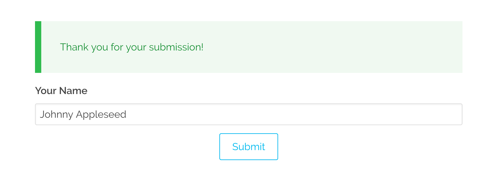

# Как сделать отправку через Ajax

## Отправка форм через XHR/Ajax

Механизм по умолчанию для обработки формы основан на отправке формы в стандартном стиле HTML, при которой содержимое HTML-формы отправляется на сервер либо через `POST`, либо через `GET` (по умолчанию - `POST`). После того, как форма была [проверена](/forms/forms/fields-available) и [обработана](/forms/forms/reference-form-actions), результаты отправляются обратно в форму (или на [перенаправленную страницу](/forms/forms/reference-form-actions/#perenapravlenie)), где отображаются сообщения, и при необходимости форму можно отредактировать для повторной отправки.

Это связано с перезагрузкой страницы, что иногда нежелательно. Здесь предпочтительным вариантом является отправка формы через JavaScript с использованием Ajax или XHR. К счастью, возможности Grav в области форм подходят для этой задачи.

## Автоматический подход (требуется плагин Form с версией >= `v7.3.0`)

С выходом версии плагина From `7.3.0` появилась возможность отправки форм с помощью XHR, что позволяет обрабатывать форму на месте и не требует перезагрузки всей страницы, с возможностью быстрой настройки.

Чтобы включить эту функцию, просто добавьте этот параметр в чертёж формы:

```yaml
xhr_submit: true
```

Вы не обязаны предоставлять `action:`, `template:` или даже `id:`. Плагин будет просто "работать" даже с несколькими ajax-формами на одной странице. Для этого используется новый шаблон `form-xhr.html.twig`, предоставляемый плагином, а также включает в себя немного ванильного JS-кода для выполнения запроса.

!! При таком подходе вся форма отправляется через XHR-запрос и заменяет весь HTML формы из ответа. Это простой подход, но при необходимости вы можете создавать собственные более сложные решения.

!!! Код Javacript, используемый для XHR-запроса, находится в файле `form/layouts/xhr.html.twig`. Если вам нужно, вы можете скопировать его в папку `templates` вашей темы (сохранив структуру путей) и изменить по мере необходимости.

## Ручной подход (требуется плагин Form с версией < `v7.3.0`)

### Создание формы

Вы можете создать любую стандартную форму, которая вам нравится, поэтому в этом примере мы сохраним форму как можно более простой, чтобы сосредоточиться на частях обработки Ajax. Сначала мы создадим форму на странице с именем: `forms/ajax-test/` и создадим страницу формы с именем `form.md`:

```yaml
---
title: Тестовая форма Ajax
form:
  name: ajax-test-form
  action: '/forms/ajax-test'
  template: form-messages
  refresh_prevention: true

  fields:
    name:
      label: Ваше имя
      type: text

  buttons:
    submit:
      type: submit
      value: Отправить

  process:
    message: 'Благодарим вас за предоставленную информацию!'
---
```

Как видите, это очень простая форма, которая просто запрашивает ваше имя и предоставляет кнопку отправки. Единственное, что выделяется, — это часть `template: form-messages`. Как указано в разделе [фронтенд-формы](/forms), вы можете предоставить собственный шаблон Twig, с помощью которого будет отображаться результат обработки формы. Для нас это отличный способ обработать форму, а затем просто вернуть сообщения через Ajax и вставить их на страницу. Уже существует шаблон `form-messages.html.twig`, поставляемый с плагином форм, который делает именно это.

!!! note ""

    Мы используем жестко запрограммированное действие `action: /forms/ajax-test`, поэтому ajax имеет согласованный URL, а не позволяет форме устанавливать действие для текущего маршрута страницы. Это решает проблему с запросом Ajax, который не обрабатывает перенаправления должным образом. В противном случае это может вызвать проблемы на «домашней» странице. Это не обязательно должна быть текущая страница формы, это просто должен быть согласованный, доступный маршрут.


### Содержание страницы

На этой же странице нам нужно разместить немного HTML и JavaScript:

=== "Vanilla JS"

    ```html
    <div id="form-result"></div>

    <script>
    document.addEventListener('DOMContentLoaded', function() {
        const form = document.querySelector('#ajax-test-form');
        form.addEventListener('submit', function(event) {
            event.preventDefault();

            const result = document.querySelector('#form-result');
            const action = form.getAttribute('action');
            const method = form.getAttribute('method');

            fetch(action, {
                method: method,
                body: new FormData(form)
            })
            .then(function(response) {
                if (response.ok) {
                    return response.text();
                } else {
                    return response.json();
                }
            })
            .then(function(output) {
                if (result) {
                    result.innerHTML = output;
                }
            })
            .catch(function(error) {
                if (result) {
                    result.innerHTML = 'Ошибка: ' + error;
                }

                throw new Error(error);
            });
        });
    });
    </script>
    ```

=== "jQuery"

    ```html
    <div id="form-result"></div>

    <script>
    $(document).ready(function(){

        var form = $('#ajax-test-form');
        form.submit(function(e) {
            // prevent form submission
            e.preventDefault();

            // submit the form via Ajax
            $.ajax({
                url: form.attr('action'),
                type: form.attr('method'),
                dataType: 'html',
                data: form.serialize(),
                success: function(result) {
                    // Inject the result in the HTML
                    $('#form-result').html(result);
                }
            });
        });
    });
    </script>
    ```

Сначала мы определяем заполнитель div с идентификатором `#form-result`, чтобы использовать его в качестве места для вставки результатов формы.

Мы используем здесь синтаксис JQuery для простоты, но, очевидно, вы можете использовать любой JavaScript, который вам нравится, если он выполняет аналогичную функцию. Сначала мы останавливаем действие формы по умолчанию и выполняем Ajax-вызов действия формы с сериализованными данными формы. Результат этого вызова затем возвращается в тот div, который мы создали ранее.


