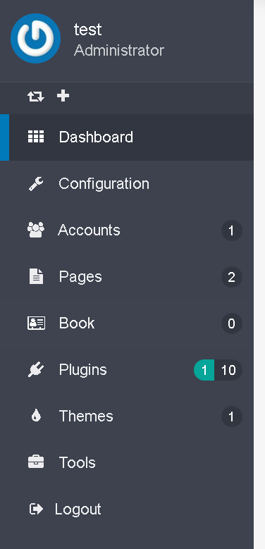
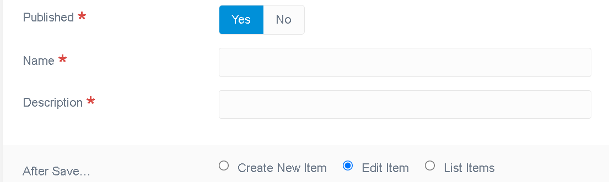

# Использование Flex в плагинах

## Введение

Использование Flex, будь то в Twig или в PHP-коде, будет рассмотрено только в рамках данного введения. Чтобы понять всю мощь и гибкость Flex, ознакомьтесь с нашей [специальной документацией по Flex](/advanced/flex).

Flex позволяет создавать собственные объекты CRUDS, как отдельные объекты, так и коллекции, и предоставляет обширные API, которые можно использовать из кода плагина или шаблонов.

Пользовательский интерфейс администратора можно легко добавить, используя как стандартные шаблоны, так и собственные настроенные листинги или формы (или что-то ещё).

## Требования

Требуется Grav 1.7 или более поздняя версия. Для целей этой документации мы будем использовать установку grav+admin. Убедитесь, что она у вас установлена и запущена, чтобы выполнить следующие шаги. Чтобы подготовить её, обратитесь к [документации по установке](/basics/installation).

## Создание ваших плагинов

Поскольку можно создать плагин с Flex или без него с нуля, чтобы гарантировать наличие всех последних изменений, мы настоятельно рекомендуем использовать инструменты DevTools для создания скелета и базовых функций:

Для этого мы воспользуемся командной строкой devtools:

```bash
bin/gpm install devtools
```

Чтобы [создать новый плагин с помощью devtools](/plugins/plugin-tutorial), используется следующая команда, имя плагина — myflexplugin:

```bash
grav-admin bin/plugin devtools new-plugin
```

Заполните вопросы, используя следующие ответы, главное — выбрать плагин, подготовленный для Flex:

```bash
Enter Plugin Name:

> myflexplugin

Enter Plugin Description:

> A little Flex plugin test

Enter Developer Name:

> grav@example.com

Enter GitHub ID (can be blank):

> gravcms

Enter Developer Email:

> grav@example.com

Please choose an option:
[blank] Basic Plugin
[flex ] Basic Plugin prepared for custom Flex Objects

> flex

Enter Flex Object Name:

> book

Please choose a storage type:
[simple] Basic Storage (1 file for all objects) - no media support
[file ] File Storage (1 file per object)
[folder] Folder Storage (1 folder per object)

> folder

SUCCESS plugin myflexplugin -> Created Successfully

Path: /home/pierre/project/grav/grav-admin/user/plugins/myflexplugin

Please run `cd /home/pierre/project/grav/grav-admin/user/plugins/myflexplugin` and `composer update` to initialize the autoloader
```

В случае успеха нам нужно установить зависимости, если таковые имеются, для нашего нового плагина:

```bash
cd /home/pierre/project/grav/grav-admin/user/plugins/myflexplugin
```

```bash
composer update
```

В случае успеха на экране должно появиться следующее сообщение:

```bash
Loading composer repositories with package information
Updating dependencies
Nothing to modify in lock file
Writing lock file
Installing dependencies from lock file (including require-dev)
Nothing to install, update or remove
Generating autoload files
No installed packages - skipping audit.
```

затем вернитесь в корневую папку установки grav-admin:

```bash
cd -
```

Скрипт devtools сгенерировал очень простой объект Flex, состоящий из имени и описания, и его коллекцию. Пользовательский интерфейс администратора уже позволяет перечислять эти объекты, создавать, редактировать или удалять их, не написав ни строчки кода.

В левом боковом меню появился новый пункт:



Форма редактирования по умолчанию выглядит так:



Вы также должны увидеть различные папки и файлы, связанные с вашим плагином и его Flex-объектом `book`.

## Что сделано

Папка с плагином должна выглядеть следующим образом:

```
../grav-admin/user/plugins/myflexplugin
├── CHANGELOG.md
├── LICENSE
├── README.md
├── blueprints
│   └── flex-objects
│   └── book.yaml
├── blueprints.yaml
├── classes
│   └── Flex
│   └── Types
│   └── Book
│   ├── BookCollection.php
│   └── BookObject.php
├── composer.json
├── composer.lock
├── languages.yaml
├── myflexplugin.php
├── myflexplugin.yaml
└── vendor
├── autoload.php
└── composer
├── ClassLoader.php
├── InstalledVersions.php
├── LICENSE
├── autoload_classmap.php
├── autoload_namespaces.php
├── autoload_psr4.php
├── autoload_real.php
├── autoload_static.php
├── installed.json
├── installed.php
└── platform_check.php
```

### Определение объекта Flex

Ключевым файлом является определение [чертежа](/advanced/flex/custom-types/blueprint). Здесь будет определена схема этого Flex-объекта, а также множество опций, позволяющих настроить практически все его параметры.

В нашем плагине чертежи книг можно найти в `user/plugins/myflexplugin/blueprints/flex-objects/book.yaml`.

> **ВАЖНО** Чертёж для каждого Flex-объекта в вашем плагине (или в основной установке `/blueprints`) должен находиться в папке `blueprints/flex-objects/`, иначе они не будут найдены.

Схема определяется в разделе Form этого чертежа. Независимо от того, будут ли использоваться формы пользовательского интерфейса администратора, в этом разделе определяются свойства этого Flex-объекта.

Мы не будем рассматривать здесь все варианты, а сосредоточимся на том, как реализовать объект нашей книги. В [обширной документации по чертежам Flex](/advanced/flex/custom-types/blueprint) вы сможете углубиться и настроить их под себя.

В приведённой ниже схеме определены эти два свойства:

```yaml
form:
  validation: loose
  fields:
    published:
      type: toggle
      label: Published
      highlight: 1
      default: 1
      options:
        1: PLUGIN_ADMIN.YES
        0: PLUGIN_ADMIN.NO
      validate:
        type: bool
        required: true
    name:
      type: text
      label: Name
      validate:
        required: true
    description:
      type: text
      label: Description
      validate:
        required: true
```

### Хуки плагина

`myflexplugin.php` — это обычное определение ядра для реализации плагинов, хуков и т. д.

Эти детали необходимы для включения Flex:

```php
<?php

public $features = [
'blueprints' => 0,
];

    /**
     * @return array
     *
     * The getSubscribedEvents() gives the core a list of events
     *     that the plugin wants to listen to. The key of each
     *     array section is the event that the plugin listens to
     *     and the value (in the form of an array) contains the
     *     callable (or function) as well as the priority. The
     *     higher the number the higher the priority.
     */
    public static function getSubscribedEvents(): array
    {
        return [
            'onPluginsInitialized' => [
                // Uncomment following line when plugin requires Grav < 1.7
                // ['autoload', 100000],
                ['onPluginsInitialized', 0]
            ],
            FlexRegisterEvent::class       => [['onRegisterFlex', 0]],
        ];
    }

```

Остальные файлы являются стандартными и хорошо описаны в предыдущих разделах документации плагинов. Мы не будем рассматривать их здесь.

Папка _classes_ содержит классы, используемые для Flex-объекта book и Flex-коллекции book. Это классы, в которые можно добавить пользовательские методы, которые будут доступны для каждого объекта или экземпляра коллекции. См. раздел [Добавление пользовательского метода к объекту Flex](#dobavlenie-polzovatelskogo-metoda-k-obektu-flex).

## Изменение схемы объектов Flex

Давайте добавим в наш объект поле, скажем, поле datetime, представляющее дату публикации этой книги, это можно сделать, просто добавив поля `pub_date` в чертежи:

```yaml
form:
  validation: loose
  fields:
    published:
      type: toggle
      label: Published
      highlight: 1
      default: 1
      options:
        1: PLUGIN_ADMIN.YES
        0: PLUGIN_ADMIN.NO
      validate:
        type: bool
        required: true
    name:
      type: text
      label: Name
      validate:
        required: true
    pub_date:
      type: datetime
      label: Description
      validate:
        required: true
```

В форме редактирования по умолчанию теперь отображаются поля ввода даты публикации:


Список всех доступных типов полей можно найти [здесь](/forms/blueprints/fields-available)

## Добавление пользовательского метода к объекту Flex<a href="#addcustommethod"></a>

Текущий Flex-объект book, `user/plugins/myflexplugin/classes/Flex/Types/Book/BookObject.php`, реализует только GenericObject (с помощью трейтов):

```php
<?php

declare(strict_types=1);

/**
 * @package    Grav\Common\Flex
 *
 * @copyright  Copyright (c) 2015 - 2021 Trilby Media, LLC. All rights reserved.
 * @license    MIT License; see LICENSE file for details.
 */

namespace Grav\Plugin\Myflexplugin\Flex\Types\Book;

use Grav\Common\Flex\Types\Generic\GenericObject;

/**
 * Class BookObject
 * @package Grav\Common\Flex\Generic
 *
 * @extends FlexObject<string,GenericObject>
*/
class BookObject extends GenericObject
{

}
```

Добавим метод для получения краткого содержания книги, используя разделитель для краткого содержания:

```php
<?php

declare(strict_types=1);

/**
 * @package    Grav\Common\Flex
 *
 * @copyright  Copyright (c) 2015 - 2021 Trilby Media, LLC. All rights reserved.
 * @license    MIT License; see LICENSE file for details.
 */

namespace Grav\Plugin\Myflexplugin\Flex\Types\Book;

use Grav\Common\Flex\Types\Generic\GenericObject;

/**
 * Class BookObject
 * @package Grav\Common\Flex\Generic
 *
 * @extends FlexObject<string,GenericObject>
*/
class BookObject extends GenericObject
{
    public function getSummary() {
        $delimiter = \Grav\Common\Grav::instance()['config']['site']['summary']['delimiter'] ?? '===';
        $summary = explode($delimiter, $this->content);
        return $summary[0] ?? '';
    }
}
```

Теперь мы можем вызвать этот метод в любом месте, где используется Flex-объект book, например, в шаблоне:

```twig


<h1>{{ book.header.title}}</h1>
<p>{{ book.getSummary()}}</p>

```

Метод `::getSummary` можно использовать и в любом PHP-коде.

То же самое можно сделать в классе коллекции `user/plugins/myflexplugin/classes/Flex/Types/Book/BookCollection.php`. Например, добавить дружественный метод поиска по нетривиальным запросам. Действительно, коллекция уже предоставляет все обычные методы коллекций. Если у объекта много различных полей, то стандартные методы сбора могут привести к ошибкам.
