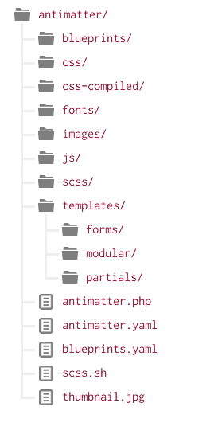

# Основы тем

Темы в Grav довольно простые и очень гибкие, потому что они созданы с помощью мощного [движка шаблонов Twig](https://twig.symfony.com/). Каждая тема создается с помощью комбинации файлов Twig (смесь PHP-кода и HTML), называемых шаблонами, и CSS. Обычно мы используем [расширение CSS Sass](https://sass-lang.com) для создания наших файлов CSS, но ничто не мешает вам использовать [Less](http://lesscss.org/), или даже обычный CSS. Всё сводится к вашим личным предпочтениям.

## Страницы контента и шаблоны Twig

Первое, что нужно понять — это прямая связь между **страницами** в Grav и **файлами шаблонов Twig**, которые предоставляются в теме.

Каждая создаваемая вами страница ссылается на определенный файл шаблона либо по имени файла страницы, либо путем установки переменной заголовка шаблона для страницы. Для упрощения обслуживания мы советуем по возможности использовать имя страницы, а не заменять его переменной заголовка.

Давайте рассмотрим простой пример. Если вы установили пакет [**Grav Base**](/basics/installation), вы заметите, что в папке `user/pages/01.home` у вас есть файл с именем `default.md`, который содержит содержимое страницы, основанное на разметке. Имя этого файла, т. е. `default` сообщает Grav, что эта страница должна отрисовываться с помощью шаблона Twig под названием `default.html.twig`, который находится в папке `templates/` темы.

!!! warning ""

    Имена шаблонов страниц должны быть строчными, например «default», «blog» и т. д.

Если бы у вас был файл страницы под названием `blog.md`, Grav попыталась бы отрисовать его с помощью шаблона Twig: `<your_theme>/templates/blog.html.twig`.

!!! warning ""

    Имена файлов в Grav не отображаются на передней панели Grav. Только имена папок. Не волнуйтесь, если все ваши записи в блоге будут иметь одно и то же имя файла. Это нормально.

## Организация темы

### Определение и конфигурация

Каждая тема должна иметь файл определения под названием `blueprints.yaml`, который содержит некоторую информацию о теме. Дополнительно он может предоставлять определения **form** для использования в [**админке**](/admin-panel/introduction) для редактирования опций темы. Тема **Antimatter** имеет следующий файл `blueprints.yaml`:

```yaml
name: Antimatter
slug: antimatter
type: theme
version: 1.6.7
description: "Antimatter is the default theme included with **Grav**"
icon: empire
author:
  name: Team Grav
  email: devs@getgrav.org
  url: https://getgrav.org
homepage: https://github.com/getgrav/grav-theme-antimatter
demo: https://demo.getgrav.org/blog-skeleton
keywords: antimatter, theme, core, modern, fast, responsive, html5, css3
bugs: https://github.com/getgrav/grav-theme-antimatter/issues
license: MIT

dependencies:
    - { name: grav, version: '>=1.6.0' }

form:
  validation: loose
  fields:
    dropdown.enabled:
        type: toggle
        label: Dropdown in navbar
        highlight: 1
        default: 1
        options:
          1: Enabled
          0: Disabled
        validate:
          type: bool
```

Если вы хотите использовать опции настройки темы, вы должны предоставить настройки по умолчанию в файле под названием `your_theme.yaml`. Например:

```yaml
enabled: true
color: blue
```

!!! warning ""

    Опция `color: blue` в файле конфигурации на самом деле ничего не делает. Она просто используется в качестве примера того, как переопределить настройки.

Для получения более подробной информации о доступных формах, которые можно создать, обратитесь к [главе 6. Формы](/forms). Вы также должны предоставить изображение `300px` x `300px` и назвать его `thumbnail.jpg` в корневой части темы. Оно появится в разделе выбора тем в вашей панели администрирования.

### Шаблоны

**Нет правил** относительно структуры темы Grav, за исключением того, что в папке `templates/` должны быть соответствующие Twig-шаблоны для каждого типа страниц, которые вы используете в вашем контенте.

!!! warning ""

    Из-за такой тесной связи между содержанием страницы и шаблонами Twig в теме часто имеет смысл разрабатывать темы в сочетании с содержанием, с которым они предназначены для использования.  Хорошим способом создания тем _general_ является поддержка типов шаблонов, используемых пакетами Skeleton, которые доступны на нашей [странице загрузки](https://getgrav.org/downloads). Например, поддержка: **default**, **blog**, **error**, **item** и **modular**.

Вообще говоря, корень папки `templates/` должен использоваться для размещения поддерживаемых первичных шаблонов, затем создается подпапка `partials/` для размещения частей, или меньшего шаблона _chunks_.

Если вы хотите поддерживать **модульные** шаблоны в вашей теме, вам также следует создать подпапку шаблонов под названием `modular/` и хранить в ней ваши модульные файлы шаблонов Twig.

История поддержки **форм** та же самая. Создайте ещё одну подпапку под названием `forms/` и храните в ней любые шаблоны пользовательских форм.

### SCSS / LESS / CSS

Опять же, здесь нет ничего сложного, но солидная практика заключается в том, чтобы иметь подпапку под названием `scss/`, если вы хотите разрабатывать с Sass, или `less/`, если вы предпочитаете Less вместе с папкой `css/` для размещения статических CSS-файлов, и папку `css-compiled/` для любых автоматически генерируемых файлов из ваших компиляций Sass или Less.

Как вы организуете свои файлы здесь, полностью зависит от вас. Не стесняйтесь следовать нашему примеру в теме по умолчанию **antimatter**, поставляемой с пакетом Grav Base для некоторых идей. Мы используем вариант Sass **scss**, который больше похож на CSS, и, откровенно говоря, более естественный для написания.

Чтобы установить Sass на свой компьютер, просто следуйте инструкциям на [sass-lang.com](https://sass-lang.com/install).

1. Выполните простой скрипт scss shell, набрав `./scss.sh` из корня темы.
2. Либо запустите команду напрямую: `scss --source-map --watch scss:css-compiled`, что одно и то же.

По умолчанию, это скомпилирует ваши scss-файлы в папку `css-compiled/`. Затем вы можете обратиться к результирующему файлу CSS в своей теме.

### Чертежи

Папка `blueprints/` используется для определения форм для опций и конфигурации для каждого из файлов шаблонов. Они используются в **административной панели** и являются необязательными. Тема на 100% функциональна без них, но они не будут редактироваться через панель администрирования, если не будут предоставлены.

### События тем и плагинов

Ещё одна мощная функция, которая является чисто необязательным, — возможность для темы взаимодействовать с Grav через **плагины** архитектуры. Короче говоря, во время инициализации последовательности Grav в последовательности есть несколько точек, где можно «перехватить» свой собственный кусок кода. Это может быть полезно, например, для определения дополнительных ярлыков путей в вашей теме при инициализации Twig, чтобы вы могли использовать их в ваших Twig шаблонах. [Глава 4. Плагины](/plugins) содержит больше информации о системе плагинов и доступных хуках событий. Чтобы использовать эти хуки в вашей теме, просто создайте файл под названием `mytheme.php` и используйте следующий формат:

```php
<?php

namespace Grav\Theme;

use Grav\Common\Theme;

class MyTheme extends Theme
{

    public static function getSubscribedEvents()
    {
        return [
            'onThemeInitialized' => ['onThemeInitialized', 0]
        ];
    }

    public function onThemeInitialized()
    {
        if ($this->isAdmin()) {
            $this->active = false;
            return;
        }

        $this->enable([
            'onTwigSiteVariables' => ['onTwigSiteVariables', 0]
        ]);
    }

    public function onTwigSiteVariables()
    {
        $this->grav['assets']
            ->addCss('plugin://css/mytheme-core.css')
            ->addCss('plugin://css/mytheme-custom.css');

        $this->grav['assets']
            ->add('jquery', 101)
            ->addJs('theme://js/jquery.myscript.min.js');
    }
}
```

Как вы можете заметить, для того, чтобы использовать хуки событий, вам сначала нужно зарегистрировать их в списке с помощью функции `getSubscribeEvents`, а затем определить их своим собственным кодом. Если вы подписываете событие для использования, определите его также. В противном случае вы получите ошибку.

### Другие папки

Мы рекомендуем создать отдельные папки в корне вашей темы для `images/`, `fonts/` и `js/`, которые будут содержать изображения, любые пользовательские веб-шрифты и необходимые файлы JavaScript.

## Пример темы

Давайте используем тему **Antimatter** по умолчанию в качестве примера. Ниже вы можете увидеть общую структуру этой темы:



В этом примере фактические файлы `css`, `css-compiled`, `fonts`, `images`, `js`, `scss` и `templates` были проигнорированы, чтобы сделать их более читабельными. Важно отметить общую структуру темы.
