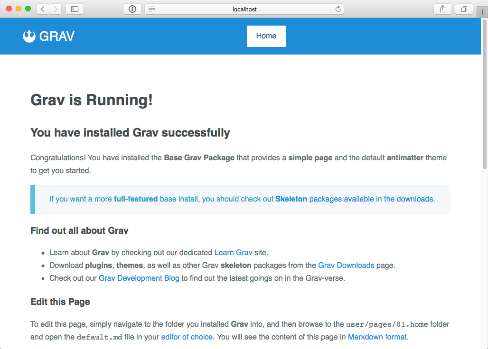

# Учебник по темам

Часто лучший способ узнать что-то новое — это использовать пример, а затем попытаться построить свое собственное творение из него. Мы собираемся использовать эту же методологию для создания новой темы Grav.

## Quark

Grav поставляется с чистой и современной темой под названием **Quark**, которая использует [фреймворк Spectre.css](https://picturepan2.github.io/spectre/).

Spectre.css — легкий, отзывчивый и современный CSS-фреймворк для более быстрой и расширяемой разработки.

Spectre предоставляет базовые стили для типографии и элементов, гибкую систему быстрой разметки, чистые CSS-компоненты и утилиты с передовой практикой кодирования и последовательным языком проектирования.

Однако, часто лучше начинать с чего-то ещё более простого.

## Pure.css

Ради этого учебника мы создадим тему, использующую популярный [фреймворк Pure.css](https://purecss.io/), разработанный Yahoo!

Pure — маленький, быстрый и отзывчивый CSS-фреймворк, который содержит основы для разработки вашего сайта без накладных расходов как у более крупных фреймворков, таких как [Bootstrap](https://getbootstrap.com/css/) или [Foundation](https://foundation.zurb.com/). Он содержит несколько модулей, которые могут быть использованы независимо друг от друга, но полный пакет занимает **4 Кб в сжатом и упакованном виде**!

Вы можете прочитать обо всех возможностях Pure на [сайте проекта Pure.css](https://purecss.io/).

Кроме того, вы должны прочитать статью [Important Theme Updates](https://getgrav.org/blog/important-theme-updates) в блоге Grav, которая описывает некоторые ключевые изменения в Grav-темах, чтобы обеспечить лучшую поддержку плагинов в будущем.

## Шаг 1 - Установка плагина DevTools

!!! warning ""

    Предыдущие версии данного руководства требовали создания базовой темы по умолчанию. Весь этот процесс можно пропустить благодаря нашему новому плагину **DevTools**.

Первым шагом в создании новой темы является **установка плагина DevTools**. Это можно сделать двумя способами.

#### Установка через консольное приложение GPM

* Перейдите в командной строке в корень вашей установки Grav и введите следующую команду:

```bash
bin/gpm install devtools
```

#### Установка через плагин Admin

* После входа в систему просто перейдите к разделу **Плагины** в боковой панели.
* Нажмите кнопку :material-plus: **Добавить** в правом верхнем углу.
* Найдите **DevTools** в списке и нажмите кнопку :material-plus: **Установить**.

## Шаг 2 - Создание базовой темы

Для этого следующего шага вам действительно нужно быть в [командной строке](/cli-console/command-line-intro), так как DevTools предоставляет пару CLI-команд для того, чтобы сделать процесс создания новой темы намного проще!

Из корневой части вашей установки Grav введите следующую команду (в консоли Open Server не забудьте добавить `php` в начале команды):

```bash
bin/plugin devtools new-theme
```

В ходе этого процесса вам будет задано несколько вопросов, которые необходимы для создания новой темы:

!!! info ""

    Мы собираемся использовать **pure-blank** для создания новой темы, но вы можете создать простой шаблон, **наследующий** от другой базовой темы.

```bash
bin/plugin devtools new-theme

Enter Theme Name: MyTheme
Enter Theme Description: My New Theme
Enter Developer Name: Acme Corp
Enter Developer Email: contact@acme.co
Please choose a template type
  [pure-blank ] Basic Theme using Pure.css
  [inheritance] Inherit from another theme
  [copy       ] Copy another theme
 > pure-blank

SUCCESS theme mytheme -> Created Successfully

Path: /www/user/themes/my-theme
```

DevTools сообщает, где был создан этот новый шаблон. Созданный шаблон полностью функционален, но в то же время очень прост. Вы захотите изменить это в соответствии с вашими потребностями.

Чтобы увидеть вашу новую тему в действии, вам нужно будет изменить тему по умолчанию с `quark` на `my-theme`, так что отредактируйте ваш `user/config/system.yaml` таким образом:

```yaml
...
pages:
    theme: my-theme
...
```

Перезагрузите ваш сайт в браузере, и вы увидите, что тема теперь изменилась.

## Шаг 3 - Основы темы

Теперь мы создали новую базовую тему, которую можно изменять и развивать, давайте разберем её и рассмотрим составляющие. Если вы заглянете в папку `user/themes/my-theme`, вы увидите:

```text
.
├── CHANGELOG.md
├── LICENSE
├── README.md
├── blueprints.yaml
├── css
│   └── custom.css
├── fonts
├── images
│   └── logo.png
├── js
├── my-theme.php
├── my-theme.yaml
├── screenshot.jpg
├── templates
│   ├── default.html.twig
│   ├── error.html.twig
│   └── partials
│       ├── base.html.twig
│       └── navigation.html.twig
└── thumbnail.jpg
```

Это примерная структура, но необходимы некоторые вещи:

### Необходимые элементы для работы

Эти элементы имеют решающее значение, и ваша тема не будет работать надежно, если вы не включите их в свою тему.

**`blueprints.yaml`** - файл конфигурации, используемый Grav для получения информации о вашей теме. Он также может определить форму, отображаемую при просмотре деталей темы. Эта форма позволит вам сохранить настройки темы. Подробнее в главе [Формы](/forms/blueprints).
* **`my-theme.php`** - Этот файл будет назван в соответствии с вашей темой, но может быть использован для размещения любой нужной логики. Вы можете использовать любой [хук событий плагинов](/plugins/event-hooks) за исключением `onPluginsInitialized()`, однако есть хук `onThemeInitialized()`, который можно использовать в качестве альтернативы.
* **`my-theme.yaml`** - это конфигурация, используемая плагином для установки опций темы.
* **`templates/`** - это папка, которая содержит шаблоны Twig для отображения ваших страниц.

### Требуемые элементы для выпуска

Эти пункты необходимы, если вы хотите выпустить свою тему через GPM.

* **`CHANGELOG.md`** - файл, который соответствует [формату списка изменений Grav](/advanced/grav-development/#format-spiska-izmenenii) для отображения изменений в релизах.
* **`LICENSE`** - файл лицензии. Чаще всего это MIT, если только у вас нет особой потребности в чем-то другом.
* **`README.md`** - содержит любую документацию по теме. Например, как установить, настроить и использовать.
* **`screenshot.jpg`** - скриншот темы, размером 1009px x 1009px.
* **`thumbnail.jpg`** - скриншот темы, размером 300px x 300px.


## Шаг 4 - Базовый шаблон

Как вы знаете из [предыдущей главы](../theme-basics), каждый элемент контента в Grav имеет определенное имя файла, например `default.md`, который указывает Grav искать шаблон Twig для рендеринга с именем `default.html.twig`. Можно поместить всё, что вам нужно для отображения страницы в этом одном файле, и он будет работать нормально. Однако есть лучшее решение.

Используя тег Twig [Extends](https://twig.symfony.com/doc/1.x/tags/extends.html), вы можете определить базовый макет с помощью определенных [блоков](https://twig.symfony.com/doc/1.x/tags/block.html). Это позволяет любому шаблону Twig **расширять** базовый шаблон и предоставляет определения для любого **блока**, определенного в базе. Итак, посмотрите на файл `templates/default.html.twig` и изучите его содержимое:

```twig



    {{ page.content }}

```

В действительности здесь происходят две вещи.

Во-первых, этот шаблон расширяет другой шаблон, расположенный в `partials/base.html.twig`.

!!! info ""

    Вам не нужно включать `templates/` в шаблоны Twig, поскольку Twig уже ищет `templates/` в качестве корневого уровня для любого шаблона.

Во-вторых, блок `content` переопределяется из базового шаблона, и содержимое страницы выводится вместо него.

!!! warning ""

    Для единообразия рекомендуется использовать папку `templates/partials` для хранения шаблонов Twig, которые представляют либо небольшие фрагменты HTML, либо являются общими. Мы также используем `templates/modular` для модульных шаблонов и `templates/forms` для любых форм. Вы можете создать любые подпапки, которые вам нравятся, если вы предпочитаете организовывать свои шаблоны по-другому.

Если вы посмотрите на `templates/partials/base.html.twig`, вы увидите основную часть HTML-макета:

```twig

<!DOCTYPE html>
<html lang="{{ grav.language.getActive ?: theme_config.default_lang }}">
<head>

    <meta charset="utf-8" />
    <title>{{ header.title|e('html') }} | {{ site.title|e('html') }}</title>

    <meta http-equiv="X-UA-Compatible" content="IE=edge">
    <meta name="viewport" content="width=device-width, initial-scale=1">
    

    <link rel="icon" type="image/png" href="{{ url('theme://images/logo.png') }}" />
    <link rel="canonical" href="{{ page.url(true, true) }}" />



    
    
    



    



    {{ assets.css()|raw }}
    {{ assets.js()|raw }}


</head>
<body id="top" class="{{ page.header.body_classes }}">


    <div class="header">
        <div class="wrapper padding">
            <a class="logo left" href="{{ base_url == '' ? '/' : base_url }}">
                <i class="fa fa-rebel"></i>
                {{ config.site.title }}
            </a>
            
            <nav class="main-nav">
                
            </nav>
            
        </div>
    </div>



    <section id="body">
        <div class="wrapper padding">
        
        </div>
    </section>



    <div class="footer text-center">
        <div class="wrapper padding">
            <p><a href="https://getgrav.org">Grav</a> was <i class="fa fa-code"></i> with <i class="fa fa-heart"></i> by <a href="https://www.rockettheme.com">RocketTheme</a>.</p>
        </div>
    </div>



    {{ assets.js('bottom')|raw }}


</body>
```

!!! tip ""

    Если переменная безопасна для рендеринга и содержит HTML, всегда используйте фильтр `|raw`, чтобы шаблон работал с включенным экранированием (`autoescape`).

!!! warning ""

    Очень важно включить параметр `autoescape` в [конфигурации системы](/basics/grav-configuration/#twig) или не забыть экранировать каждую переменную в файлах шаблонов, чтобы защитить сайт от XSS-атак.

## Шаг 5 - Погружение в детали

Пожалуйста, прочитайте код в файле `base.html.twig`, чтобы попытаться понять, что происходит. Есть несколько ключевых моментов, которые следует отметить:

1. Переменная `theme_config` устанавливается с конфигурацией темы. Потому что Twig плохо работает с тире, чтобы извлекать переменные с тире (например `config.themes.my-theme`), мы используем Twig-функцию `attribute()` для динамического получения данных `my-theme` из `config.themes`.

1. Элемент `<html lang=...` установлен на основе активного языка Grav, если он включен, иначе он использует `default_lang`, как установлено в `theme_config`.

1. Синтаксис '' определяет область в базовом шаблоне Twig. Обратите внимание, что использование `head` в теге `` не требуется, но используется здесь для удобства чтения. В этот блок мы помещаем вещи, которые обычно находятся в HTML-теге `<head>`.

1. Тег `<title>` динамически устанавливается на основе переменной `title` страницы, установленной в заголовке файла. `header.title` - это метод быстрого доступа, но он эквивалентен `page.header.title`.

1. После установки пары стандартных метатегов появляется ссылка для включения `partials/metadata.html.twig`. Этот файл содержит цикл, который перебирает метаданные страницы. Фактически это объединение метаданных из `site.yaml` и любых переопределений, специфичных для страницы.

1. Запись `<link rel="icon"...` устанавливается путем указания на изображение, зависящее от темы. В этом случае оно находится в каталоге тем под именем `images/logo.png`. Синтаксис для этого - `{{url ('theme: //images/logo.png')}}`.

1. Запись `<link rel="canonical"...` устанавливает канонический URL-адрес для страницы, который всегда устанавливается на полный URL-адрес страницы через `{{ page.url(true, true) }}`.

1. Теперь мы определяем блок под названием `stylesheets`, и здесь мы используем [менеджер активов](../asset-manager) для добавления нескольких активов. Первый загружает каркас `Pure.css`. Второй загружает [FontAwesome](https://fontawesome.io/) для предоставления полезных иконок. Последняя запись указывает на файл `custom.css` в папке темы `css/`. Здесь есть несколько полезных стилей, чтобы вы могли начать, но вы можете добавить больше здесь. Также вы можете добавить другие записи CSS-файлов по мере необходимости.

1. Вызов `{{ assets.css()|raw }}` - это то, что запускает шаблон для отображения всех тегов ссылок на CSS.

1. Блок `javascripts`, как и блок `stylesheets` - хорошее место для размещения ваших JavaScript-файлов. В этом примере мы добавляем только библиотеку `jquery`, которая уже связана с Grav, так что вам не нужно указывать путь к ней.

1. `{{ assets.js()|raw }}`выведет все теги JavaScript.

1. Тэг `<body>` имеет атрибут класса, который будет выводить всё, что вы установили в переменной `body_classes` фронтматтера страницы.

1. В блоке `header` есть несколько вещей, которые выводят HTML-заголовок страницы. Важно отметить, что логотип имеет гиперссылку на `base_url` с логикой:` {{base_url == '? '/': base_url}} `. Это сделано для того, чтобы гарантировать, что если нет подкаталога, ссылка будет просто `/`.

1. Название сайта выводится в качестве логотипа в этой теме примера с `{{config.site.title}}`, но вы можете просто заменить его тегом `` на логотип, если хотите.

1. Тег `<nav>` на самом деле содержит ссылку на `partials/navigation.HTML.twig`, который содержит логику для циклического перебора любых **видимых** страниц и отображения их в виде меню. По умолчанию он поддерживает выпадающие меню для вложенных страниц, но это можно отключить с помощью конфигурации темы. Загляните в этот навигационный файл, чтобы получить представление о том, как генерируется меню.

1. Использование ` ` предоставляет заполнитель, который позволяет нам предоставлять контент из шаблона, расширяющего этот шаблон. Помните, что мы переопределили это в `default.html.twig` для вывода содержимого страницы.

1. Блок `footer` содержит простой нижний колонтитул, вы можете легко изменить его для своих нужд.

1. Подобно блоку содержимого, ` ` предназначен в качестве заполнителя для шаблонов для добавления пользовательских кодов инициализации JavaScript или аналитических кодов. В этом примере мы выводим любой код JavaScript, который был добавлен в группу активов `bottom`. Подробнее об этом читайте в документации [менеджер активов](../asset-manager).


## Шаг 6 - CSS-файлы темы

Вы могли заметить, что в файле `partials/base.html.twig` мы сделали ссылку на настраиваемую тему CSS через менеджер активов: `do assets.add('theme://css/custom.css', 98)`. Этот файл будет содержать любой настраиваемый CSS, который нам нужен для заполнения пробелов, не предусмотренных платформой Pure.css. Поскольку Pure - это очень минималистичный фреймворк, он предоставляет самое необходимое, но почти не имеет стилей.

1. В папке `user/themes/my-theme/css` просмотрите файл `custom.css`:

```css
/* Core Stuff */
* {
    -webkit-box-sizing: border-box;
    -moz-box-sizing: border-box;
    box-sizing: border-box;
}

body {
    font-size: 1rem;
    line-height: 1.7;
    color: #606d6e;
}

h1,
h2,
h3,
h4,
h5,
h6 {
    color: #454B4D;
}

a {
    color: #1F8CD6;
    text-decoration: none;
}

a:hover {
    color: #175E91;
}

pre {
    background: #F0F0F0;
    margin: 1rem 0;
    border-radius: 2px;
}

blockquote {
    border-left: 10px solid #eee;
    margin: 0;
    padding: 0 2rem;
}

/* Utility Classes */
.wrapper {
    margin: 0 3rem;
}

.padding {
    padding: 3rem 1rem;
}

.left {
    float: left;
}

.right {
    float: right
}

.text-center {
    text-align: center;
}

.text-right {
    text-align: right;
}

.text-left {
    text-align: left;
}

/* Content Styling */
.header .padding {
    padding: 1rem 0;
}

.header {
    background-color: #1F8DD6;
    color: #eee;
}

.header a {
    color: #fff;
}

.header .logo {
    font-size: 1.7rem;
    text-transform: uppercase;
}

.footer {
    background-color: #eee;
}

/* Menu Settings */
.main-nav ul {
    text-align: center;
    letter-spacing: -1em;
    margin: 0;
    padding: 0;
}

.main-nav ul li {
    display: inline-block;
    letter-spacing: normal;
}

.main-nav ul li a {
    position: relative;
    display: block;
    line-height: 45px;
    color: #fff;
    padding: 0 20px;
    white-space: nowrap;
}

.main-nav > ul > li > a {
    border-radius: 2px;
}

/*Active dropdown nav item */
.main-nav ul li:hover > a {
    background-color: #175E91;
}

/* Selected Dropdown nav item */
.main-nav ul li.selected > a {
    background-color: #fff;
    color: #175E91;
}

/* Dropdown CSS */
.main-nav ul li {position: relative;}

.main-nav ul li ul {
    position: absolute;
    background-color: #1F8DD6;
    min-width: 100%;
    text-align: left;
    z-index: 999;

    display: none;
}
.main-nav ul li ul li {
    display: block;
}

/* Dropdown CSS */
.main-nav ul li ul ul {
    left: 100%;
    top: 0;
}

/* Active on Hover */
.main-nav li:hover > ul {
    display: block;
}

/* Child Indicator */
.main-nav .has-children > a {
    padding-right: 30px;
}
.main-nav .has-children > a:after {
    font-family: FontAwesome;
    content: '\f107';
    position: absolute;
    display: inline-block;
    right: 8px;
    top: 0;
}

.main-nav .has-children .has-children > a:after {
    content: '\f105';
}

```

Это довольно стандартный CSS-файл, который задает некоторые основные поля, шрифты, цвета и служебные классы. Для рендеринга раскрывающегося меню требуются некоторые базовые стили содержимого и более обширные стили. Не стесняйтесь изменять этот файл по своему усмотрению или даже добавлять новые файлы CSS (просто убедитесь, что вы добавили ссылку в блоке `head`, следуя примеру с `custom.css`).

## Шаг 7 - Тестирование

Чтобы увидеть свою тему в действии, откройте браузер и укажите в нем свой сайт Grav. Вы должны увидеть что-то вроде этого:



Поздравляем, вы создали свою первую тему!
