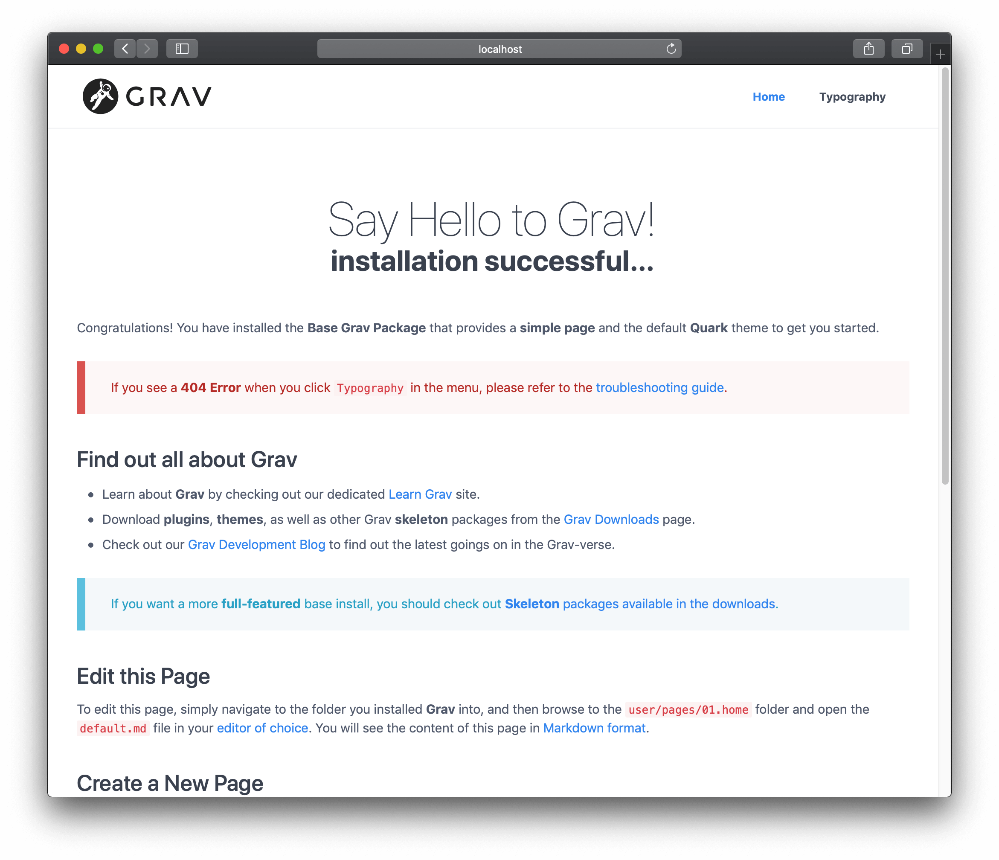
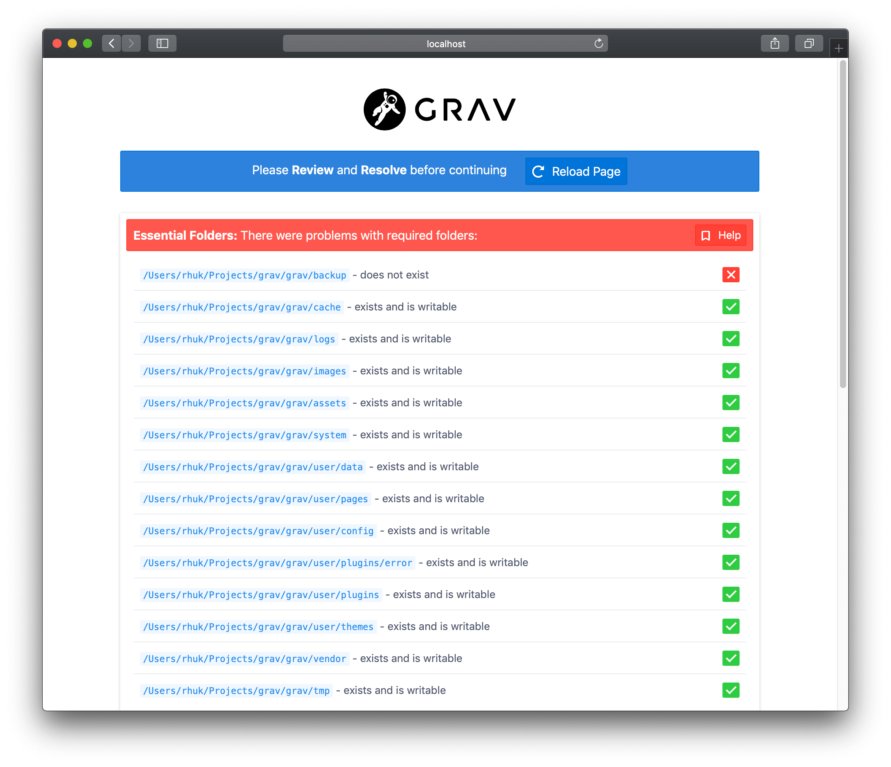

Установка Grav — крайне простой процесс. На самом деле, реальная установка не требуется. У вас есть **три** варианта для установки Grav. Первый и самый простой способ - скачать **zip**-архив и распаковать его. Второй способ — установка через **Composer**. Третий способ - клонировать исходный проект непосредственно из **GitHub**, а затем запустить скрипт для установки необходимых зависимостей:

## Проверка версию PHP

Grav невероятно прост в настройке и запуске. Убедитесь, что у вас есть установлен PHP версии [version=15]5.6.3+[/version][version=16]7.1.3+[/version], зайдя в терминал и набрав `php -v`:

[prism classes="language-bash command-line" cl-output="2-10"]
php -v
PHP 7.2.15 (cli) (built: Feb  7 2019 20:10:03) ( NTS )
Copyright (c) 1997-2018 The PHP Group
Zend Engine v3.2.0, Copyright (c) 1998-2018 Zend Technologies
    with Zend OPcache v7.2.15, Copyright (c) 1999-2018, by Zend Technologies
[/prism]

## Вариант 1: установка из ZIP-пакета

Самый простой способ установить Grav - это скачать ZIP-архив и распаковать его:

1. Загрузите самую последнюю версию пакета **[Grav](https://getgrav.org/download/core/grav/latest)** или **[Grav + Admin](https://getgrav.org/download/core/grav-admin/latest)**.
2. Распакуйте ZIP-файл в [корень сайта](https://www.wordnik.com/words/webroot), например: `~/webroot/grav`

!!! Можно воспользоваться [каркасами](https://getgrav.org/downloads/skeletons) — это пакеты, которые включают в себя Grav, примеры страниц, плагины и конфигурацию. Просто выберите понравившийся пакет и выполните шаги, описанные выше.

!!!! Если вы загрузили ZIP-файл, а затем планируете переместить его в корень сайта, переместите **ВСЁ СОДЕРЖИМОЕ ПАПКИ**, поскольку без некоторых скрытых файлов (таких как .htaccess) Grav не сможет работать нормально.

## Вариант 2: установка через Composer

Альтернативный метод - установить Grav через [composer](https://getcomposer.org/doc/00-intro.md#installation-linux-unix-osx):

[prism classes="language-bash command-line"]
composer create-project getgrav/grav ~/webroot/grav
[/prism]

Для установки экспериментальной версии Grav добавьте `1.x-dev` в качестве параметра:

[prism classes="language-bash command-line"]
composer create-project getgrav/grav ~/webroot/grav 1.x-dev
[/prism]

## Вариант 3: Установка с GitHub

Другой способ — клонировать Grav из репозитория GitHub, а затем запустить простой скрипт установки зависимостей:

1. Клонируйте репозиторий Grav из [GitHub](https://github.com/getgrav/grav) в корневую папку вашего сервера, например: '~ /webroot/grav`. Запустите **терминал** или **консоль** и перейдите в корень сайта:

   [prism classes="language-bash command-line"]
   cd ~/webroot
   git clone -b master https://github.com/getgrav/grav.git
   [/prism]

2. Установки требуемые **зависимости** через [composer](https://getcomposer.org/doc/00-intro.md#installation-linux-unix-osx):

   [prism classes="language-bash command-line"]
   cd ~/webroot/grav
   composer install --no-dev -o
   [/prism]

3. Установите **плагины** и **темы** через [консольное приложение Grav](../../advanced/grav-cli) `bin/grav`:

   [prism classes="language-bash command-line"]
   cd ~/webroot/grav
   bin/grav install
   [/prism]

   Это автоматически **клонирует** необходимые зависимости из GitHub непосредственно в текущую установку.

## Веб-серверы

#### Apache/IIS/Nginx

Использование Grav с веб-сервером, таким как Apache, IIS или Nginx, так же просто, как извлечение Grav в [корневую папку](https://www.wordnik.com/words/webroot). Все, что требуется для работы - это [version=15]PHP 5.6.3[/version][version=16]PHP 7.1.3[/version] или выше, поэтому вы должны убедиться, что ваш экземпляр сервера соответствует этому требованию. Более подробную информацию о требованиях Grav можно найти в главе [Требования](../requirements) данного руководства.

Если ваш веб-корень, например, `~/public_html`, вы можете извлечь его в эту папку и перейти к нему через `http://localhost`. Если вы извлечете его в `~/public_html/grav`, вы получите его через `http//localhost/grav`.

!!! Каждый веб-сервер должен быть настроен. Grav поставляется с .htaccess по умолчанию для Apache и поставляется с некоторыми [файлами конфигурации по умолчанию](https://github.com/getgrav/grav/tree/master/webserver-configs), для `nginx`,` caddy server`, `iis` и` lighttpd`. Используйте их соответственно при необходимости.

#### Запуск Grav со встроенным PHP-сервером с использованием `router.php`

Вы можете запустить Grav, используя простую команду из терминала / командной строки, используя встроенный сервер PHP, доступный для любой системы с установленным [версия=15]PHP 5.6.3+[/версия] [версия=16] PHP 7.1.3+[/версия]. Все, что вам нужно сделать, это перейти к корню вашей установки Grav с помощью терминала или командной строки и ввести `php -S localhost:8000 system/router.php`. Вы можете заменить номер порта (в нашем примере это `8000`) на любой порт, который вы предпочитаете.

Ввод этой команды предоставит вам вывод, подобный следующему:

[prism classes="language-bash command-line" cl-output="2-10"]
php -S localhost:8000 system/router.php
PHP 7.2.15 Development Server started at Sun Feb 17 21:02:14 2019
Listening on http://localhost:8000
Document root is /Users/rhuk/Projects/grav/grav
Press Ctrl-C to quit.
[/prism]

Ваш терминал также будет предоставлять вам в режиме реального времени обновления любой активности на этом специальном сервере. Вы можете скопировать URL-адрес, указанный в строке `Listening on`, и вставить его в выбранный браузер, чтобы получить доступ к своему сайту, включая администратора.

!!!! Это полезный инструмент для быстрой разработки, и его **не** следует использовать вместо выделенного веб-сервера, такого как Apache.

## Успешная установка

При первой загрузке Grav предварительно компилирует некоторые файлы. Если вы сейчас обновите свой браузер, вы получите более быструю кешированную версию.

!! В предыдущих примерах **$** представляет командную строку. Это может выглядеть по-разному на разных платформах.

По умолчанию в Grav есть несколько примеров страниц, чтобы вы могли с чего-то начать. Ваш сайт уже полностью функционален, и вы можете настраивать его, добавлять контент, расширять или настраивать его по своему усмотрению.

## Проблемы с установкой и настройкой

Если какие-либо проблемы обнаружены во время начальной загрузки страницы (или после события очистки кэша), вы можете увидеть страницу ошибки:

Пожалуйста, обратитесь к разделу [Устранение неисправностей](../../troubleshooting)  для получения помощи по конкретным вопросам.

! Если у вас есть проблемы с правами доступа к файлам, обратитесь к разделу [Документация по устранению неполадок с разрешениями](/troubleshooting/permissions). Кроме того, вы можете посмотреть [Документацию по хостингу](/webservers-hosting), в которой содержатся конкретные инструкции для различных сред хостинга

## Обновление Grav

### Автоматические обновления

Предпочтительным способом обновления Grav является использование **менеджера пакетов Grav (GPM)**. Всё, что вам нужно сделать, это перейти к корню вашего сайта Grav и набрать:

[prism classes="language-bash command-line"]
bin/gpm selfupgrade -f
[/prism]

Полную информацию можно найти в главе [Документация по Grav GPM](../../advanced/grav-gpm). Мы также интегрировали GPM в нашу [панель администратора](../../admin-panel), которая будет проверять, предлагать и автоматически устанавливать любые обновления.
