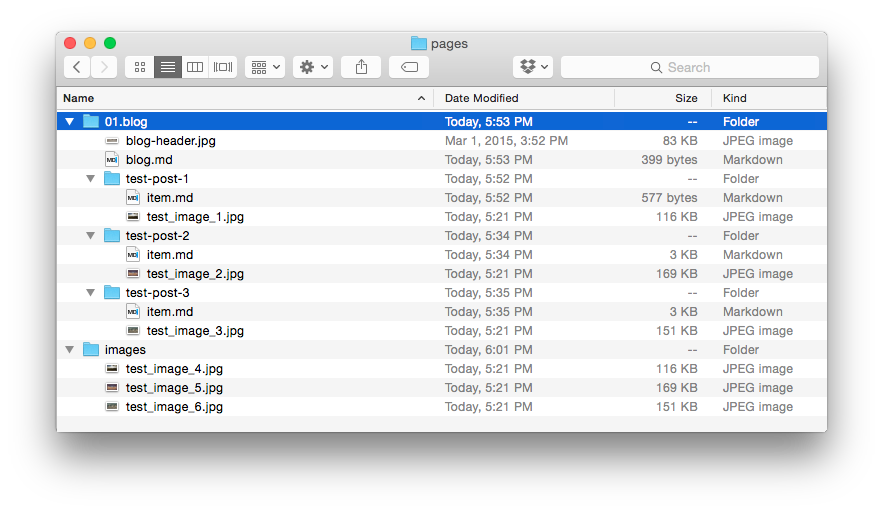

Grav имеет множество гибких вариантов связывания, которые позволяют ссылаться на изображения с других страниц сайта и даже из удаленных источников. Если вы когда-либо связывали файлы с помощью HTML или работали с файловой системой с помощью командной строки, многое из этого должно быть элементарным.

Мы рассмотрим несколько простых примеров, используя эту очень простую, урезанную модель того, как может выглядеть каталог **pages** сайта Grav.



Используя эту структуру каталогов в качестве примера, мы рассмотрим различные типы ссылок, которые вы можете использовать для отображения мультимедийных файлов в вашем контенте. У нас есть файлы изображений в каждой папке, включая одно изображение для каждого сообщения в блоге и три изображения в специальном каталоге `/images`, который действует как страница, но содержит только файлы мультимедиа.

Использование папки `/images` служит примером того, как вы можете поддерживать простой централизованный каталог изображений для хранения файлов, которые часто используются несколькими страницами. Это упрощает процесс связывания в этих случаях.

!!!! Если вы решите использовать централизованный каталог изображений, имейте в виду, что этот каталог должен существовать в папке `/pages`, поскольку эта папка предназначена для внешнего содержимого.

Для начала вот краткий обзор некоторых стандартных компонентов тега изображения на основе Grav Markdown.

```markdown

```

[div class="table-keycol"]
| Строка | Описание                                                                                               |
| :----- | :-----                                                                                                 |
| `!`    | При размещении в начале традиционного тега ссылки Markdown он указывает, что это тег изображения.      |
| `[]`   | Квадратная скобка используется для обертывания **необязательного** альтернативного текста изображения. |
| `()`   | В круглых скобках заключена ссылка на само изображение. Он помещается сразу после квадратной скобки.   |
| `../`  | Когда используется в ссылке, это означает перемещение вверх по каталогу.                               |
[/div]

!!! Вы можете объединить обычную ссылку на страницу и ссылку на изображение, как если бы изображение было заключено в ссылку: `[](http://example.net/)`

### Относительный слаг

**Относительные** ссылки на изображения используют назначения, заданные относительно текущей страницы. Это может быть так же просто, как ссылка на другой файл в текущем каталоге, например, файл изображения, связанный с текущей страницей, или сложнее, например, подняться на несколько уровней каталогов, а затем вернуться к определенной папке `/files`, где может находиться изображение.

При использовании относительных ссылок расположение исходного файла не менее важно, чем место назначения. Если какой-либо файл в миксе перемещается, изменяя путь между ними, ссылка может быть разорвана.

Преимущество такого типа структуры ссылок заключается в том, что вы можете быстро переключаться между локальным сервером разработки и активным сервером с другим доменным именем, и пока файловая структура остается согласованной, ссылки должны работать без проблем.

Ссылка на файл указывает на конкретный файл по имени, а не по его каталогу или ярлыку. Если бы вы создавали ссылку на изображение в `pages/01.blog/test-post-1/item.md` на `/pages/01.blog/test-post-3/test-image-3.jpg`, вы бы использовали следующую команду:

```markdown

```

Эта ссылка перемещает на одну папку вверх, как обозначено `../`, а затем на одну папку вниз, указывая прямо на `test-image-3.jpg` в качестве места назначения.

Если мы хотим загрузить `blog-header.jpg` из каталога` 01.blog`, мы должны сделать следующее:

```markdown

```

! Вам не нужно включать порядковые номера (`01.`) для относительных ссылок заголовка.

Grav имеет встроенную поддержку слагов в заголовке основного файла разметки страницы. Этот ярлык заменяет имя папки для страницы и все содержащиеся в ней медиафайлы.

Например, **Test Post 2** имеет ярлык, установленный через его markdown-файл (`/pages/01.blog/test-post-2/item.md`). Заголовок этого файла содержит следующее:

[prism classes="language-yaml line-numbers"]
---
title: Test Post 2
slug: test-slug
taxonomy:
    category: blog
---
[/prism]

Вы заметите, что установлен ярлык `test-slug`. Установленные таким образом ярлыки не являются обязательными. Как упоминалось в предыдущей главе, они действительно предоставляют простой способ связи. Если задан слаг, то любая ссылка, которую вы делаете для медиафайла в этой папке, должна быть **относительным слагом** или **абсолютной** с полным URL-адресом, установленным для ссылки.

Если мы хотим связать `test-image-2.jpg` с **Test Post 2**, мы должны ввести следующее:

```markdown

```

Вы заметите, что мы перешли на один каталог вверх, используя (`../`), а затем вниз в папку страницы `test-slug`, используя slug, который был установлен в файле `/pages/01.blog/test-post-2/item.md`.

### Относительная директория

**Относительные** ссылки на изображения используют назначения, заданные относительно текущей страницы. Основное различие между относительной ссылкой ярлыка и относительной ссылкой каталога заключается в том, что вместо использования ярлыков URL вы ссылаетесь на полный путь с именами папок.

Примером этого может быть что-то вроде:

```markdown

```

!! Основное преимущество этого заключается в том, что вы можете поддерживать целостность ссылок в других системах за пределами Grav, таких как GitHub.

### Абсолютные ссылки

Абсолютные ссылки аналогичны относительным, но относятся к корню сайта. В **Grav** корнем обычно считается **/user/pages/**. Этот тип ссылки может быть выполнен двумя разными способами.

Вы можете сделать это аналогично стилю **относительного слага**, который для простоты использует в пути имя каталога. Этот метод устраняет потенциальные проблемы изменения порядка позже (изменение номера в начале имени папки), разрывая ссылку. Это будет наиболее часто используемый метод абсолютной привязки.

Абсолютная ссылка начинается с помощью символа `/`. Вот пример абсолютной ссылки на `pages/01.blog/test-post-2/test-image-2.jpg` в стиле **слаг** из `pages/01.blog/blog.md`.

```markdown

```

!!! Мощный метод — создать папку `user/pages/images/` на вашем сайте Grav и поместить сюда свои изображения. Затем вы можете легко ссылаться на них с помощью абсолютного URL-адреса с любой страницы Grav: `/images/test-image-4.jpg` и по-прежнему иметь возможность выполнять [медиа-действия](../media) с ними.

### Потоки PHP

У вас есть возможность ссылаться на изображения и связывать их через потоки PHP. Доступно несколько встроенных потоков PHP, которые полезны, в том числе:

* `user://` - папка пользователя. Например `user/`
* `page://` - папка страниц. Например `user/pages/`
* `image://` - папка изображений. Например `user/images/`
* `plugins://` - папка плагинов. Например `user/plugins/`
* `theme://` - текущая тема. Например `user/themes/antimatter/`

Это позволяет вам легко получать доступ к изображениям, которые традиционно находятся за пределами иерархии страниц (`user/pages/`).

```markdown

```

или:

```markdown

```

Полный список местоположений потоков по умолчанию см. в разделе [Настройка мультисайта - Потоки](/advanced/multisite-setup#streams).

### Полные URL-адреса изображений

Ссылки на изображения, находящиеся на других сайтах, позволяют напрямую отображать практически любой медиафайл через его URL-адрес. Это не обязательно должно включать содержание вашего собственного сайта, но может. Вот пример отображения изображения по его URL-адресу:

```markdown

```

Вы можете ссылаться практически на любой прямой URL, включая защищенные ссылки HTTPS.

### Действия мультимедиа с изображениями

Одним из основных преимуществ использования изображений, связанных со страницами, является то, что это позволяет вам воспользоваться преимуществами [мощных медиа-действий Grav](../media). Например, вот строка, которую вы могли бы использовать для загрузки изображения с другой страницы:

```markdown

```

или воспользоваться потоками для доступа к изображению в текущей теме:

```markdown

```

Вы найдете больше информации о действиях и других [функциях мультимедийных файлов в следующей главе](../media).

### Атрибуты изображения

Отличная новая функция, которой вы можете воспользоваться — предоставление атрибутов изображения напрямую через синтаксис Markdown. Это позволяет вам легко добавлять атрибуты HTML **classes** и **id** без необходимости использования [Markdown Extra](https://michelf.ca/projects/php-markdown/extra/).

Вот некоторые примеры этого:

##### Одиночный класс

```markdown

```

что приведет к HTML, подобному:

```html

```

##### Несколько классов

```markdown

```

что приведет к HTML, подобному:

```html

```

##### Атрибут ID

```markdown

```

что приведет к HTML, подобному:

```html

```
