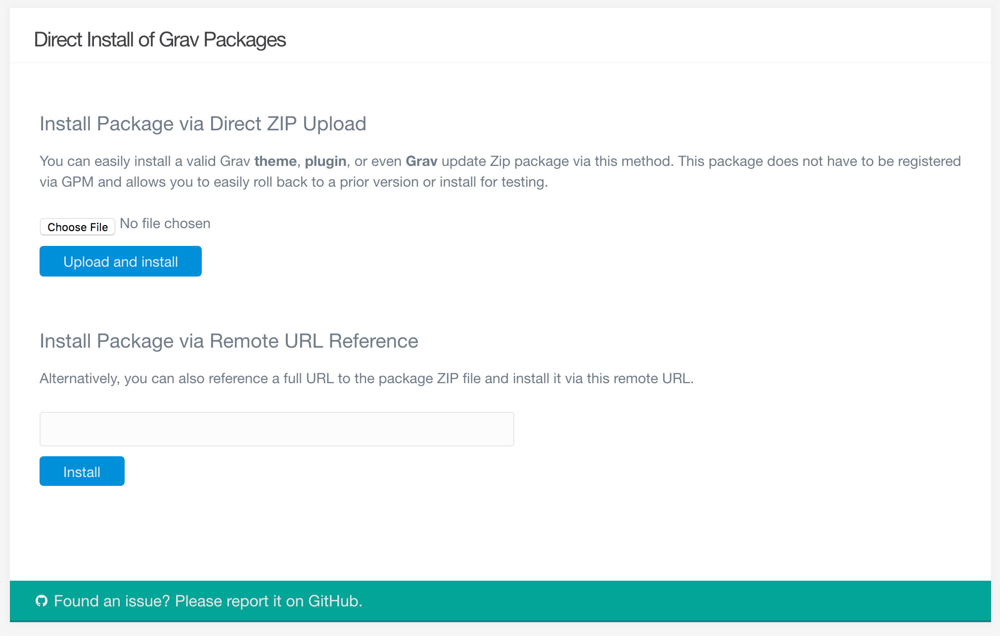

Бывают случаи, когда вы можете захотеть загрузить тему или пакет плагина, которого в настоящее время нет в основном каталоге плагинов Grav. Возможно, у вас есть тема премиум-класса, доступная в виде zip-файла, или вы разрабатываете плагин и хотите загрузить последнюю сборку в свою установку Grav для тестирования. В любом случае вы можете сделать это через FTP, но админка предлагает ещё более простое решение.

Используя инструмент **Прямая установка**, вы можете загрузить заархивированный пакет прямо в вашу установку Grav, и он будет доступен для использования в считанные секунды. Это не ограничивается плагинами и темами. Вы даже можете загрузить Grav таким образом и обновить (или понизить), сделав это. Это особенно полезно для участников Grav, которые хотят легко проверить свою работу.

Как и в случае с любым другим процессом установки, мы рекомендуем создать последнюю резервную копию вашей установки Grav перед использованием этого инструмента - особенно если вы планируете использовать её для изменения всей вашей установки Grav.

### Установка пакета через прямую загрузку ZIP-файла

Первый доступный метод прямой установки — это загрузка файла. Вы можете загрузить zip-пакет прямо в Grav, используя этот инструмент. Просто нажмите кнопку **Обзор...** (или перетащите свой zip-пакет на кнопку в некоторых браузерах) и выберите локальный файл пакета. После того, как вы выбрали файл, просто нажмите **Загрузить и установить**, чтобы установить пакет.

После того, как ваш пакет будет успешно установлен, вы получите уведомление. Вот и всё!

#### Установка пакета через удаленный URL-адрес

Второй метод предполагает прямую ссылку на файл пакета. Например, если у вас есть пакет, размещенный на удаленном сервере, вы можете ввести URL-адрес этого пакета в поле. Ссылки для загрузки, удобные для GPM, такие как `https://getgrav.org/download/themes/bootstrap/1.6.0`, должны работать нормально.

По умолчанию эти загрузки ограничены официальными ссылками на репозиторий GPM. Но вы можете перейти в **Настройка > Система** и переключить опцию **Только официальный GPM** на **Нет**, чтобы разблокировать это поле и включить прямые ссылки на zip-пакеты, которые не являются официальными репозиториями GPM. Например: `http://example.com/mypackage.zip`. Это расширенная функция, которую следует использовать только в тех случаях, когда вы правильно проверили пакет как безопасный.
