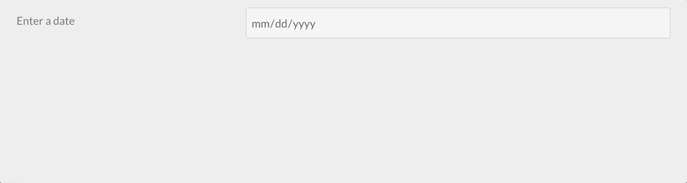

## Общие атрибуты полей

Каждое поле принимает список атрибутов, которые вы можете использовать. Каждое поле может иметь общие атрибуты, но отдельные поля могут их игнорировать. Лучший способ проверить, какие атрибуты разрешены в поле - это проверить описание поля на этой странице и увидеть, какие атрибуты упоминаются.

Этот список обеспечивает общую основу, поэтому нет необходимости повторять описание общего поля.

[div class="table table-keycol"]
| Атрибут           | Описание                                                                                                                                                                                                    |
| :-----              | :-----                                                                                                                                                                                                         |
| `autocomplete`      | принимает `on` или `off`                                                                                                                                                                                          |
| `autofocus`         | если включено, автофокус на этом поле                                                                                                                                                                            |
| `classes`           | принимает строку с одним или несколькими классами CSS для добавления                                                                                                                                                           |
| `default`           | устанавливает значение поля по умолчанию                                                                                                                                                                                   |
| `disabled`          | устанавливает отключенное состояние поля                                                                                                                                                                                  |
| `help`              | добавляет всплывающую подсказку к полю                                                                                                                                                                                    |
| `id`                | устанавливает идентификатор поля. Также устанавливает атрибут `for` для тега `label`                                                                                                                                                  |
| `label`             | устанавливает метку поля                                                                                                                                                                                           |
| `display_label`     | принимает `true` или `false`                                                                                                                                                                                           |
| `labelclasses`      | принимает строку с одним или несколькими классами CSS для добавления                                                                                                                                                            |
| `name`              | устанавливает имя поля                                                                                                                                                                                            |
| `novalidate`        | устанавливает состояние novalidate поля                                                                                                                                                                                |
| `outerclasses`      | классы, добавленные в div, включающий тег `label` и поле                                                                                                                                                |
| `placeholder`       | устанавливает значение заполнителя поля                                                                                                                                                                               |
| `readonly`          | устанавливает состояние поля только для чтения                                                                                                                                                                                  |
| `size`              | устанавливает размер поля, которое, в свою очередь, добавляет класс в свой контейнер. Допустимые значения: `large`, `x-small`, `medium`, `long`, `small`. Вы, конечно, можете добавить больше в шаблон, который вы видите, когда он используется во фронтенде |
| `style`             | устанавливает стиль поля                                                                                                                                                                                           |
| `title`             | устанавливает значение заголовка поля                                                                                                                                                                                     |
| `type`              | устанавливает тип поля                                                                                                                                                                                            |
| `validate.required` | если установлено положительное значение, устанавливает поле как обязательное                                                                                                                                                        |
| `validate.pattern`  | устанавливает шаблон валидации                                                                                                                                                                                      |
| `validate.message`  | устанавливает сообщение, отображаемое в случае сбоя валидации                                                                                                                                                                 |
[/div]

!!! ПРИМЕЧАНИЕ. Положительные значения можно установить несколькими способами: `'on'`, `true`, `1`. Остальные значения интерпретируются как отрицательные..

---

## Доступные поля

### Поле Captcha

Тип поля `captcha` используется для добавления элемента Google reCAPTCHA в вашу форму. В отличие от других элементов, его можно использовать в форме только один раз.

! Вы должны настроить конфигурации Google reCAPTCHA в [консоли администратора reCAPTCHA](https://www.google.com/recaptcha/admin?target=_blank)

Начиная с версии 3.0, поле поддерживает 3 варианта reCAPTCHA. Общую конфигурацию reCAPTCHA лучше всего настраивать в файле конфигурации глобальной формы (обычно `user/config/plugins/form.aml`). Параметры по умолчанию:

[prism classes="language-yaml line-numbers"]
recaptcha:
  version: 2-checkbox
  theme: light
  site_key:
  secret_key:
[/prism]

Эти параметры должны быть установлены на основе следующего:

[div class="table table-keycol"]
| Ключ | Значения |
|-----|--------|
| version | По умолчанию `2-checkbox`, но также может быть `2-invisible` или `3` |
| theme | По умолчанию `light`, но также может быть `dark` (в настоящее время работает только для версии `2-x`) |
| site_key | Ваш ключ сайта Google  |
| secret_key | Ваш секретный ключ Google |
[/div]

!! Убедитесь, что домен сайта указан в конфигурации Google reCAPTCHA.

В определении формы атрибут `name` поля `captcha` должен быть `g-recaptcha-response'. Причина в том, что Google reCAPTCHA хранит код подтверждения Captcha в поле с именем `g-recaptcha-response`.

Пример:

[prism classes="language-yaml line-numbers"]
g-recaptcha-response:
  type: captcha
  label: Captcha

[/prism]

Вы также можете предоставить настраиваемое сообщение об ошибке `recaptcha_not_validated`, но если вы этого не сделаете, сообщение по умолчанию предоставляется подключаемым модулем формы. Если вы хотите установить специфичный для формы ключ `recaptcha_site_key`, а не устанавливать его глобально в конфигурации формы, вы также можете установить это.

[prism classes="language-yaml line-numbers"]
g-recaptcha-response:
  type: captcha
  label: Captcha
  recaptcha_site_key: ENTER_YOUR_CAPTCHA_PUBLIC_KEY
  recaptcha_not_validated: 'Captcha not valid!'
[/prism]

[div class="table table-keycol"]
| Атрибут                   | Описание                                           |
| :-----                    | :-----                                             |
| `recaptcha_site_key`      | Ключ сайта Google reCAPTCHA (необязательно)        |
| `recaptcha_not_validated` | Сообщение, показывающее, что капча недействительна |
[/div]

[div class="table"]
| Разрешены общие атрибуты                       |
| :-----                                         |
| [help](#common-fields-attributes)              |
| [label](#common-fields-attributes)             |
| [name](#common-fields-attributes)              |
| [outerclasses](#common-fields-attributes)      |
| [validate.required](#common-fields-attributes) |
[/div]

##### Проверка Captcha на стороне сервера

Приведенный выше код проверит Captcha во внешнем интерфейсе и предотвратит отправку формы, если она неверна. Чтобы также проверить правильность ввода капчи на стороне сервера, добавьте действие процесса ввода капчи в свои формы:

[prism classes="language-yaml line-numbers"]
  process:
    captcha: true
[/prism]

Вы также можете указать необязательное `message` об успешном выполнении, но если вы этого не сделаете, при успешном выполнении не будет отображаться никакого конкретного сообщения. Если вы хотите установить специфичный для формы `recaptcha_secret`, а не устанавливать его глобально в конфигурации формы, вы также можете установить это.

[prism classes="language-yaml line-numbers"]
  process:
    captcha:
      recaptcha_secret: ENTER_YOUR_CAPTCHA_SECRET_KEY
      message: 'Successfully passed reCAPTCHA!'
[/prism]

См. [пример контактной формы](/forms/forms/example-form), чтобы увидеть его в действии.

---

### Поле флажка

Тип поля `checkbox` используется для добавления одного флажка в вашу форму.

Пример:

[prism classes="language-yaml line-numbers"]
agree_to_terms:
  type: checkbox
  label: "Agree to the terms and conditions"
  validate:
      required: true
[/prism]

[div class="table"]
| Разрешены общие атрибуты                       |
| :-----                                         |
| [autofocus](#common-fields-attributes)         |
| [classes](#common-fields-attributes)           |
| [default](#common-fields-attributes)           |
| [disabled](#common-fields-attributes)          |
| [id](#common-fields-attributes)                |
| [label](#common-fields-attributes)             |
| [name](#common-fields-attributes)              |
| [novalidate](#common-fields-attributes)        |
| [outerclasses](#common-fields-attributes)      |
| [size](#common-fields-attributes)              |
| [style](#common-fields-attributes)             |
| [validate.required](#common-fields-attributes) |
| [validate.pattern](#common-fields-attributes)  |
| [validate.message](#common-fields-attributes)  |
[/div]

---

### Поле флажков

Тип поля `checkboxes` используется для добавления группы флажков в вашу форму.

Примеры:

[prism classes="language-yaml line-numbers"]
pages.process:
    type: checkboxes
    label: PLUGIN_ADMIN.PROCESS
    help: PLUGIN_ADMIN.PROCESS_HELP
    default:
        markdown: true
        twig: true
    options:
        markdown: Markdown
        twig: Twig
    use: keys
[/prism]

[prism classes="language-yaml line-numbers"]
my_field:
    type: checkboxes
    label: A couple of checkboxes
    default:
        - option1
        - option2
    options:
        option1: Option 1
        option2: Option 2
[/prism]

[div class="table table-keycol"]
| Атрибут   | Описание                                                                                                                                                         |
| :-----    | :-----                                                                                                                                                           |
| `use`     | Если установлено значение `keys`, флажок будет сохранять значение ключа элемента при отправке формы. В противном случае он будет использовать значение элемента. |
| `options` | Массив разрешенных параметров «ключ-значение».                                                                                                                   |
[/div]

[div class="table"]
| Разрешены общие атрибуты                       |
| :-----                                         |
| [autofocus](#common-fields-attributes)         |
| [classes](#common-fields-attributes)           |
| [default](#common-fields-attributes)           |
| [disabled](#common-fields-attributes)          |
| [help](#common-fields-attributes)              |
| [id](#common-fields-attributes)                |
| [label](#common-fields-attributes)             |
| [name](#common-fields-attributes)              |
| [outerclasses](#common-fields-attributes)      |
| [size](#common-fields-attributes)              |
| [style](#common-fields-attributes)             |
| [validate.required](#common-fields-attributes) |
| [validate.pattern](#common-fields-attributes)  |
| [validate.message](#common-fields-attributes)  |
[/div]

!! ПРИМЕЧАНИЕ: Поле флажков не поддерживает действие процесса `remember`.

---
### Условное поле

Тип поля `conditional` используется для отображения некоторых других полей в зависимости от заданного условия.

Примеры:

Если ваше условное выражение уже возвращает `true` или `false`, вы можете просто использовать этот упрощенный формат:

[prism classes="language-yaml line-numbers"]
header.field_condition:
  type: conditional
  condition: config.plugins.yourplugin.enabled
  fields: # The field(s) below will be displayed only if the plugin named yourplugin is enabled
    header.mytextfield:
    type: text
    label: A text field
[/prism]

Однако, если вам требуются более сложные условия, вы можете выполнить некоторую логику, которая возвращает `true` или `false` в виде строк, и поле это тоже поймет.

[prism classes="language-yaml line-numbers"]
header.field_condition:
  type: conditional
  condition: "config.plugins.yourplugin.enabled ? 'true' : 'false'"
  fields: # The field(s) below will be displayed only if the plugin named yourplugin is enabled
    header.mytextfield:
    type: text
    label: A text field
[/prism]

[div class="table table-keycol"]
| Атрибут     | Описание                                                                                   |
| :-----      | :-----                                                                                     |
| `condition` | Состояние оценивается twig. Любая переменная, доступная с помощью twig, может быть оценена |
[/div]

[div class="table"]
| Разрешены общие атрибуты              |
| :-----                                |
| [disabled](#common-fields-attributes) |
| [id](#common-fields-attributes)       |
| [label](#common-fields-attributes)    |
| [name](#common-fields-attributes)     |
[/div]

---

### Поле даты

Тип поля `date` используется для добавления поля ввода HTML5 `date`.

Пример:

[prism classes="language-yaml line-numbers"]
-
  type: date
  label: Enter a date
  validate.min: "2014-01-01"
  validate.max: "2018-12-31"
[/prism]

[div class="table table-keycol"]
| Атрибут      | Описание                                                                                                                                                                                        |
| :-----         | :-----                                                                                                                                                                                             |
| `validate.min` | Устанавливает атрибут `min` поля (см. [http://html5doctor.com/the-woes-of-date-input/#feature-min-max-attributes](http://html5doctor.com/the-woes-of-date-input/#feature-min-max-attributes)) |
| `validate.max` | Устанавливает атрибут `max` поля (см. [http://html5doctor.com/the-woes-of-date-input/#feature-min-max-attributes](http://html5doctor.com/the-woes-of-date-input/#feature-min-max-attributes)) |
[/div]

[div class="table"]
| Разрешены общие атрибуты                       |
| :-----                                         |
| [autofocus](#common-fields-attributes)         |
| [classes](#common-fields-attributes)           |
| [default](#common-fields-attributes)           |
| [disabled](#common-fields-attributes)          |
| [help](#common-fields-attributes)              |
| [id](#common-fields-attributes)                |
| [label](#common-fields-attributes)             |
| [name](#common-fields-attributes)              |
| [novalidate](#common-fields-attributes)        |
| [outerclasses](#common-fields-attributes)      |
| [readonly](#common-fields-attributes)          |
| [size](#common-fields-attributes)              |
| [style](#common-fields-attributes)             |
| [title](#common-fields-attributes)             |
| [validate.required](#common-fields-attributes) |
| [validate.pattern](#common-fields-attributes)  |
| [validate.message](#common-fields-attributes)  |
[/div]

---

### Поле отображения

Тип поля `display` используется для отображения текста или инструкций внутри формы. Может принимать Markdown-контент.

Пример:

[prism classes="language-yaml line-numbers"]
test:
    type: display
    size: large
    label: Instructions
    markdown: true
    content: "This is a test of **bold** and _italic_ in a text/display field\n\nanother paragraph...."
[/prism]

[div class="table table-keycol"]
| Атрибут    | Описание                                                                    |
| :-----     | :-----                                                                      |
| `markdown` | логическое значение, которое включает обработку Markdown в поле содержимого |
| `content`  | текстовое содержимое для отображения                                        |
[/div]

[div class="table"]
| Разрешены общие атрибуты                  |
| :-----                                    |
| [help](#common-fields-attributes)         |
| [id](#common-fields-attributes)           |
| [label](#common-fields-attributes)        |
| [name](#common-fields-attributes)         |
| [id](#common-fields-attributes)           |
| [outerclasses](#common-fields-attributes) |
| [size](#common-fields-attributes)         |
| [style](#common-fields-attributes)        |
[/div]

---

### Поле электронной почты

Тип поля `email` используется для представления текстового поля ввода, которое принимает электронную почту, используя [HTML5-ввод электронной почты](https://html5doctor.com/html5-forms-input-types/#input-email).

!! В электронных письмах не учитывается регистр символов. Убедитесь, что логика вашего приложения правильно обрабатывает электронные письма в верхнем, нижнем или смешанном регистре.

Пример:
[prism classes="language-yaml line-numbers"]
header.email:
  type: email
  autofocus: true
  label: Email
[/prism]

[div class="table table-keycol"]
| Атрибут         | Описание                        |
| :-----          | :-----                          |
| `minlength`     | минимальная длина текста        |
| `maxlength`     | максимальная длина текста       |
| `validate.min`  | то же, что и минимальная длина  |
| `validate.max`  | то же, что и максимальная длина |
[/div]

[div class="table"]
| Разрешены общие атрибуты                       |
| :-----                                         |
| [autofocus](#common-fields-attributes)         |
| [classes](#common-fields-attributes)           |
| [default](#common-fields-attributes)           |
| [disabled](#common-fields-attributes)          |
| [help](#common-fields-attributes)              |
| [id](#common-fields-attributes)                |
| [label](#common-fields-attributes)             |
| [name](#common-fields-attributes)              |
| [novalidate](#common-fields-attributes)        |
| [outerclasses](#common-fields-attributes)      |
| [readonly](#common-fields-attributes)          |
| [size](#common-fields-attributes)              |
| [style](#common-fields-attributes)             |
| [title](#common-fields-attributes)             |
| [validate.required](#common-fields-attributes) |
| [validate.pattern](#common-fields-attributes)  |
| [validate.message](#common-fields-attributes)  |
[/div]

---

### Поле файла

С типом поля `file` вы можете позволить пользователям загружать файлы через форму. Поле по умолчанию позволяет **только один файл** типа **изображение** и будет загружено на **текущую** страницу, где была объявлена ​​форма.

[prism classes="language-yaml line-numbers"]
# Default settings
my_files:
  type: file
  multiple: false
  destination: '@self'
  accept:
    - image/*
[/prism]

[div class="table table-keycol"]
| Атрибут     | Описание                                                                                                                                                                                                                                                                                                                                                                                                                                                                              |
| :-----        | :-----                                                                                                                                                                                                                                                                                                                                                                                                                                                                                   |
| `multiple`    | Может быть `true` или `false`, если установлено значение **true**, можно выбрать несколько файлов одновременно time                                                                                                                                                                                                                                                                                                                                                                                          |
| `destination` | Может быть **@self**, **@page:/route**, или **local/rel/path/**.  Если установлено **@self**, файлы будут загружены туда, где была объявлена ​​форма (current .md).  При использовании **@page:/route** файлы будут загружаться по указанному маршруту страницы, если существует (например, **@page:/blog/a-blog-post**).  Если установлено **'local/rel/path'**, файлы будут загружены в указанное местоположение. Например, `user/data/files`. Если путь не существует, он будет создан, поэтому убедитесь, что он доступен для записи. |
| `accept`      | Принимает массив разрешенных типов MIME. Например, чтобы разрешить только файлы gif и mp4: `accept: ['image/gif', 'video/mp4']`                                                                                                                                                                                                                                                                                                                                                       |
[/div]

!!! Поле `file` в админке немного отличается, что позволяет также удалить файл, загруженный в форму, потому что в админке вариант использования заключается в том, чтобы загрузить, а затем связать файл с полем.

[div class="table"]
| Разрешены общие атрибуты                       |
| :-----                                         |
| [help](#common-fields-attributes)              |
| [label](#common-fields-attributes)             |
| [name](#common-fields-attributes)              |
| [outerclasses](#common-fields-attributes)      |
| [validate.required](#common-fields-attributes) |
[/div]

По умолчанию в админке поле типа `file` будет перезаписывать загруженный файл с тем же именем, что и более новый, содержащийся в той же папке, в которую вы хотите его загрузить, если только вы не установите для параметра `avoid_overwriting` значение `true` в определении поля.

---

### Скрытое поле

Тип поля `hidden` используется для добавления скрытого элемента в форму.

Example:
[prism classes="language-yaml line-numbers"]
header.some_field:
  type: hidden
  default: my-value
[/prism]

[div class="table table-keycol"]
| Атрибут   | Описание                                                                                                                    |
| :-----    | :-----                                                                                                                      |
| `name`    | Имя поля. Если отсутствует, имя поля берется из элемента определения поля (в приведенном выше примере: `header.some_field`) |
[/div]

[div class="table"]
| Разрешены общие атрибуты             |
| :-----                               |
| [default](#common-fields-attributes) |
[/div]

---

### Поле приманки

Тип поля `honeypot` создает скрытое поле, которое при заполнении возвращается с ошибкой. Это полезный способ предотвратить заполнение и отправку формы ботами.

Пример:

[prism classes="language-yaml line-numbers"]
fields:
    honeypot:
      type: honeypot
[/prism]

Это простое текстовое поле, которое не отображается в интерфейсе пользователя. Боты, которые обнаруживают поля в коде и заполняют их автоматически, скорее всего, заполнят это поле. Ошибка не позволяет правильно отправить эту форму. Ошибка возвращается рядом с элементом формы, а не вверху блока сообщения.

Поле приманки - популярная альтернатива полям капчи.

---

### Поле игнорирования

Тип поля `ignore` можно использовать для удаления неиспользуемых полей при расширении из другого чертежа

Пример:

[prism classes="language-yaml line-numbers"]
header.process:
  type: ignore
content:
  type: ignore
[/prism]

---

### Числовое поле

Тип поля `number` используется для представления поля ввода текста, которое принимает только числа, с использованием [number HTML5 input](http://html5doctor.com/html5-forms-input-types/#input-number).

Пример:
[prism classes="language-yaml line-numbers"]
header.count:
  type: number
  label: 'How Much?'
  validate:
    min: 10
    max: 360
    step: 10
[/prism]

[div class="table table-keycol"]
| Атрибут         | Описание                       |
| :-----          | :-----                         |
| `validate.min`  | минимальное значение           |
| `validate.max`  | максимальное значение          |
| `validate.step` | который увеличивает шаг вперед |
[/div]

[div class="table"]
| Разрешены общие атрибуты                       |
| :-----                                         |
| [autofocus](#common-fields-attributes)         |
| [classes](#common-fields-attributes)           |
| [default](#common-fields-attributes)           |
| [disabled](#common-fields-attributes)          |
| [help](#common-fields-attributes)              |
| [id](#common-fields-attributes)                |
| [label](#common-fields-attributes)             |
| [name](#common-fields-attributes)              |
| [novalidate](#common-fields-attributes)        |
| [outerclasses](#common-fields-attributes)      |
| [readonly](#common-fields-attributes)          |
| [size](#common-fields-attributes)              |
| [style](#common-fields-attributes)             |
| [title](#common-fields-attributes)             |
| [validate.required](#common-fields-attributes) |
| [validate.pattern](#common-fields-attributes)  |
| [validate.message](#common-fields-attributes)  |
[/div]

---

### Поле пароля

Тип поля `password` используется для представления поля ввода текста пароля.

Пример:
[prism classes="language-yaml line-numbers"]
password:
  type: password
  label: Password
[/prism]

[div class="table"]
| Разрешены общие атрибуты                       |
| :-----                                         |
| [autofocus](#common-fields-attributes)         |
| [classes](#common-fields-attributes)           |
| [default](#common-fields-attributes)           |
| [disabled](#common-fields-attributes)          |
| [help](#common-fields-attributes)              |
| [id](#common-fields-attributes)                |
| [label](#common-fields-attributes)             |
| [name](#common-fields-attributes)              |
| [novalidate](#common-fields-attributes)        |
| [outerclasses](#common-fields-attributes)      |
| [readonly](#common-fields-attributes)          |
| [size](#common-fields-attributes)              |
| [style](#common-fields-attributes)             |
| [title](#common-fields-attributes)             |
| [validate.required](#common-fields-attributes) |
| [validate.pattern](#common-fields-attributes)  |
| [validate.message](#common-fields-attributes)  |
[/div]

---

### Поле Radio

Тип поля `radio` используется для представления набора радиополей.

Пример:
[prism classes="language-yaml line-numbers"]
my_choice:
  type: radio
  label: Choice
  default: markdown
  options:
      markdown: Markdown
      twig: Twig
[/prism]

[div class="table table-keycol"]
| Атрибут   | Описание                                       |
| :-----    | :-----                                         |
| `options` | Массив разрешенных параметров «ключ-значение». |
[/div]

[div class="table"]
| Разрешены общие атрибуты                       |
| :-----                                         |
| [default](#common-fields-attributes)           |
| [disabled](#common-fields-attributes)          |
| [help](#common-fields-attributes)              |
| [id](#common-fields-attributes)                |
| [label](#common-fields-attributes)             |
| [name](#common-fields-attributes)              |
| [outerclasses](#common-fields-attributes)      |
| [validate.required](#common-fields-attributes) |
| [validate.pattern](#common-fields-attributes)  |
| [validate.message](#common-fields-attributes)  |
[/div]

---

### Поле диапазона

Поле `range` используется для представления [поле ввода диапазона](https://html5doctor.com/html5-forms-input-types/#input-range).

Пример:
[prism classes="language-yaml line-numbers"]
header.choose_a_number_in_range:
  type: range
  label: Choose a number
  validate:
    min: 1
    max: 10
[/prism]

[div class="table"]
| Разрешены общие атрибуты                       |
| :-----                                         |
| [autofocus](#common-fields-attributes)         |
| [classes](#common-fields-attributes)           |
| [default](#common-fields-attributes)           |
| [disabled](#common-fields-attributes)          |
| [help](#common-fields-attributes)              |
| [id](#common-fields-attributes)                |
| [label](#common-fields-attributes)             |
| [name](#common-fields-attributes)              |
| [novalidate](#common-fields-attributes)        |
| [outerclasses](#common-fields-attributes)      |
| [readonly](#common-fields-attributes)          |
| [size](#common-fields-attributes)              |
| [style](#common-fields-attributes)             |
| [title](#common-fields-attributes)             |
| [validate.required](#common-fields-attributes) |
| [validate.pattern](#common-fields-attributes)  |
| [validate.message](#common-fields-attributes)  |
[/div]

---

### Поле Section

Тип поля `Section` используется для разделения страницы настроек на разделы.

Пример:

[prism classes="language-yaml line-numbers"]
content:
    type: section
    title: PLUGIN_ADMIN.DEFAULTS
    underline: true

    fields:

        #..... subfields
[/prism]

[div class="table table-keycol"]
| Атрибут       | Описание                                                                       |
| :-----        | :-----                                                                         |
| `title`       | Заголовок                                                                      |
| `text`        | Текст для отображения внизу                                                    |
| `security`    | Массив учётных данных, необходимых пользователю для визуализации этого раздела |
| `title_level` | Установить собственный тег заголовка. По умолчанию: `h3`                       |
[/div]

---

### Поле выбора

Тип поля `select` используется для представления поля выбора.

Пример:
[prism classes="language-yaml line-numbers"]
pages.order.by:
    type: select
    size: long
    classes: fancy
    label: 'Default Ordering'
    help: 'Pages in a list will render using this order unless it is overridden'
    options:
        default: 'Default - based on folder name'
        folder: 'Folder - based on prefix-less folder name'
        title: 'Title - based on title field in header'
        date: 'Date - based on date field in header'
[/prism]

[div class="table table-keycol"]
| Атрибут    | Описание                                                                      |
| :-----     | :-----                                                                        |
| `options`  | Массив разрешенных параметров «ключ-значение». Ключ будет отправлен по форме. |
| `multiple` | Разрешить форме принимать несколько значений.                                 |
[/div]

Если вы установите для `multiple` значение true, вам нужно добавить `validate.type: array`. В противном случае массив выбранных значений не будет сохранен правильно.

[div class="table"]
| Разрешены общие атрибуты                       |
| :-----                                         |
| [autofocus](#common-fields-attributes)         |
| [classes](#common-fields-attributes)           |
| [default](#common-fields-attributes)           |
| [disabled](#common-fields-attributes)          |
| [help](#common-fields-attributes)              |
| [id](#common-fields-attributes)                |
| [label](#common-fields-attributes)             |
| [name](#common-fields-attributes)              |
| [novalidate](#common-fields-attributes)        |
| [outerclasses](#common-fields-attributes)      |
| [size](#common-fields-attributes)              |
| [style](#common-fields-attributes)             |
| [validate.required](#common-fields-attributes) |
| [validate.pattern](#common-fields-attributes)  |
| [validate.message](#common-fields-attributes)  |
[/div]

---

### Поле Select Optgroup

Тип поля `select_optgroup` используется для представления поля выбора с группировками.

Пример:
[prism classes="language-yaml line-numbers"]
header.newField:
    type: select_optgroup
    label: Test Optgroup Select Field
    options:
      - OptGroup1:
        - Option1
        - Option2
      - OptGroup2:
        - Option3
        - Option4
[/prism]

[div class="table table-keycol"]
| Атрибут    | Описание                                       |
| :-----     | :-----                                         |
| `options`  | Массив разрешенных параметров «ключ-значение». |
| `multiple` | Разрешить форме принимать несколько значений.  |
[/div]

[div class="table"]
| Разрешены общие атрибуты                       |
| :-----                                         |
| [autofocus](#common-fields-attributes)         |
| [classes](#common-fields-attributes)           |
| [default](#common-fields-attributes)           |
| [disabled](#common-fields-attributes)          |
| [help](#common-fields-attributes)              |
| [id](#common-fields-attributes)                |
| [label](#common-fields-attributes)             |
| [name](#common-fields-attributes)              |
| [novalidate](#common-fields-attributes)        |
| [outerclasses](#common-fields-attributes)      |
| [size](#common-fields-attributes)              |
| [style](#common-fields-attributes)             |
| [validate.required](#common-fields-attributes) |
| [validate.pattern](#common-fields-attributes)  |
| [validate.message](#common-fields-attributes)  |
[/div]

---

### Промежуточное поле

Тип поля `spacer` используется для добавления текста, заголовка или тега hr

Пример:

[prism classes="language-yaml line-numbers"]
test:
    type: spacer
    title: A title
    text: Some text
    underline: true
[/prism]

[div class="table table-keycol"]
| Атрибут     | Описание                                                       |
| :-----      | :-----                                                         |
| `title`     | заголовок h3 для формы                                         |
| `text`      | текст. Если установлен заголовок, добавьте его после заголовка |
| `underline` | логический, добавлять или нет тег `
`                       |
[/div]

---

### Поля Tabs / Tab

Типы полей `tabs` и `tab` используются для разделения содержащихся полей формы на вкладки.

Пример:

[prism classes="language-yaml line-numbers"]
tabs:
  type: tabs
  active: 1

  fields:
    content:
      type: tab
      title: PLUGIN_ADMIN.CONTENT

      fields:

        # .... other subfields

    options:
      type: tab
      title: PLUGIN_ADMIN.OPTIONS

      fields:

        # .... other subfields
[/prism]

[div class="table table-keycol"]
| Атрибут   | Описание               |
| :-----    | :-----                 |
| `active`  | Номер активной вкладки |
[/div]

---

### Поле телефона

Тип поля `tel` используется для представления поля ввода текста, которое принимает телефонный номер, используя [tel HTML5 input](https://html5doctor.com/html5-forms-input-types/#input-tel).

Пример:
[prism classes="language-yaml line-numbers"]
header.phone:
  type: tel
  label: 'Your Phone Number'
[/prism]

[div class="table table-keycol"]
| Атрибут | Описание                                       |
| :-----    | :-----                                            |
| `minlength` | минимальная длина текста |
| `maxlength`  | максимальная длина текста  |
| `validate.min` | то же, что и минимальная длина |
| `validate.max`  | то же, что и максимальная длина  |
[/div]

[div class="table"]
| Разрешены общие атрибуты                       |
| :-----                                         |
| [autofocus](#common-fields-attributes)         |
| [classes](#common-fields-attributes)           |
| [default](#common-fields-attributes)           |
| [disabled](#common-fields-attributes)          |
| [help](#common-fields-attributes)              |
| [id](#common-fields-attributes)                |
| [label](#common-fields-attributes)             |
| [name](#common-fields-attributes)              |
| [novalidate](#common-fields-attributes)        |
| [outerclasses](#common-fields-attributes)      |
| [readonly](#common-fields-attributes)          |
| [size](#common-fields-attributes)              |
| [style](#common-fields-attributes)             |
| [title](#common-fields-attributes)             |
| [validate.required](#common-fields-attributes) |
| [validate.pattern](#common-fields-attributes)  |
| [validate.message](#common-fields-attributes)  |
[/div]

---

### Текстовое поле

Поле `text` используется для представления поля ввода текста.

Пример:
[prism classes="language-yaml line-numbers"]
header.title:
  type: text
  autofocus: true
  label: PLUGIN_ADMIN.TITLE
  minlength: 10
  maxlength: 255
[/prism]

[div class="table table-keycol"]
| Атрибут   | Описание                              |
| :-----    | :-----                                |
| `prepend` | добавить текст или HTML в начало поля |
| `append`  | добавить текст или HTML в конец поля  |
| `minlength` | минимальная длина текста |
| `maxlength`  | максимальная длина текста  |
| `validate.min` | то же, что и минимальная длина |
| `validate.max`  | то же, что и максимальная длина  |
[/div]

[div class="table"]
| Разрешены общие атрибуты                       |
| :-----                                         |
| [autofocus](#common-fields-attributes)         |
| [classes](#common-fields-attributes)           |
| [default](#common-fields-attributes)           |
| [disabled](#common-fields-attributes)          |
| [help](#common-fields-attributes)              |
| [id](#common-fields-attributes)                |
| [label](#common-fields-attributes)             |
| [name](#common-fields-attributes)              |
| [novalidate](#common-fields-attributes)        |
| [outerclasses](#common-fields-attributes)      |
| [readonly](#common-fields-attributes)          |
| [size](#common-fields-attributes)              |
| [style](#common-fields-attributes)             |
| [title](#common-fields-attributes)             |
| [validate.required](#common-fields-attributes) |
| [validate.pattern](#common-fields-attributes)  |
| [validate.message](#common-fields-attributes)  |
[/div]

---

### Поле Textarea

Поле `textarea` используется для представления поля ввода текстового поля.

Пример:

[prism classes="language-yaml line-numbers"]
header.content:
  type: textarea
  autofocus: true
  label: PLUGIN_ADMIN.CONTENT
  minlength: 10
  maxlength: 255
[/prism]

[div class="table table-keycol"]
| Атрибут   | Описание                               |
| :-----    | :-----                                 |
| `rows`    | Добавляет заданное количество строк    |
| `cols`    | Добавляет заданное количество столбцов |
| `minlength` | минимальная длина текста |
| `maxlength`  | максимальная длина текста  |
| `validate.min` | то же, что и минимальная длина |
| `validate.max`  | то же, что и максимальная длина  |
[/div]

[div class="table"]
| Разрешены общие атрибуты                       |
| :-----                                         |
| [autofocus](#common-fields-attributes)         |
| [classes](#common-fields-attributes)           |
| [default](#common-fields-attributes)           |
| [disabled](#common-fields-attributes)          |
| [help](#common-fields-attributes)              |
| [id](#common-fields-attributes)                |
| [label](#common-fields-attributes)             |
| [name](#common-fields-attributes)              |
| [novalidate](#common-fields-attributes)        |
| [outerclasses](#common-fields-attributes)      |
| [readonly](#common-fields-attributes)          |
| [size](#common-fields-attributes)              |
| [style](#common-fields-attributes)             |
| [title](#common-fields-attributes)             |
| [validate.required](#common-fields-attributes) |
| [validate.pattern](#common-fields-attributes)  |
| [validate.message](#common-fields-attributes)  |
[/div]

---

### Поле переключателя

Тип поля `toggle` - это тип ввода вкл/выкл с настраиваемыми метками.

Пример:

[prism classes="language-yaml line-numbers"]
summary.enabled:
    type: toggle
    label: PLUGIN_ADMIN.ENABLED
    highlight: 1
    help: PLUGIN_ADMIN.ENABLED_HELP
    options:
        1: PLUGIN_ADMIN.YES
        0: PLUGIN_ADMIN.NO
    validate:
        type: bool
[/prism]

[div class="table table-keycol"]
| Атрибут     | Описание                                                    |
| :-----      | :-----                                                      |
| `highlight` | Клавиша опции для выделения (при выборе становится зеленым) |
| `options`   | Список параметров «ключ-значение»                           |
[/div]

[div class="table"]
| Разрешены общие атрибуты                       |
| :-----                                         |
| [default](#common-fields-attributes)           |
| [help](#common-fields-attributes)              |
| [label](#common-fields-attributes)             |
| [name](#common-fields-attributes)              |
| [style](#common-fields-attributes)             |
| [toggleable](#common-fields-attributes)        |
| [validate.required](#common-fields-attributes) |
| [validate.type](#common-fields-attributes)     |
| [disabled](#common-fields-attributes)          |
[/div]

---

### Поле URL-адреса

Тип поля `url` используется для представления поля ввода текста, которое принимает URL-адрес, используя [url HTML5 input](https://html5doctor.com/html5-forms-input-types/#input-url).

Пример:
[prism classes="language-yaml line-numbers"]
header.phone:
  type: url
  label: 'Your Phone Number'
[/prism]

[div class="table table-keycol"]
| Атрибут | Описание                                       |
| :-----    | :-----                                            |
| `minlength` | минимальная длина текста |
| `maxlength`  | максимальная длина текста  |
| `validate.min` | то же, что и минимальная длина |
| `validate.max`  | то же, что и максимальная длина  |
[/div]

[div class="table"]
| Разрешены общие атрибуты                       |
| :-----                                         |
| [autofocus](#common-fields-attributes)         |
| [classes](#common-fields-attributes)           |
| [default](#common-fields-attributes)           |
| [disabled](#common-fields-attributes)          |
| [help](#common-fields-attributes)              |
| [id](#common-fields-attributes)                |
| [label](#common-fields-attributes)             |
| [name](#common-fields-attributes)              |
| [novalidate](#common-fields-attributes)        |
| [outerclasses](#common-fields-attributes)      |
| [readonly](#common-fields-attributes)          |
| [size](#common-fields-attributes)              |
| [style](#common-fields-attributes)             |
| [title](#common-fields-attributes)             |
| [validate.required](#common-fields-attributes) |
| [validate.pattern](#common-fields-attributes)  |
| [validate.message](#common-fields-attributes)  |
[/div]

## Недокументированные в настоящее время поля

[div class="table table-keycol"]
| Поле                                              | Описание                                                                  |
| :-----                                            | :-----                                                                    |
| **Array**                                         |                                                                           |
| **Avatar**                                        |                                                                           |
| **Color**                                         |                                                                           |
| **Columns**                                       |                                                                           |
| **Column**                                        |                                                                           |
| **Datetime**                                      |                                                                           |
| **Fieldset**                                      |                                                                           |
| **Formname**                                      |                                                                           |
| **Key**                                           |                                                                           |
| **Month**                                         |                                                                           |
| **Signature**                                     |                                                                           |
| **Switch**                                        |                                                                           |
| **Time**                                          |                                                                           |
| **Unique Id**                                     |                                                                           |
| **Value**                                         |                                                                           |
| **Week**                                          |                                                                           |
[/div]
