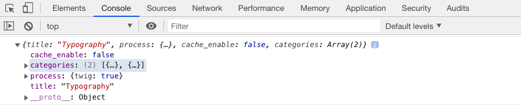

При разработке тем и плагинов часто требуется отображать **отладочную** информацию. Grav обладает мощными возможностями отладки с помощью множества функций:

## Панель отладки

Grav поставляется с отличным инструментом, облегчающим эту задачу, который вызывается через **панель отладки**. Эта функция **отключена** по умолчанию, но может быть включена либо глобально, либо для вашей [среды разработки](../environment-config) только через файл конфигурации `system.yaml`:

[prism classes="language-yaml line-numbers"]
debugger:
  enabled: true                        # Включить отладчик Grav и следующие настройки
  shutdown:
    close_connection: true             # Закрывать соединение перед вызовом onShutdown(). false для отладки
[/prism]

!! При первом включении панель отладки может появиться в виде небольшого значка Grav в нижнем левом углу страницы. При нажатии на нее отображается полная панель отладки.

Панель отладки PHP по-прежнему показывает общее **время обработки**, а также **использование памяти**, но теперь на ней есть несколько вкладок с более подробной информацией.

Первая вкладка предназначена для **сообщений**, и вы можете использовать ее, чтобы помочь отладить процесс разработки Grav, разместив на этой вкладке информацию из вашего кода.

Наряду с информацией **Запрос**, **Исключения** и **Конфигурация**, вы также можете увидеть подробную разбивку времени Grav на панели **Временная шкала**:

### Команда дампа для PHP

Если вы пытаетесь отладить какой-либо PHP, например настраиваемый плагин, который вы разрабатываете, и хотите быстро проверить какой-либо объект или переменную, вы можете использовать мощную команду `dump()`. Он принимает практически любую допустимую переменную PHP и выводит результаты в красиво отформатированном и раскрашенном виде в вашем браузере.

Например, вы можете легко выгрузить переменную или объект PHP:

[prism classes="language-php"]
dump($myvariable);
[/prism]

и просмотрите результаты в своем браузере:

Вы также можете выгружать переменные на вкладку **Сообщения** панели отладки, используя синтаксис:

[prism classes="language-php"]
$this->grav['debugger']->addMessage($myvariable)
[/prism]

### Команда дампа для Twig

Вы также можете отображать переменные Twig из ваших шаблонов Twig. Это делается аналогичным образом, но результаты отображаются на панели **Сообщения** панели отладки. Эта функция **отключена** по умолчанию, но может быть включена либо глобально, либо для вашей [среды разработки](../environment-config) только через файл конфигурации `system.yaml`:

[prism classes="language-yaml line-numbers"]
twig:
  debug: true                        # Включить отладчик Twig
[/prism]

Например, вы можете легко выгрузить переменную или объект Twig:


[prism classes="language-twig line-numbers"]
{{ dump(page.header) }}
[/prism]


и просмотрите результаты на панели отладки:

### Дамп в консоль браузера из Twig

Для отображения переменных до того, как страница будет возвращена Grav, или в случае, если обновление страницы не происходит, например, при использовании AJAX, есть другая альтернатива. Используя одну строку Javascript, можно отобразить любую переменную в консоли разработчика вашего браузера, например:


[prism classes="language-html"]

[/prism]


Затем проверьте значение в консоли браузера:

## Отображение ошибок

На нашей новой странице отображения ошибок представлена ​​подробная информация, трассировки и даже соответствующие блоки кода. Это помогает быстрее выявлять, выявлять и устранять критические ошибки. По умолчанию в Grav 1.0+ они отключены по умолчанию, поэтому вам нужно включить их, чтобы воспользоваться этой полезной обработкой ошибок для разработки:

[prism classes="language-yaml line-numbers"]
errors:
  display: true
[/prism]

Для производственных сред вы можете отключить страницу подробных ошибок с помощью чего-то более тонкого, настроив параметры ошибок в файле `user/config/system.yaml` и полагаясь на то, что ошибки регистрируются в файле:

[prism classes="language-yaml line-numbers"]
errors:
  display: false
  log: true
[/prism]

## Логирование

Возможность регистрации информации часто бывает полезной, и, опять же, Grav предоставляет нам простую и мощную функцию регистрации. Используйте один из следующих синтаксисов:

[prism classes="language-twig line-numbers"]
$this->grav['log']->info('My informational message');
$this->grav['log']->notice('My notice message');
$this->grav['log']->debug('My debug message');
$this->grav['log']->warning('My warning message');
$this->grav['log']->error('My error message');
$this->grav['log']->critical('My critical message');
$this->grav['log']->alert('My alert message');
$this->grav['log']->emergency('Emergency, emergency, there is an emergency here!');

[/prism]

Все ваше сообщение будет добавлено в файл `/logs/grav.log`.
