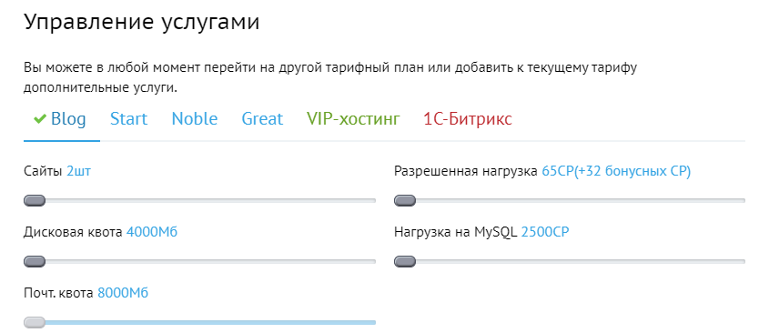
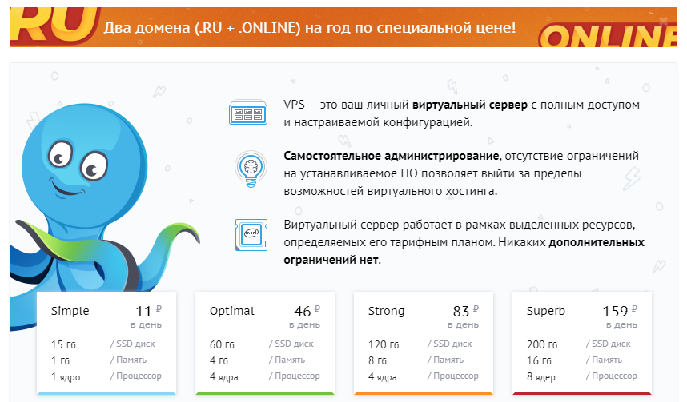
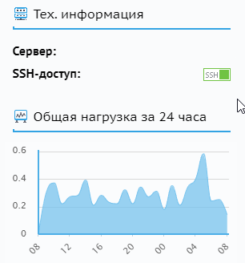
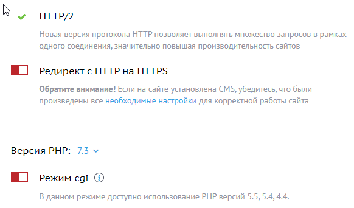
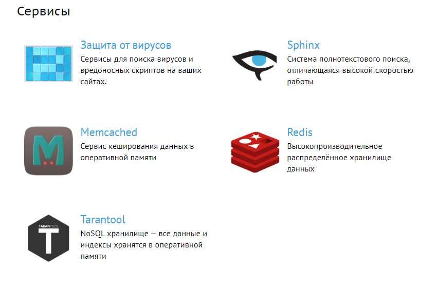

[Beget](https://beget.com/p1361) является одним из крупнейших хостинг-провайдеров России, характеризуемых проверенной временем технической поддержкой, надежностью и развитием собственных программных продуктов.

[](https://beget.com/?id=1361)

## Особенности тарифов

* Неограниченное количество доменов и поддоменов
* Собственную панель управления;
* PHP 4/5/7, Perl 5, Python, Zend, phpMyAdmin;
* SSH, sFTP/FTP доступ;
* Возможность заказа дополнительных IP-адресов;
* Неограниченный трафик;
* Автоматическую установку CMS;
* Управление CronTab (задания по расписанию);
* Управление DNS-записями;
* POP3, IMAP, SMTP для работы с почтой;
* Автоматическое резервное копирование;
* Управление журналами веб-сервера;
* Круглосуточную техническую поддержку;
* Разрешённую нагрузку 65 CP в день;
* Разрешённую нагрузку 2500 CP для MySQL в день.

Выбранный тариф всегда можно перенастроить в зависимости от своих нужд, в личном кабинете:



При желании можно выбрать и среди VPS-тарифов:



## Включение SSH

SSH включается легко и просто — кнопочкой в левом сайдбаре личного кабинета:



## Конфигурация PHP и кэширование

Версия PHP выбирается для каждого сайта отдельно:



Из дополнительных сервисов доступны следующие:



## Установка и тестирование Grav

Используя ваши новые обнаруженные возможности SSH, подключитесь по SSH к вашему серверу и загрузите последнюю версию Grav, распакуйте её и протестируйте!

Мы распакуем Grav в подпапку `/grav`, но вы можете распаковать его прямо в корень вашего домена `~/www/`, чтобы обеспечить прямой доступ к Grav.

```
cd ~/www
wget https://getgrav.org/download/core/grav/latest
unzip grav-v{{ grav_version }}.zip
```

Теперь вы должны иметь возможность указать в браузере `https://yourlogin.beget.tech/grav`.

Поскольку вы тщательно следовали этим инструкциям, вы также сможете использовать такие команды [Grav CLI](/cli-console/grav-cli) и [Grav GPM](/cli-console/grav-gpm), как:

```
cd ~/public_html/grav
bin/grav clear-cache

Clearing cache

Cleared:  cache/twig/*
Cleared:  cache/doctrine/*
Cleared:  cache/compiled/*
Cleared:  cache/validated-*
Cleared:  images/*
Cleared:  assets/*

Touched: /home/your_user/public_html/grav/user/config/system.yaml
```
