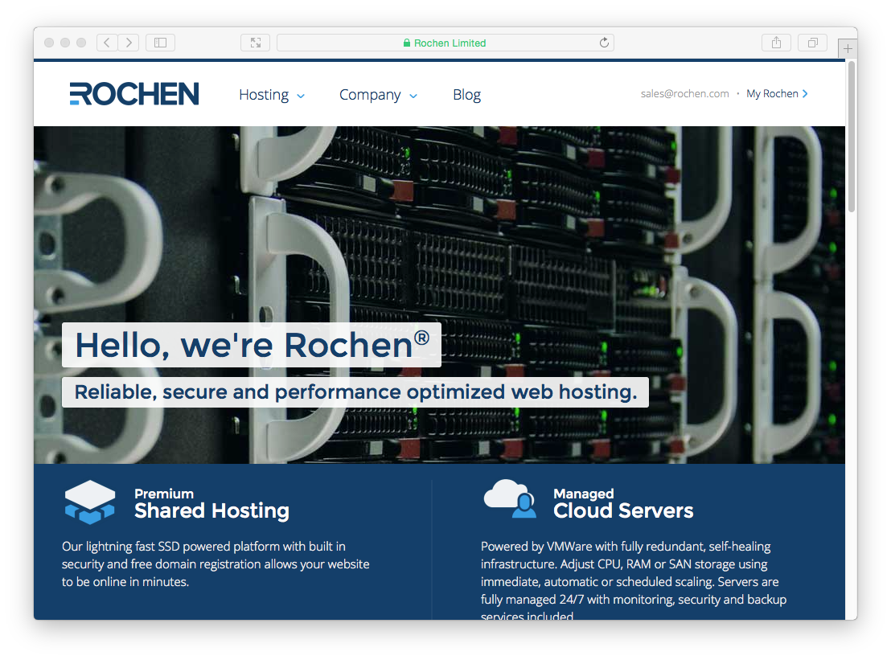
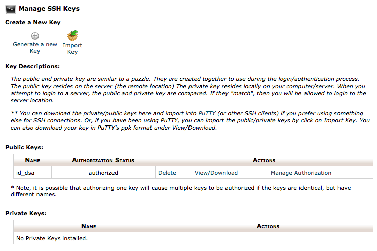
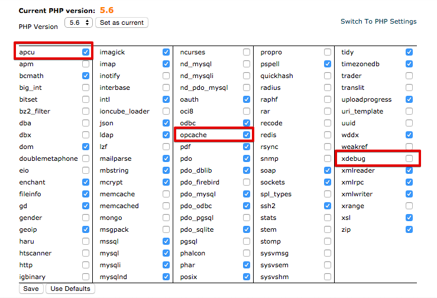
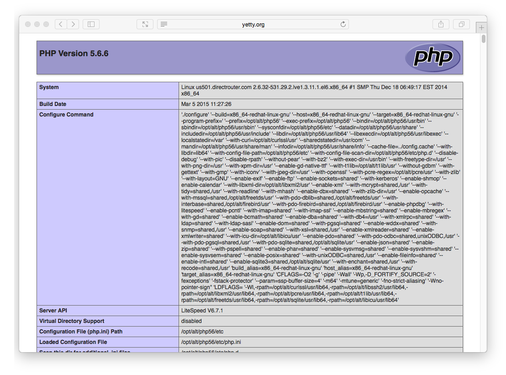
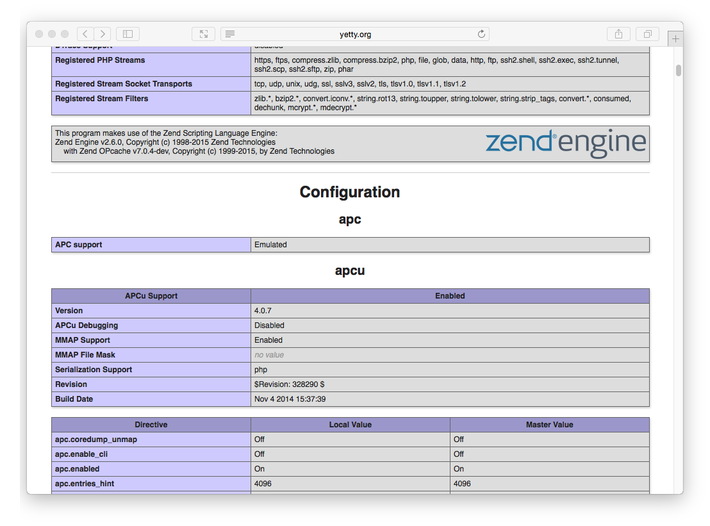

[Хостинг Rochen](http://www.rochen.com/?utm_source=RocketTheme&utm_medium=Showcase&utm_campaign=Promotions) является давним партнером **GetGrav.org** и **RocketTheme.com**. Теперь у Rochen есть новое премиальное предложение общего хостинга, которое использует **SSD-накопители**, **Litespeed** веб-серверы с новейшими процессорами Intel XEON**, гарантирующими оптимальную работу Grav. Они также предлагают на выбор американские или британские серверы, так что вы можете выбрать лучший вариант для своих пользователей.

## Выбор тарифа

[Rochen](http://www.rochen.com/?utm_source=RocketTheme&utm_medium=Showcase&utm_campaign=Promotions) имеет два варианта, когда речь заходит о хостинге: **виртуальный** и **Burst** хостинг.  Rochen рекомендует вариант Burst для более загруженных и требовательных сайтов. В этом руководстве мы будем использовать базовую опцию виртуального хостинга.

Общий хостинг составляет от 7,95 долларов в месяц до 13,95 долларов в месяц в зависимости от продолжительности услуги.

## Включение SSH

Сначала вам нужно будет открыть параметр **Toggle SSH Access** в разделе **Безопасность** cPanel. На этой странице доступа по SSH нажмите кнопку **Включить доступ по SSH**.

Затем в разделе **Безопасность** снова выберите **Управление ключами SSH**.

На данный момент есть два варианта. **Создать новый ключ** или **Импортировать ключ**. Проще создать пару открытого/закрытого ключей локально на вашем компьютере, а затем просто импортировать открытый ключ DSA.

!! Пользователям Windows сначала необходимо установить [Cygwin](https://www.cygwin.com/), чтобы предоставить множество полезных инструментов GNU и инструментов с открытым исходным кодом, доступных на платформах Mac и Linux. Когда будет предложено выбрать пакеты, убедитесь, что вы отметили опцию SSH. После установки запустите `Cygwin Terminal`

Откройте окно терминала и введите:

[prism classes="language-bash command-line"]
ssh-keygen -t dsa
[/prism]

Этот сценарий генерации ключей предложит вам ввести некоторые значения, или вы можете просто нажать `[return]`, чтобы принять значения по умолчанию. Это создаст `id_dsa` (закрытый ключ) и `id_dsa.pub` (открытый ключ) в папке с именем `.ssh/` в вашем домашнем каталоге. Важно убедиться, что вы **НИКОГДА** не раздаете свой закрытый ключ и никуда его не загружаете, **только свой открытый ключ**.

После генерации вы можете вставить содержимое вашего открытого ключа `id_dsa.pub` в поле `Public Key` раздела **Import SSH key** на странице **SSH Access**:

После загрузки вы должны увидеть ключ, указанный в разделе **Public Keys** на странице Manage SSH Keys. Затем вам нужно нажать **Manage**, чтобы убедиться, что ключ авторизован:

Чтобы **включить доступ по SSH** для своей учетной записи, просто перейдите в раздел **Управляемые службы** на портале **my.rochen.com** и щелкните информацию о своей учетной записи **Общий хостинг**. Рядом с параметром **SSH** щелкните ссылку **Отключено** и подтвердите, что вы хотите включить SSH.

Это означает, что вы готовы протестировать ssh'ing на своем сервере.

[prism classes="language-bash command-line"]
ssh rochen_username@rochen_servername
[/prism]

Очевидно, вам нужно будет ввести предоставленное Rochen имя пользователя для `rochen_username` и предоставленное rochen имя сервера для `rochen_servername`.

## Конфигурация PHP и кэширование

По умолчанию Rochen использует PHP **5.4**, но у вас есть возможность использовать более новую версию **5.5** или **5.6**, которая требуется для Grav.

Первое, что нужно сделать, это изменить версию PHP по умолчанию, с которой работает ваш сайт. Поэтому щелкните ссылку **Выбрать версию PHP** в разделе **Программное обеспечение и службы**.

Вы увидите страницу с текущей версией PHP. Ниже представлен раскрывающийся список, в котором можно выбрать альтернативные версии. Выберите **5.6** и нажмите кнопку «Установить как текущее».

Rochen - редкая порода в мире хостинг-провайдеров, поскольку они предоставляют некоторые сложные расширения кэширования для PHP. Чтобы воспользоваться этим, включите расширение кэширования apcu, а также расширение Zend opcache. Затем нажмите «Сохранить» под этими параметрами.

Одна оптимизация, которую вы должны сделать, - это **отключить** расширение `xdebug`, которое включено по умолчанию, но не требуется в производственной среде, фактически оно только замедляет работу.

Чтобы проверить, что у вас работает **правильная версия PHP**, **Zend OPcache** и **APCu**, вы можете создать временный файл: `public_html/info.php` и поместить его в содержимое:

[prism classes="language-php"]
<?php phpinfo();
[/prism]

Сохраните файл и укажите в браузере этот файл info.php на своем сайте, и вы должны увидеть информацию PHP, отражающую версию, которую вы выбрали ранее:

Вы также должны иметь возможность прокрутить вниз и увидеть **Zend OPcache** в блоке **zend Engine** и раздел **APCu** под ним:

## Установка и тестирование Grav

Используя ваши новые обнаруженные возможности SSH, подключитесь по SSH к вашему серверу Rochen (если вы еще не на нем) и загрузите последнюю версию Grav, распакуйте ее и протестируйте!

Мы распакуем Grav в подпапку `/grav`, но вы можете распаковать его прямо в корень вашего домена `~/www/`, чтобы обеспечить прямой доступ к Grav.

[prism classes="language-bash command-line"]
cd ~/www
wget https://getgrav.org/download/core/grav/latest
unzip grav-v{{ grav_version }}.zip
[/prism]

Теперь вы должны иметь возможность указать в браузере `http://myrochenserver.com/grav`, используя, конечно же, соответствующий URL.

Поскольку вы тщательно следовали этим инструкциям, вы также сможете использовать такие команды [Grav CLI](../../advanced/grav-cli) и [Grav GPM](../../advanced/grav-gpm), как:

[prism classes="language-bash command-line" cl-output="3-13"]
cd ~/public_html/grav
bin/grav clear-cache

Clearing cache

Cleared:  cache/twig/*
Cleared:  cache/doctrine/*
Cleared:  cache/compiled/*
Cleared:  cache/validated-*
Cleared:  images/*
Cleared:  assets/*

Touched: /home/your_user/public_html/grav/user/config/system.yaml
[/prism]
